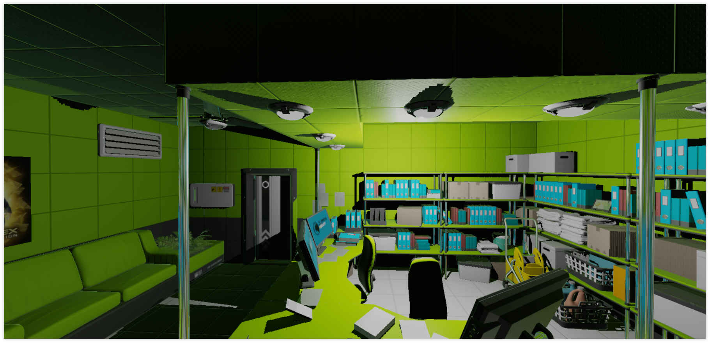

# android-vulkan

Welcome to _android-vulkan_ source code repository. This project was started as personal hobby. Main purpose of the project is learning and implementing the most recent programming techniques for robust _3D_ game engines on the _Android_ mobile devices. Two years later the project goals were extended to _3D_ physics engine development, [_Lua_](https://en.wikipedia.org/wiki/Lua_(programming_language)) embedded scripting language integration and spatial sound rendering.

## Introduction

_android-vulkan_ is _3D_ engine framework. _android-vulkan_ is dedicated to _Vulkan API_ learning, _3D_ physics engine development, [_Lua_](https://en.wikipedia.org/wiki/Lua_(programming_language)) embedded scripting language integration and spatial sound rendering.

## Documentation

Useful documentation is located [here](docs/documentation.md).

## Quick start instructions

### Requirements

* _Windows Vista_+ or _Monjaro KDE_
* [_Android Studio Electric Eel | 2022.1.1 Patch 2_](https://developer.android.com/studio)
* _Android Studio Gradle Plugin 7.4.2_
* _Android NDK 25.2.9519653 (side by side)_
* _Android SDK 11.0 (API level 30)_
* _Android SDK Build-Tools 33.0.2_
* _Android SDK Platform-Tools 34.0.1_
* _Kotlin 1.8.10_
* _Kotlin Gradle plugin 1.8.0_
* _CMake 3.22.1_
* [_Gradle 7.6.1-bin_](https://services.gradle.org/distributions/)
* [_DirectX Shader Compiler 1.7.2212.10065_](https://github.com/microsoft/DirectXShaderCompiler)
* [_libogg 1.3.5_](https://gitlab.xiph.org/xiph/ogg) `db5c7a49ce7ebda47b15b78471e78fb7f2483e22`
* [_libvorbis 1.3.7_](https://gitlab.xiph.org/xiph/vorbis) `84c023699cdf023a32fa4ded32019f194afcdad0`
* [_libvorbisfile 1.3.7_](https://gitlab.xiph.org/xiph/vorbis) `84c023699cdf023a32fa4ded32019f194afcdad0`
* [_Vulkan Validation Layers_](https://github.com/KhronosGroup/Vulkan-ValidationLayers) `e7b63ce7ba3187a65da8c757676c71330be29346`
* [_Lua 5.4.5_](https://github.com/lua/lua) `cf08915d62e338c987b71c078b148490510e9fe7`
* Real _Android 11_ device with _Vulkan 1.1.131_ support
* [_ARM Neon A64_](https://developer.arm.com/architectures/instruction-sets/simd-isas/neon/neon-programmers-guide-for-armv8-a/introducing-neon-for-armv8-a) native support

To begin, clone this repository onto your local drive.

_Optional_: Recompile project shaders to _SPIR-V_ representation via _DirectX Shader Compiler_. See manual [here](docs/shader-compilation.md).

Create and setup _Android_ certificate. See manual [here](docs/release-build.md).

Next step is to compile project via _Android Studio IDE_ as usual.

## Controller support

_XBOX ONE S_ controller is supported via _Bluetooth_ connection. Other controllers are not tested.
