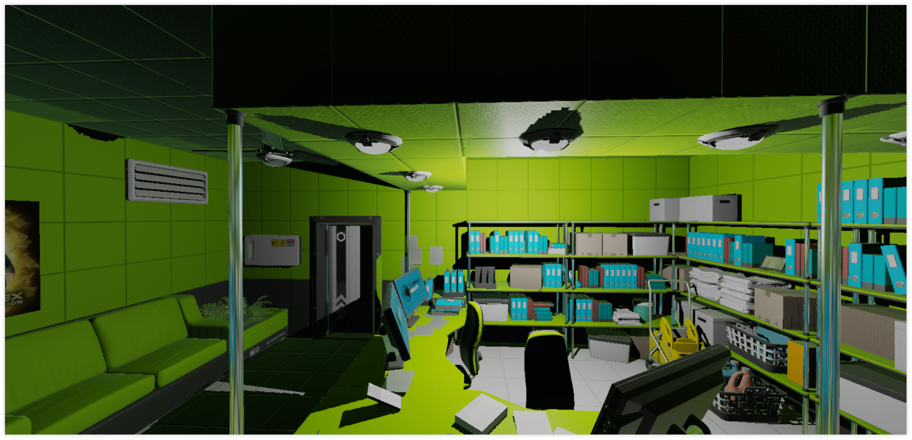
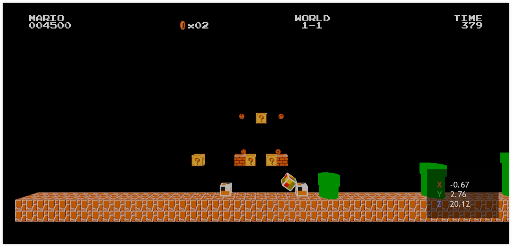

# android-vulkan

Welcome to _android-vulkan_ source code repository. This project was started as personal hobby. Main purpose of the project is learning and implementing the most recent programming techniques for robust _3D_ game engines on the _Android_ mobile devices. Two years later the project goals were extended to _3D_ physics engine development, [_Lua_](https://en.wikipedia.org/wiki/Lua_(programming_language)) embedded scripting language integration, spatial sound rendering and _HTML5 + CSS_ rendering system for _UI_. In 2025, the decision was made to develop a dedicated [editor](docs/editor.md) for the engine, as its growing complexity required a more streamlined workflow.

---

## Introduction

_android-vulkan_ is _3D_ engine framework. _android-vulkan_ is dedicated to _Vulkan API_ learning, _3D_ physics engine development, [_Lua_](https://en.wikipedia.org/wiki/Lua_(programming_language)) embedded scripting language integration, spatial sound rendering and _HTML5 + CSS_ rendering system for _UI_ and engine [editor](docs/editor.md) development.

## Documentation

Useful documentation is located [here](docs/documentation.md).

## Quick start instructions

### Requirements

Note desktop operating system requirements apply for builder machine only. In other words you can build, deploy and debug the project out of the box as soon as you are able to install proper [_Android Studio_](https://developer.android.com/studio).

The canonical way is to use real _Android_ device via _USB_ connection. _Android_ emulator is never tested and there are no plans to support it.

Pay attention that all 3rd party libraries are prebuilt already and project has all needed header files. You **_do not need_** to build them by yourself. Same applies to _SPIR-V_ shader blobs and game assets.

* _Windows 10+_
* [_Android Studio Quail 4 | 2026.1.4 Patch 1_](https://developer.android.com/studio)
* _Android Studio Gradle Plugin 9.4.1_
* _Android NDK 30.0.16248370 (side by side)_
* _Minimum _Android SDK_ version: Android 11 (API level 30)_
* _Compile _Android SDK_ version: Android 17 (API level 37)_
* _Android SDK Build-Tools 37.0.0_
* _Android SDK Platform-Tools 37.0.1_
* _Kotlin 2.4.20_
* _Kotlin Gradle plugin 2.4.20_
* _CMake 4.1.2_
* [_PowerShell 7.6.6_](https://github.com/PowerShell/PowerShell/releases/tag/v7.6.6)
* [_Gradle 9.6.0-bin_](https://services.gradle.org/distributions/)
* [_DirectX Shader Compiler v1.10.2609.10012_](https://github.com/microsoft/DirectXShaderCompiler) `717b24d7a487efb555e976104a263f93f181fd44`
* [_libfreetype 2.14.3_](https://gitlab.freedesktop.org/freetype/freetype) `d333439633039de426f943f28a2926c7f97b5ae5`
* [_libogg 1.3.6_](https://gitlab.xiph.org/xiph/ogg) `06a5e0262cdc28aa4ae6797627a783b5010440f0`
* [_libvorbis 1.3.7_](https://gitlab.xiph.org/xiph/vorbis) `1b75110b5a2754ba1931d82dd83cb822b266a21d`
* [_libvorbisfile 1.3.7_](https://gitlab.xiph.org/xiph/vorbis) `1b75110b5a2754ba1931d82dd83cb822b266a21d`
* [_stb_image 2.30_](https://github.com/nothings/stb) `2c980bb59875b0d32144a71867fbdebb2f77cd20`
* [_Vulkan Validation Layers 1.4.364_](https://github.com/KhronosGroup/Vulkan-ValidationLayers) `4315e7fd4500673692174ed4fee92277a200a7c5`
* [_Lua 5.5.1_](https://github.com/lua/lua) `0b29f408433e92953cc72b1d3e06c7ac8139e439`
* Real _Android 11_ device with _Vulkan 1.1_ support

### Building manual

To begin, clone this repository onto your local drive.

_Optional_: Recompile project shaders to _SPIR-V_ representation via _DirectX Shader Compiler_. See manual [here](docs/shader-compilation.md).

Create and setup _Android_ certificate. See manual [here](docs/release-build.md).

Next step is to compile project via _Android Studio IDE_ as usual.

## Controller support

_XBOX ONE S_ controller is supported via _Bluetooth_ connection. Other controllers are not tested.
