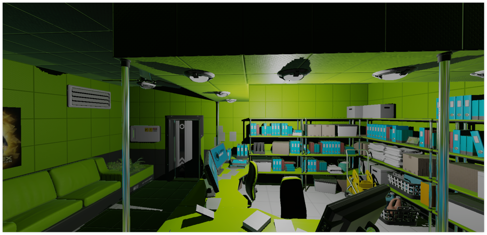

# android-vulkan

Welcome to _android-vulkan_ source code repository. This project was started as personal hobby. Main purpose of the project is learning and implementing the most recent programming techniques for robust _3D_ game engines on the _Android_ mobile devices. Two years later the project goals were extended to _3D_ physics engine development, [_Lua_](https://en.wikipedia.org/wiki/Lua_(programming_language)) embedded scripting language integration, spatial sound rendering and _HTML5 + CSS_ rendering system for _UI_.

---

## Introduction

_android-vulkan_ is _3D_ engine framework. _android-vulkan_ is dedicated to _Vulkan API_ learning, _3D_ physics engine development, [_Lua_](https://en.wikipedia.org/wiki/Lua_(programming_language)) embedded scripting language integration, spatial sound rendering and _HTML5 + CSS_ rendering system for _UI_.

## Documentation

Useful documentation is located [here](docs/documentation.md).

## Quick start instructions

### Requirements

* _Windows Vista_+ or _Monjaro KDE_
* [_Android Studio Koala | 2024.1.1 Patch 2_](https://developer.android.com/studio)
* _Android Studio Gradle Plugin 8.5.2_
* _Android NDK 27.0.12077973 (side by side)_
* _Minimum _Android SDK_ version: Android 11 (API level 30)_
* _Compile _Android SDK_ version: Android 13 (API level 34)_
* _Android SDK Build-Tools 35.0.0_
* _Android SDK Platform-Tools 35.0.2_
* _Kotlin 2.0.0_
* _Kotlin Gradle plugin 2.0.0_
* _CMake 3.22.1_
* [_Gradle 8.10-bin_](https://services.gradle.org/distributions/)
* [_DirectX Shader Compiler 1.8.2407.10013_](https://github.com/microsoft/DirectXShaderCompiler) `a2a220bc616ca28848ec0af77ad33a09f92fa43a`
* [_libfreetype 2.13.2_](https://gitlab.freedesktop.org/freetype/freetype) `37cefe33b284d0bad4ec52bcccc1a8c2d8704340`
* [_libogg 1.3.5_](https://gitlab.xiph.org/xiph/ogg) `7cf42ea17aef7bc1b7b21af70724840a96c2e7d0`
* [_libvorbis 1.3.7_](https://gitlab.xiph.org/xiph/vorbis) `bb4047de4c05712bf1fd49b9584c360b8e4e0adf`
* [_libvorbisfile 1.3.7_](https://gitlab.xiph.org/xiph/vorbis) `bb4047de4c05712bf1fd49b9584c360b8e4e0adf`
* [_stb_image 2.30_](https://github.com/nothings/stb) `f7f20f39fe4f206c6f19e26ebfef7b261ee59ee4`
* [_Vulkan Validation Layers 1.3.290_](https://github.com/KhronosGroup/Vulkan-ValidationLayers) `b93cd0c87caa1d69346e9a1adb7b3e1c68b72423`
* [_Lua 5.5.0_](https://github.com/lua/lua) `c1dc08e8e8e22af9902a6341b4a9a9a7811954cc`
* Real _Android 11_ device with _Vulkan 1.1.131_ support
* [_ARM Neon A64_](https://developer.arm.com/architectures/instruction-sets/simd-isas/neon/neon-programmers-guide-for-armv8-a/introducing-neon-for-armv8-a) native support

To begin, clone this repository onto your local drive.

_Optional_: Recompile project shaders to _SPIR-V_ representation via _DirectX Shader Compiler_. See manual [here](docs/shader-compilation.md).

Create and setup _Android_ certificate. See manual [here](docs/release-build.md).

Next step is to compile project via _Android Studio IDE_ as usual.

## Controller support

_XBOX ONE S_ controller is supported via _Bluetooth_ connection. Other controllers are not tested.
