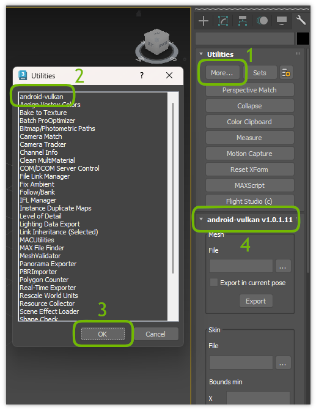

# _3ds Max exporter_

## <a id="table-of-content">Table of content</a>

- [_Installation_](#installation)
- [_Skin bounds_](#skin-bounds)
- [_Build_](#build)
- [_Debug_](#debug)

## <a id="installation">Installation</a>

**Warning:** Current manual is applicable for _3ds Max 2023_ only. There is no any guarantee to work with other versions of _3ds Max_ due to rules how native plugins are written.

Copy `android-vulkan.dle` from `<repo>/tools/bin` directory to the _3ds Max 2023_ plugin directory. For example here:

`D:\Programs\Autodesk\3ds Max 2023\Plugins\android-vulkan.dle`

Plugin will be available in the _Utilities_ panel of the _3ds Max_:

[↬ table of content ⇧](#table-of-content)

## <a id="skin-bounds">Skin bounds</a>

The _android-vulkan_ rendering system relies on the bounding box information to minimize draw calls. Skin is a special type of data because it could change its bounds depending on pose of the skeleton. So ideally the artist should estimate the biggest possible bounds of the skin asset by setting _Bounds min_ and _Bounds max_ properties before export:

Take a note that exporter will calculate approximate bounds if the artist will ignore this values. The exporter will find the biggest distance from coordinate origin in the skin vertices. This distance will be multiplied by `8`. The final bounds will be considered as cube with side as calculated at previous step. Obviously the approximation could produce incorrect results in some cases of skin data and animation data. The objects could disappear.

[↬ table of content ⇧](#table-of-content)

## <a id="build">Build</a>

**Requirements**

- [_3ds Max 2023 SDK_](https://aps.autodesk.com/developer/overview/3ds-max#3dsmax-sdk)
- [_MikkTSpace_](https://github.com/mmikk/MikkTSpace) `3e895b49d05ea07e4c2133156cfa94369e19e409`
- _Visual Studio 2022 Community 17.12.2_
  - Workloads: Desktop development with C++
  - Individual components
    - MSBuild
    - _MSVC v143 - VS 2022 C++ x64/x86 build tools (v14.42-17.12)_
    - Windows Universal CRT SDK
    - C++ core features
    - Windows 11 SDK (10.0.26100.0)
    - Windows Universal C Runtime

In order to build plugin binary you should open solution file inside _Visual Studio_:

`<repo>/tools/3ds-max-plugin/3ds-max-plugin.sln`

There are two configurations: _Release_ and _Debug_.

But **before** build that you have to specify root directory where _3ds Max 2023 SDK_ is located on you system via environment variable `SDK_3DS_MAX`

For example:

Variable name | Value
--- | ---
`SDK_3DS_MAX` | `D:\Development\Autodesk\3ds Max 2023 SDK\maxsdk`

[↬ table of content ⇧](#table-of-content)

## <a id="debug">Debug</a>

In oder to debug plugin from _Visual Studio_ you should select _Debug_ configuration and build solution. Then you should place debug plugin binary into _3ds Max_ plugin directory. For example:

`D:\Programs\Autodesk\3ds Max 2023\Plugins\android-vulkan.dle`

At this point you should tell _Visual Studio_ to launch debug session for _3ds Max_ instead of plugin binary. You should set run configuration in the project settings like this:

This setup will allow to hit break points inside plugin code.

[↬ table of content ⇧](#table-of-content)
