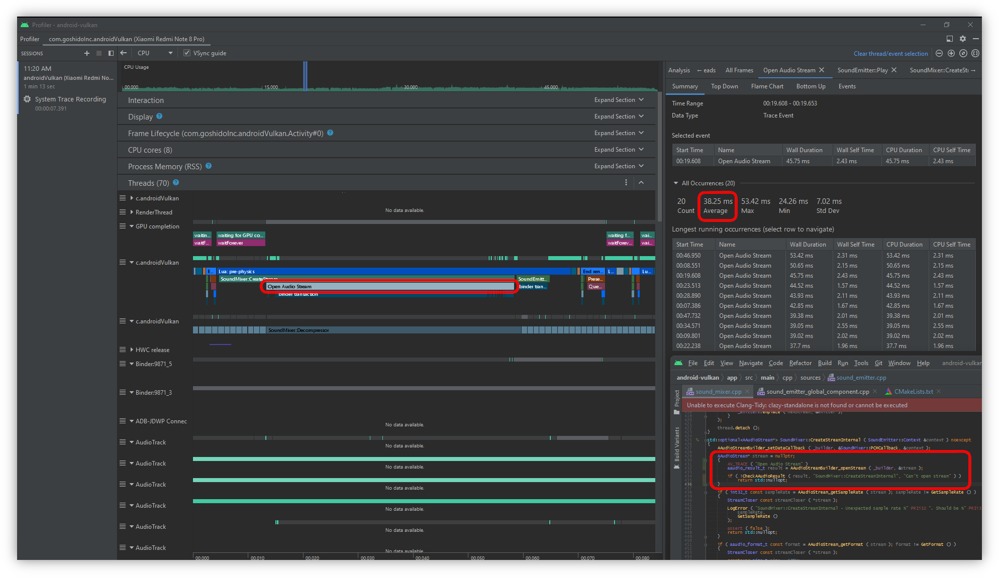
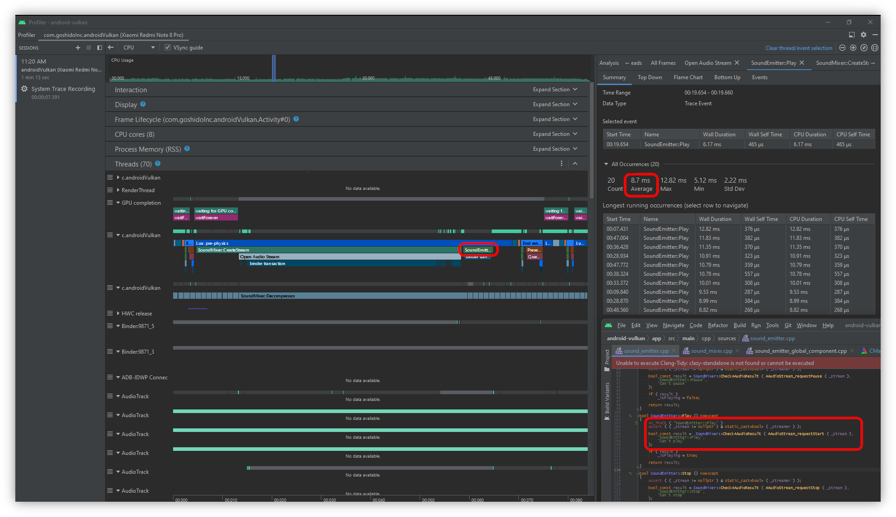
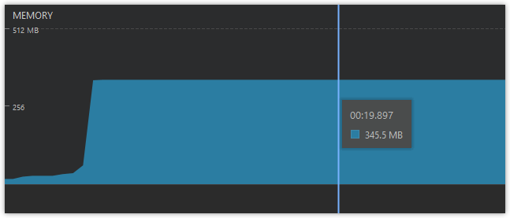

# _AAudio_ issues

## Table of content

- [_Latency_](#latency)
  - [_`AAudioStreamBuilder_openStream` latency_](#aaudiostreambuilder-open-stream-latency)
  - [_`AAudioStream_requestStart` latency_](#aaudiostream-request-start-latency)
- [_`AAudioStream` limit_](#aaudiostream-limit)

## <a id="latency">Latency</a>

At the moment **[2022/12/31]** it was discovered that [_AAudio_](https://developer.android.com/ndk/guides/audio/aaudio/aaudio) system has a huge latency. This latency does not allow to create sound emitters on demand in runtime. For example creating and playing sound right from _Lua_ script logic thread. So it's needed more complex architecture to hide such huge latency and avoid micro-freezing.

All measuarements were done on _XIAOMI Redmi Note 8 Pro_, _Android 10_, latest available firmware.

## <a id="aaudiostreambuilder-open-stream-latency">`AAudioStreamBuilder_openStream` latency</a>

In average: **38.25 ms**

### <a id="aaudiostream-request-start-latency">`AAudioStream_requestStart` latency</a>

In average: **8.7 ms**

## <a id="aaudiostream-limit">`AAudioStream` limit</a>

At the moment **[2022/12/31]** it was discovered that [_AAudio_](https://developer.android.com/ndk/guides/audio/aaudio/aaudio) system has a per process limit of `AAudioStream` handles. The limit equals `39` instances on _XIAOMI Redmi Note 8 Pro_, _Android 10_, latest available firmware. According to profiling it's not a _RAM_ limit. It's something else.

It's per process limit instead per system limit because during experiment with running music player the amount `AAudioStream` handles did not change.
