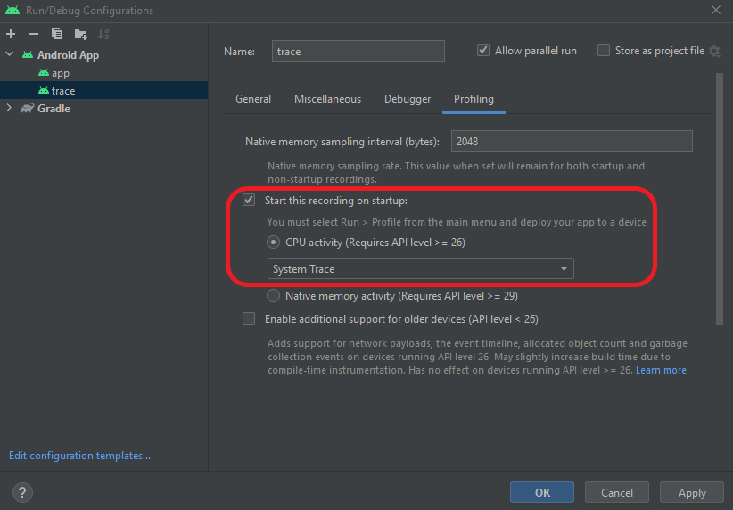
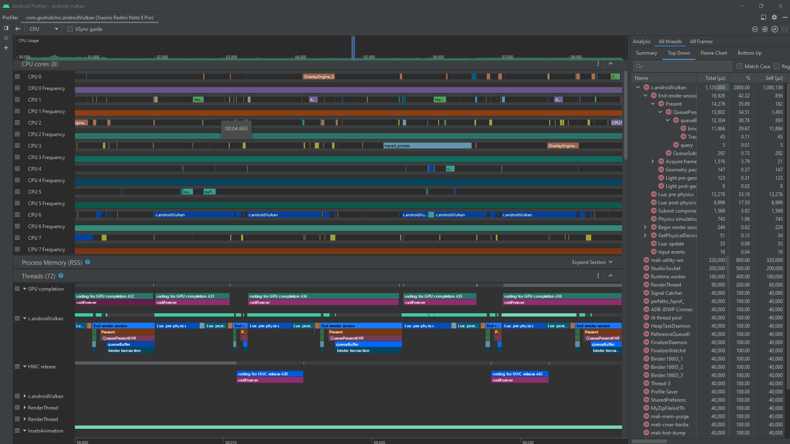

# _CPU_ tracing

The project supports _Android Studio_'s [tracing tool](https://developer.android.com/topic/performance/tracing). It's activated via preprocessor macro - [`ANDROID_ENABLE_TRACE`](preprocessor-macros.md#macro-android-enable-trace). The tool requires to make debuggable application to work. So recommended `CMakeLists.txt` configuration is the following:

```cmake
...

# See docs/preprocessor-macros.md
target_compile_definitions ( android-vulkan
    PRIVATE
    -DANDROID_ENABLE_TRACE
    -DANDROID_NATIVE_MODE_PORTRAIT
#    -DANDROID_VULKAN_DEBUG
#    -DANDROID_VULKAN_ENABLE_RENDER_DOC_INTEGRATION
#    -DANDROID_VULKAN_ENABLE_VULKAN_VALIDATION_LAYERS
#    -DANDROID_VULKAN_STRICT_MODE
    -DVK_NO_PROTOTYPES
    -DVK_USE_PLATFORM_ANDROID_KHR
)

...
```

Also you should select _System Trace_ option:



---

Example from **2022/08/18**:


