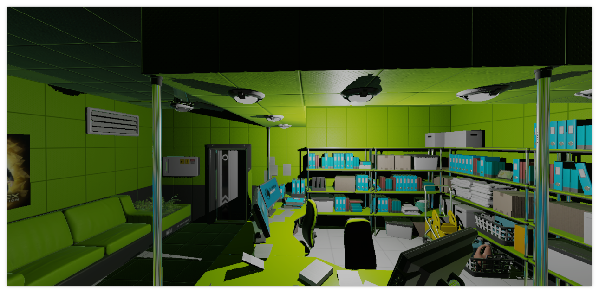
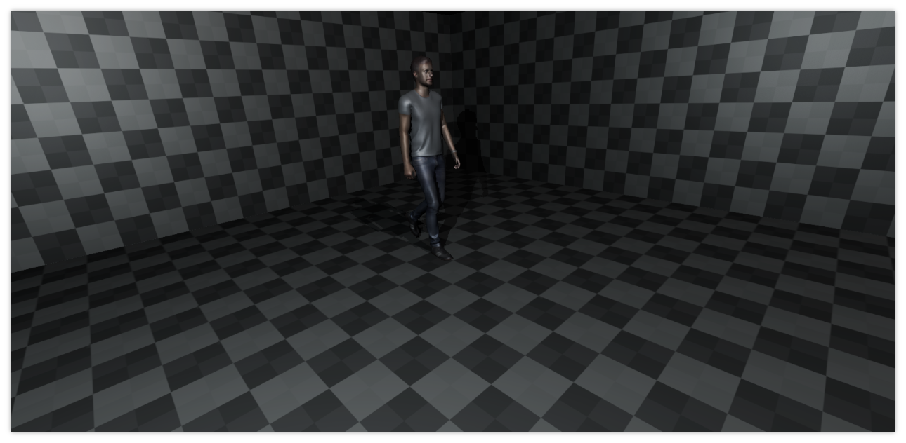
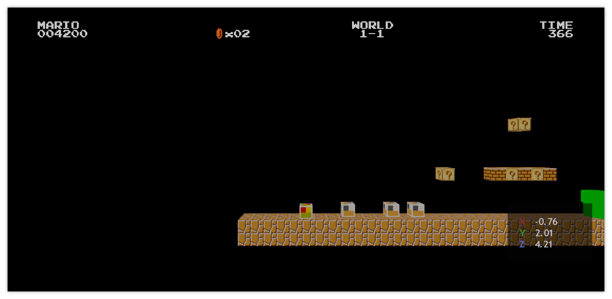

# Data compression

## <a id="table-of-content">Table of content</a>

- [_Brief_](#brief)
- [_Final result_](#final-results)
- [_Benchmark environment_](#benchmark)
- [_Optimizations #1_](#optimizations-1)
  - [_Quaternion and `float16_t`_](#opt-1-quat-float16)
  - [_Separate position data_](#opt-1-separate-positions)
- [_Optimizations #2_](#optimizations-2)
  - [_Compressing TBN in 4 bytes_](#opt-2-tbn-in-4-bytes)
  - [_Storing local-view information in 8 bytes_](#opt-2-local-view-8-bytes)
  - [_Using `uint16_t` index buffers_](#opt-2-using-uint16-indices)
  - [_Further vertex data compression_](#opt-2-further-compression)

## <a id="brief">Brief</a>

Page is written in 2024 November 12<sup>th</sup>. After almost 4 years from project start it was decided to review data structures for handling vertex data. The point of interest is to send data in more compact form to better utilize hardware caches and reduce overall bandwidth.

[↬ table of content ⇧](#table-of-content)

## <a id="final-results">Final result</a>

It was not detected any visible quality degradation on benchmark scenes.

⁘ Frame time:

**Scene** | **Stock** | **Optimized** | **Absolute difference** | **Relative difference** | **Preview**
--- | --- | --- | --- | --- | ---
_PBR_ | 17.846 ms | 16.667 ms | -1.178 ms⏬ | -6.6%⏬ | 
_Skeletal mesh_ | 17.344 ms | 15.136 ms | -2.207 ms⏬ | -12.7%⏬ | 
_World 1-1_ | 9.477 ms | 9.519 ms | +0.042 ms🔺 | +0.4%🔺 | 

⁘ Maximum instances:

**Stock** | **Optimized** | **Absolute difference** | **Relative difference**
--- | --- | --- | ---
42 | 84 | +42⏫ | +100%⏫

⁘ Bytes per scene vertex:

**Stock** | **Optimized** | **Absolute difference** | **Relative difference**
--- | --- | --- | ---
248 | 108 | -140⏬ | -56.5%⏬

⁘ Bytes per _UI_ vertex:

**Stock** | **Optimized** | **Absolute difference** | **Relative difference**
--- | --- | --- | ---
50 | 24 | -26⏬ | -52%⏬

[↬ table of content ⇧](#table-of-content)

## <a id="benchmark">Benchmark environment</a>

Testing device: [_Redmi Note 8 Pro_](https://vulkan.gpuinfo.org/displayreport.php?id=12030).

Benchmark scenes:

⁘ **_PBR_**


Frame time: 17.846 ms, _vSync_ off - `VK_PRESENT_MODE_MAILBOX_KHR`

**Metric** | **Submitted** | **Rendered** | **Culled**
--- | --- | --- | ---
Vertices | 718173 | 444954 | 39%
Opaque meshes | 417 | 243 | 42%
Stipple meshes | 2 | 1 | 50%
Point lights | 1 | 1 |0%
Local reflections | 0 | 0 | N/A
Global reflections | 1 | 1 | 0%
_UI_ vertices | 0 | 0 | N/A

---

⁘ **_Skeletal mesh_**


Frame time: 17.344 ms, _vSync_ off - `VK_PRESENT_MODE_MAILBOX_KHR`

**Metric** | **Submitted** | **Rendered** | **Culled**
--- | --- | --- | ---
Vertices | 64674 | 64674 | 0%
Opaque meshes | 2 | 2 | 0%
Stipple meshes | 0 | 0 | N/A
Point lights | 2 | 2 | 0%
Local reflections | 0 | 0 | N/A
Global reflections | 0 | 0 | N/A
_UI_ vertices | 0 | 0 | N/A

---

⁘ **_World 1-1_**


Frame time: 9.477 ms, _vSync_ off - `VK_PRESENT_MODE_MAILBOX_KHR`

**Metric** | **Submitted** | **Rendered** | **Culled**
--- | --- | --- | ---
Vertices | 10182 | 1392 | 87%
Opaque meshes | 70 | 13 | 82%
Stipple meshes | 4 | 0 | 100%
Point lights | 0 | 0 | N/A
Local reflections | 0 | 0 | N/A
Global reflections | 0 | 0 | N/A
_UI_ vertices | 288 | 288 | 0%

[↬ table of content ⇧](#table-of-content)

## <a id="optimizations-1">Optimizations #1</a>

⁘ Frame time comparison with stock version:

**Scene** | **Frame time** | **Absolute difference** | **Relative difference** | **Preview**
--- | --- | --- | --- | ---
_PBR_ | 16.669 ms | -1.177 ms⏬ | -6.6%⏬ | 
_Skeletal mesh_ | 15.496 ms | -1.847 ms⏬ | -10.7%⏬ | 
_World 1-1_ | 9.485 ms | +0.008 ms🔺 | +0.1%🔺 | 

---

⁘ Maximum instances comparison with stock version:

**Optimizations #1** | **Absolute difference** | **Relative difference**
--- | --- | ---
56 | +14⏫ | +33.3%⏫

---

⁘ Bytes per scene vertex comparison with stock version:

**Optimizations #1** | **Absolute difference** | **Relative difference**
--- | --- | ---
200 | -48⏬ | -19.4%⏬

---

⁘ Bytes per _UI_ vertex comparison with stock version:

**Optimizations #1** | **Absolute difference** | **Relative difference**
--- | --- | ---
50 | 0 | 0%

[↬ table of content ⇧](#table-of-content)

### <a id="opt-1-quat-float16">_Quaternion_ and `float16_t`</a>

Quaternion could represent local-view rotation and composite orientation for influence bones during skinning process. Computations are performed in `float16_t` for _TBN_ data. The bitangent is reconstructed using [_cross product_](https://en.wikipedia.org/wiki/Cross_product).

[↬ table of content ⇧](#table-of-content)

### <a id="opt-1-separate-positions">Separate position data</a>

Separate position data utilizes tile _GPU_ specifics: every vertex shader is implicily cut into two versions:

- only computations which affect output vertex position
- rest computations

So having positions and matrices tightly packed together increases chances to get cache-hit.

⁘ **_3D_ scene workflow**

Vertex buffer layout:

```cpp
// Vertex buffer #0
struct VertexInfo final
{                                           // Vertex buffer #0
    float32_t3      _vertex;                float32_t3          _position;

                                            // Vertex buffer #1
                                            struct VertexInfo final
                            ----------->    {
    float32_t2      _uv;                        float32_t2      _uv;
    float32_t3      _normal;                    float32_t3      _normal;
    float32_t3      _tangent;                   float32_t3      _tangent;
    float32_t3      _bitangent;                 float32_t3      _bitangent;
}                                           }
```

Uniform buffer layout:

```cpp
                                                            struct ColorData final
            ----------------------------------->            {
                                                                float32_t4      _color0;
                                                                float32_t4      _color1;
struct ObjectData final                                         float32_t4      _color2;
{                                                               float32_t4      _emission;
    float32_t4x4    _localView;                             };
    float32_t4x4    _localViewProjection;
    float32_t4      _color0;                                // Uniform buffer #0 (vertex stage)
    float32_t4      _color1;                                struct InstancePositionData final
    float32_t4      _color2;                                {
    float32_t4      _emission;                                  float32_t4x4    _localViewProj[ 56U ];
};                                                          };

// Uniform buffer #0 (vertex, fragment stages)              // Uniform buffer #1 (vertex stage)
struct InstanceData final                                   struct InstanceNormalData final
{                                                           {
    ObjectData      _instanceData[ 42U ];                       float32_t4      _localView[ 56U ];
};                                                          };

                                                            // Uniform buffer #2 (frament stage)
                                                            struct InstanceColorData final
            ----------------------------------->            {
                                                                ColorData       _colorData[ 56U ];
                                                            };
```

---

⁘ **_UI_ workflow**

Vertex buffer layout:

```cpp
// Vertex buffer #0
struct UIVertexInfo final
{                                           // Vertex buffer #0
    float32_t2      _vertex;                float32_t2          _position;

                                            // Vertex buffer #1
                                ------->    struct UIVertex final
                                            {
    float32_t4      _color;                     float32_t4      _color;
    float32_t3      _atlas;                     float32_t3      _atlas;
    float32_t2      _imageUV;                   float32_t2      _imageUV;
};                                          };
```
[↬ table of content ⇧](#table-of-content)

## <a id="optimizations-2">Optimizations #2</a>

⁘ Frame time comparison with stock version:

**Scene** | **Frame time** | **Absolute difference** | **Relative difference** | **Preview**
--- | --- | --- | --- | ---
_PBR_ | 16.667 ms | -1.178 ms⏬ | -6.6%⏬ | 
_Skeletal mesh_ | 15.136 ms | -2.207 ms⏬ | -12.7%⏬ | 
_World 1-1_ | 9.519 ms | +0.042 ms🔺 | +0.4%🔺 | 

⁘ Frame time comparison with _Optimization #1_:

**Scene** | **Frame time** | **Absolute difference** | **Relative difference** | **Preview**
--- | --- | --- | --- | ---
_PBR_ | 16.667 ms | -0.001 ms⏬ | -0.008%⏬ | 
_Skeletal mesh_ | 15.136 ms | -0.36 ms⏬ | -2.3%⏬ | 
_World 1-1_ | 9.519 ms | +0.033 ms🔺 | +0.3%🔺 | 

---

⁘ Maximum instances comparison with stock version:

**Optimizations #2** | **Absolute difference** | **Relative difference**
--- | --- | ---
84 | +42⏫ | +100%⏫

⁘ Maximum instances comparison with _optimizations #1_:

**Optimizations #2** | **Absolute difference** | **Relative difference**
--- | --- | ---
84 | +28⏫ | +50%⏫

---

⁘ Bytes per scene vertex comparison with stock version:

**Optimizations #2** | **Absolute difference** | **Relative difference**
--- | --- | ---
108 | -140⏬ | -56.5%⏬

⁘ Bytes per scene vertex comparison with _optimizations #1_:

**Optimizations #2** | **Absolute difference** | **Relative difference**
--- | --- | ---
108 | -92⏬ | -46%⏬

---

⁘ Bytes per _UI_ vertex comparison with stock/_optimizations #1_ version:

**Optimizations #2** | **Absolute difference** | **Relative difference**
--- | --- | ---
24 | -26⏬ | -52%

[↬ table of content ⇧](#table-of-content)

### <a id="opt-2-tbn-in-4-bytes">Compressing _TBN_ in 4 bytes</a>

For othogonal _TBNs_ it's possible to represent it via unit-quaternion plus information about mirroring of the bitangent vector.

First step is to make sure that _TBN_ is othogonal. Unfortunally _3ds Max_ provides non orthogonal _TBNs_. Good news that there is de-facto industry standard convention/library called [_Mikkt_](https://github.com/mmikk/MikkTSpace). This library provides orthogonal _tangents_ using mesh _normals_ and _UVs_.

Second step is futher data compression. Quaternion is 4 numbers. Mirroring information is single number. So it's needed 5 numbers. Good news that rendering system is using unit quaternions. So it's possible to store 3 components and recover 4<sup>th</sup> component using formula:

$$r = \sqrt{1 - a^2 - b^2 - c^2}$$

But there is a catch. Fundamental flaw of quaternion: duality. That means that exact same rotation is always described by two quaternions:

$$
q = r + ai + bj + ck
$$
$$
-q = -r - ai - bj - ck
$$

To solve this issue the implementation will always select quaternion with positive $r$ component.

Another issue comes from computations in `float16_t` precision. Sometimes square root will be negative due to rounding errors. To solve this issue the recovering process will use module:

$$r = \sqrt{|1 - a^2 - b^2 - c^2|}$$

And last step is optimal data format: `VK_FORMAT_A2R10G10B10_UNORM`:

- $a$ → _R_ 10 bits
- $b$ → _G_ 10 bits
- $c$ → _B_ 10 bits
- _mirroring_ scalar → _A_ 2 bits

[↬ table of content ⇧](#table-of-content)

### <a id="opt-2-local-view-8-bytes">Storing local-view information in 8 bytes</a>

For proper shading the model _TBN_ must be rotated by _local-view_ matrix. This matrix is also orthogonal and could be represented by quaternion. It was decided to use more precise compression such so every component of the quaternion is described by 16 bits. So encoding one _local-view_ matrix will require 8 bytes. The catch is passing this information via uniform buffers. Such data must be aligned by 16 byte boundary. The solution is to store two quaternions instead of one. Together they will occupy 16 bytes:

```cpp
struct TBN64
{
    uint32_t    _q0High;
    uint32_t    _q0Low;
    uint32_t    _q1High;
    uint32_t    _q1Low;
};

```

[↬ table of content ⇧](#table-of-content)

### <a id="opt-2-using-uint16-indices">Using `uint16_t` index buffers</a>

When the number of unique vertices of the mess is less that $2^{16} - 1$ or 65535 it's possible to use `uint16_t` type for index buffers.

[↬ table of content ⇧](#table-of-content)

### <a id="opt-2-further-compression">Further vertex data compression</a>

The storing color information in `float32_t4` is suboptimal. It's possible to store it in `uint32_t` instead. The catch is emission which must use intensity scaler which allows to use values beyond [0.0, 1.0] range.

```cpp
// Vertex buffer #0
struct VertexInfo final
{                                           // Vertex buffer #0
    float32_t3      _vertex;                float32_t3          _position;

                                            // Vertex buffer #1
                                            struct VertexInfo final
                            ----------->    {
    float32_t2      _uv;                        float32_t2      _uv;
    float32_t3      _normal;                    uint32_t        _tbn;
    float32_t3      _tangent;               };
    float32_t3      _bitangent;
}
```

Uniform buffer layout:

```cpp
                                                            struct TBN64
                                                            {
                                                                uint32_t        _q0High;
                                                                uint32_t        _q0Low;
                                                                uint32_t        _q1High;
                                                                uint32_t        _q1Low;
                                                            };

                                                            struct ColorData final
            ----------------------------------->            {
                                                                uint32_t        _emiRcol0rgb;
                                                                uint32_t        _emiGcol1rgb;
struct ObjectData final                                         uint32_t        _emiBcol2rgb;
{                                                               uint32_t        _col0aEmiIntens;
    float32_t4x4    _localView;                             };
    float32_t4x4    _localViewProjection;
    float32_t4      _color0;                                // Uniform buffer #0 (vertex stage)
    float32_t4      _color1;                                struct InstancePositionData final
    float32_t4      _color2;                                {
    float32_t4      _emission;                                  float32_t4x4    _localViewProj[ 84U ];
};                                                          };

// Uniform buffer #0 (vertex, fragment stages)              // Uniform buffer #1 (vertex stage)
struct InstanceData final                                   struct InstanceNormalData final
{                                                           {
    ObjectData      _instanceData[ 42U ];                       TBN64           _localView[ 84U / 2U ];
};                                                          };

                                                            // Uniform buffer #2 (frament stage)
                                                            struct InstanceColorData final
            ----------------------------------->            {
                                                                ColorData       _colorData[ 84U ];
                                                            };
```

---

⁘ **_UI_ workflow**

Vertex buffer layout:

```cpp
// Vertex buffer #0
struct UIVertexInfo final
{                                           // Vertex buffer #0
    float32_t2      _vertex;                float32_t2          _position;

                                            struct UIAtlas final
                                            {
                                                float32_t2      _uv;
                                                uint8_t         _layer;
                                                uint8_t         _padding[ 3U ];
                                            };

                                            // Vertex buffer #1
                                ------->    struct UIVertex final
                                            {
    float32_t4      _color;                     float32_t2      _image;
    float32_t3      _atlas;                     UIAtlas         _atlas;
    float32_t2      _imageUV;                   uint32_t        _color;
};                                          };
```

**Note:** [2024/11/14] _XIAOMI Redmi Note 8 Pro_. Probably driver bug. Brief: having vertex element non multiple of 4 bytes causes runtime artefacts loking like data race or missing barrier or so. _VVL 1.3.299_ does not detect any core or sync validation issues. Running same code on _NVIDIA RTX 4080_ does not have any artifacts. To solve the issue it was added 3 byte padding after `UIAtlas::_layer` field.

[↬ table of content ⇧](#table-of-content)
