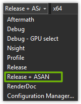
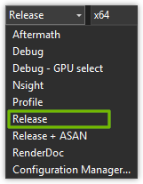

# Editor

## <a id="table-of-content">Table of content</a>

- [_Quick start instructions_](#quck-start)
  - [_Requirements_](#requirements)
  - [_Building_](#building)
- [_Configurations_](#configurations)
  - [_RenderDoc integration_](#renderdoc-integration)
  - [_NVIDIA Nsight Graphics integration_](#nsight-integration)
  - [_NVIDIA Aftermath integration_](#aftermath-integration)
  - [_PIX integration_](#pix-integration)
  - [_ASAN integration_](#asan-integration)
  - [_Debug build_](#debug-build)
  - [_Release build_](#release-build)

## <a id="quck-start">Quick start instructions</a>

### <a id="requirements">Requirements</a>

* _Windows 11_+
* _Visual Studio 2022 Community 17.12.1_
  - Workloads: Desktop development with C++
  - Individual components
    - MSBuild
    - _MSVC v143 - VS 2022 C++ x64/x86 build tools (v14.42-17.12)_
    - Windows Universal CRT SDK
    - C++ core features
    - Windows 11 SDK (10.0.26100.0)
    - Windows Universal C Runtime
* [_RenderDoc v1.40_](https://renderdoc.org/)
* [_NVIDIA Nsight Graphics 2025.4.1.0 (build 36508989) (public-release)_](https://developer.nvidia.com/nsight-graphics)
* [_PIX 2509.25 / WinPixEventRuntime.\(dll|lib\) 1.0.240308001_](https://devblogs.microsoft.com/pix/download/)
* [_DirectX Shader Compiler 1.8.2505.10149_](https://github.com/microsoft/DirectXShaderCompiler) `0bf8434bc3b57a0b99477162dfe54673d9b5153b`
* [_libfreetype 2.14.1_](https://gitlab.freedesktop.org/freetype/freetype) `4334f009e7d20789cc7ee1224290ea1e22a17b5b`
* [_stb_image 2.30_](https://github.com/nothings/stb) `fede005abaf93d9d7f3a679d1999b2db341b360f`
* [_Vulkan SDK 1.4.328.1_](https://vulkan.lunarg.com/sdk/home)
* [_Vulkan Validation Layers 1.4.329_](https://github.com/KhronosGroup/Vulkan-ValidationLayers) `62d79257ac9b93ba3f6fa7507fb172cb9cf8e7ff`

[↬ table of content ⇧](#table-of-content)

### <a id="building">Building</a>

To begin you have to run script

`<repo>tools\editor\scripts\prepare-environment.ps1`

This script gonna create symbolic links for:

- asset directories
- [_PIX_](https://devblogs.microsoft.com/pix/) tooling library for _CPU_ tracing
- 3rd-party libraries

Next step is to compile project via _Visual Studio_ as usual.

[↬ table of content ⇧](#table-of-content)

## <a id="configurations">Configurations</a>

### <a id="renderdoc-integration">_RenderDoc_ integration</a>

First step is to select _RenderDoc_ build configuration:

Next step is to [compile _HLSL_ code into _SPIR-V_ with shader sources](./shader-compilation.md#spirv-sources).

Under the hood it's used [_RenderDoc_ compatibility compile options](./renderdoc-integration.md).

The build artifacts will be located in directory:

`<repo>\tools\editor\bin\RenderDoc`

Now you will be able to use [_RenderDoc_](https://renderdoc.org/) for debugging:

**Note:** It's expected that application will crash in case of running without _RenderDoc_. For performance reasons internal implementation does not check that the following debug functions are not `nullptr`.

- `vkCmdBeginDebugUtilsLabelEXT`
- `vkCmdEndDebugUtilsLabelEXT`
- `vkSetDebugUtilsObjectNameEXT`

The _RenderDoc Vulkan_ layer provides those functions.

[↬ table of content ⇧](#table-of-content)

### <a id="nsight-integration">_NVIDIA Nsight Graphics_ integration</a>

First step is to select _Nsight_ build configuration:

Next step is to [compile _HLSL_ code into _SPIR-V_ with shader sources](./shader-compilation.md#spirv-sources).

The build artifacts will be located in directory:

`<repo>\tools\editor\bin\Nsight`

Now you will be able to use [_NVIDIA Nsight Graphics_](https://developer.nvidia.com/nsight-graphics) for debugging:

Graphics debugger:

_GPU_ profiler:

**Note:** It's expected that application could crash in case of running outside _NVIDIA Nsight Graphics_. For performance reasons internal implementation does not check that the following debug functions are not `nullptr`.

- `vkCmdBeginDebugUtilsLabelEXT`
- `vkCmdEndDebugUtilsLabelEXT`
- `vkSetDebugUtilsObjectNameEXT`

The _NVIDIA Nsight Graphics Vulkan_ layer provides those functions.

[↬ table of content ⇧](#table-of-content)

### <a id="aftermath-integration">_NVIDIA Aftermath_ integration</a>

First step is to select _Aftermath_ build configuration:

Next step is to [compile _HLSL_ code into _SPIR-V_ with shader sources](./shader-compilation.md#spirv-sources).

The build artifacts will be located in directory:

`<repo>\tools\editor\bin\Aftermath`

Now you will be able to use [_NVIDIA Aftermath_](https://developer.nvidia.com/nsight-aftermath) for debugging:

ℹ️ Pay attention that [_NVIDIA Nsight Graphics_](https://developer.nvidia.com/nsight-graphics) already contains [_NVIDIA Aftermath_](https://developer.nvidia.com/nsight-aftermath) components. So all you need is to activate [_NVIDIA Aftermath_](https://developer.nvidia.com/nsight-aftermath) tool and wait for application crash.

[↬ table of content ⇧](#table-of-content)

### <a id="pix-integration">_PIX_ integration</a>

First step is to select _Profile_ build configuration:

The build artifacts will be located in directory:

`<repo>\tools\editor\bin\Profile`

Now you will able to use _PIX_ for _CPU_ tracing.

[↬ table of content ⇧](#table-of-content)

### <a id="asan-integration">_ASAN_ integration</a>

First step is to select _Release + ASAN_ build configuration:

The build artifacts will be located in directory:

`<repo>\tools\editor\bin\Release + ASAN`

Now you will able to use [_ASAN_ features](https://learn.microsoft.com/en-us/cpp/sanitizers/asan?view=msvc-170).

[↬ table of content ⇧](#table-of-content)

### <a id="debug-build">Debug build</a>

First step is to select _Debug_ build configuration:

The build artifacts will be located in directory:

`<repo>\tools\editor\bin\Debug`

Build activates: _VVL_ with core, best practices and sync validation features.

[↬ table of content ⇧](#table-of-content)

### <a id="release-build">Release build</a>

First step is to select _Release_ build configuration:

The build artifacts will be located in directory:

`<repo>\tools\editor\bin\Release`

Build features:

- all _CPU_ optimizations are enabled
- _VVL_ are disabled

[↬ table of content ⇧](#table-of-content)
