# Gizmo rendering

## <a id="table-of-content">Table of content</a>

- [_Analytical Anti-Aliasing for SDF_](#aaa)
  - [_Anti-Aliasing zone_](#aa-zone)
  - [_Pixel coverage_](#pixel-coverage)
  - [_Efficient ray-marching threshold_](#threshold)
  - [_Final result_](#result)
- [_Shell extend_](#shell-extend)
- [_Memory layout_](#memory-layout)
  - [_Samples_](#samples)
  - [_Counters_](#counters)
- [_SDF simplifications_](#simplification)
  - [_Line segment_](#line-segment)
- [_Interaction with mouse_](#interaction)
  - [_Axis_](#inter-axis)
  - [_Plane_](#inter-plane)
  - [_Ring_](#inter-ring)
- [_Known limitations_](#limitations)

## <a id="aaa">Analytical Anti-Aliasing for _SDF_</a>

The core principle of anti-aliasing Signed Distance Fields (_SDF_) is the analytical estimation of how close a given pixel's center is to the shape's boundary. The objective is to determine an accurate sub-pixel coverage value for pixels that straddle the edge of the shape.
The "loop of pixels" that forms the boundary in the final image is the critical area of focus.

[↬ table of content ⇧](#table-of-content)

## <a id="aa-zone">Anti-Aliasing zone</a>

The anti-aliasing algorithm assigns an alpha value to each pixel within this transition zone:

- Alpha approaches 1: when the pixel's center is extremely close to, or just inside, the shape's boundary.
- Alpha approaches 0: when the pixel's center is far from the boundary.

This analytical method uses the _SDF_ value itself, scaled by the estimated pixel size, to smoothly interpolate between full transparency and full opacity, effectively simulating a precise sub-pixel fill without resorting to costly supersampling.

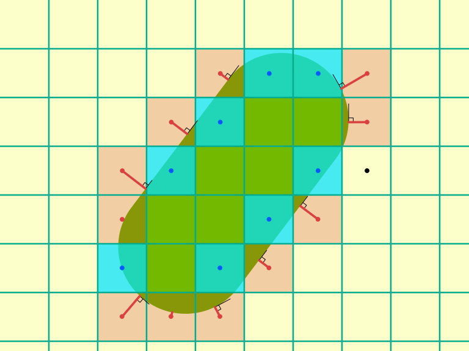

[↬ table of content ⇧](#table-of-content)

### <a id="pixel-coverage">Pixel coverage</a>

The most tricky task is to estimate pixel coverage. The _SDF_ shape is defined in _3D_ coordinates and volumes, while the screen is defined by _2D_ pixel grids and areas. The relationship between camera settings and the pixel coverage is determined by the following rules:

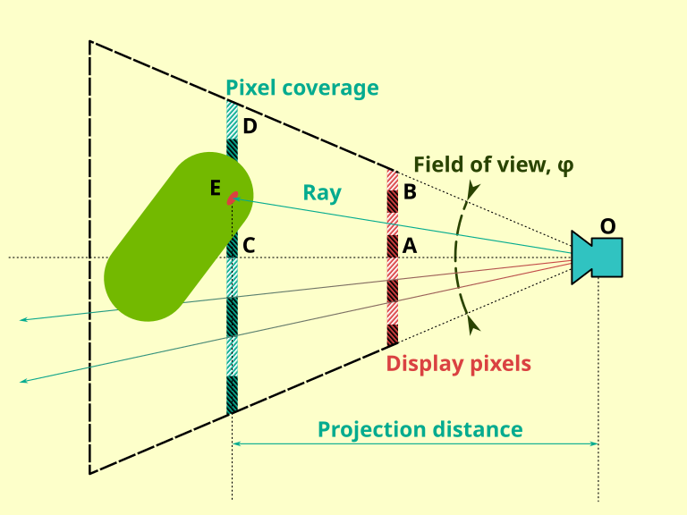

$$
\begin{aligned}
    &\tan{\frac{\varphi}{2}}=\frac{\left|CD\right|}{\left|OC\right|}                                                  \\
    &\left|OC\right|=\widehat{OC}\cdot\overrightarrow{OE}                                                             \\
    &\left|CD\right|=\left(\widehat{OC}\cdot\overrightarrow{OE}\right)\tan{\frac{\varphi}{2}}
\end{aligned}
$$

Note that we are using a half of field of view angle. No magic here. It's literally on the picture above.

$\widehat{OC}$ is the *"forward"* vector of the camera, [unit vector](https://en.wikipedia.org/wiki/Unit_vector).

Please note that the $\left|CD\right|$ is equivalent to half the vertical pixel count $\left(h\right)$. So each pixel represents a physical length of $\eta$ units:

$$
\begin{aligned}
    &\eta=\left|CD\right|\div\dfrac{h}{2}                                                                             \\
    &\eta=\dfrac{2\cdot\left|CD\right|}{h}                                                                            \\
    &\eta=\dfrac{2\left(\widehat{OC}\cdot\overrightarrow{OE}\right)\tan{\frac{\varphi}{2}}}{h}
\end{aligned}
$$

The equation above could be simplified. $\tan{\frac{\varphi}{2}}$ and $\dfrac{2}{h}$ could be precomputed and combined:

$$
\begin{aligned}
    &\alpha=\dfrac{2\tan{\frac{\varphi}{2}}}{h}                                                                       \\
    &\eta=\alpha\left(\widehat{OC}\cdot\overrightarrow{OE}\right)
\end{aligned}
$$

Another runtime optimization happens around dot product:

$$
\overrightarrow{a}\cdot\overrightarrow{b}=a_xb_x+a_yb_y+a_zb_z
$$

Imagine that $\overrightarrow{a}$ is scaled by $\lambda$:

$$
\begin{aligned}
    &\lambda\overrightarrow{a}\cdot\overrightarrow{b}=\lambda{a_x}b_x+\lambda{a_y}b_y+\lambda{a_z}b_z                 \\
    &\lambda\overrightarrow{a}\cdot\overrightarrow{b}=\lambda\left(a_xb_x+a_yb_y+a_zb_z\right)                        \\
    &\lambda\overrightarrow{a}\cdot\overrightarrow{b}=\lambda\left(\overrightarrow{a}\cdot\overrightarrow{b}\right)
\end{aligned}
$$

It's exactly the same scenario which happens with $\eta$. So it's possible to precompute $\alpha$ and $\widehat{OC}$ as $\overrightarrow{v}$. Pay attention that $\overrightarrow{v}$ is a **uniform constant** in fact. This will simplify whole equation to single dot product:

$$
\begin{aligned}
    &\overrightarrow{v}=\dfrac{2\tan{\frac{\varphi}{2}}}{h}\widehat{OC}                                               \\
    &\eta=\overrightarrow{v}\cdot\overrightarrow{OE}                                                                  \\
    &                                                                                                                 \\
    &\text{where:}                                                                                                    \\
    &\eta - \text{pixel size in scene units}                                                                          \\
    &h - \text{vertical pixel count}                                                                                  \\
    &\varphi - \text{camera field of view angle}                                                                      \\
    &\widehat{OC} - \text{camera forward direction, unit vector}                                                      \\
    &\overrightarrow{OE} - \textit{SDF}\text{ ray vector}                                                             \\
\end{aligned}
$$


At this point, a rule can be established to map _SDF_ proximity to the pixel center and transparency:

- Fully Transparent: If the _SDF_ shape proximity is greater than the pixel size relative to the pixel center.
- Fully Opaque: If the _SDF_ shape touches the pixel center.
- In all other cases, apply linear interpolation clamped between 0 and 1 to determine the final alpha.

⚠️ Anti-aliasing breaks when world to _SDF_ coordinate transformations involve scaling. Pay extra attention to $\widehat{OC}$ normalization when computing $\overrightarrow{v}$.

[↬ table of content ⇧](#table-of-content)

### <a id="threshold">Efficient ray-marching threshold</a>

When ray-marching _SDF_, many tutorials rely on a "magic constant" — typically `0.0005` — as a proximity threshold for hit detection. However, since distant objects occupy fewer pixels, a fixed threshold is often inefficient or imprecise. To maintain visual consistency, the threshold should be dynamically calculated based on the camera's field of view and the distance the ray has traveled.

The following picture shows pixel coverage for 3 zones during ray-marching:

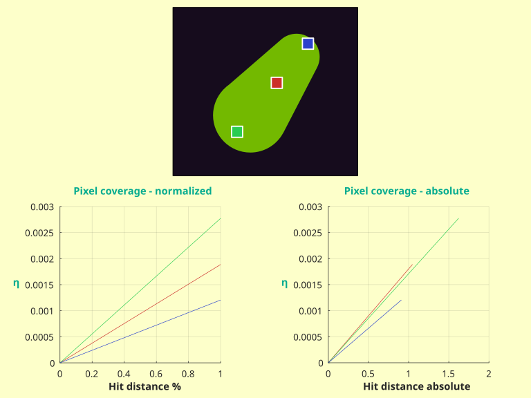

Distant _SDF_ regions are less sensitive to threshold precision, whereas areas near the camera require much higher accuracy. The image below highlights the artifacts caused by using a naive fixed threshold:

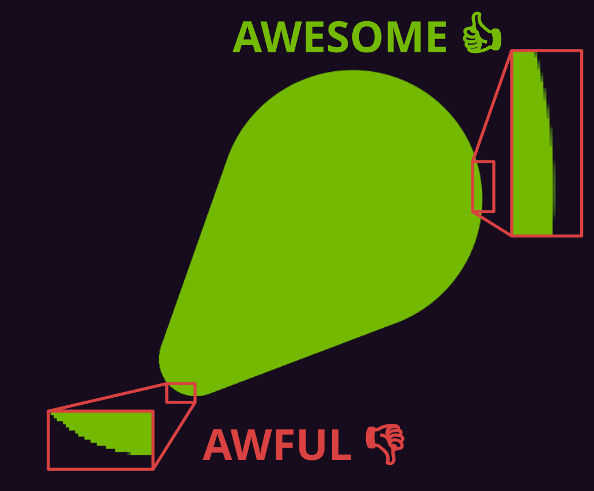

To solve this, we should use a threshold that adjusts based on pixel coverage at every step. This threshold is naturally tied to the desired alpha quantization. Using 8-bit alpha as a baseline, the algorithm defines a 'hit' when the distance to the _SDF_ surface is smaller than the ratio of pixel coverage to the available discrete alpha values.

Let’s examine the iteration distribution. It is important to note that pixels missing the _SDF_ shape are not included in this data. Note, those pixels generally reach an iteration count of `30`.

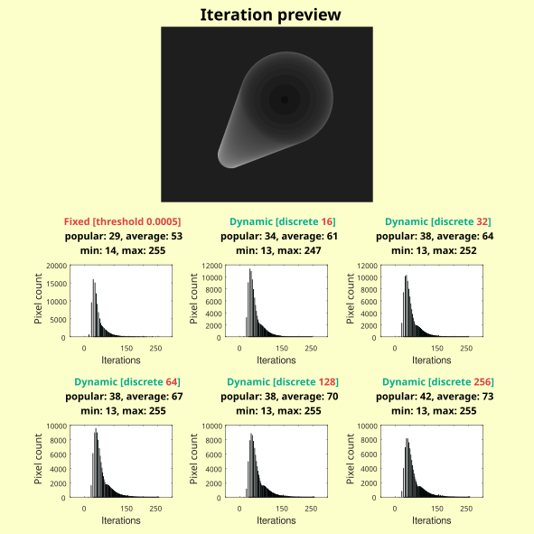

The number of alpha quantization levels clearly affects performance. Since this is highly dependent on the specific profiling environment, it is up to the individual developer to choose the configuration that best fits their needs.

[↬ table of content ⇧](#table-of-content)

## <a id="result">Final result</a>

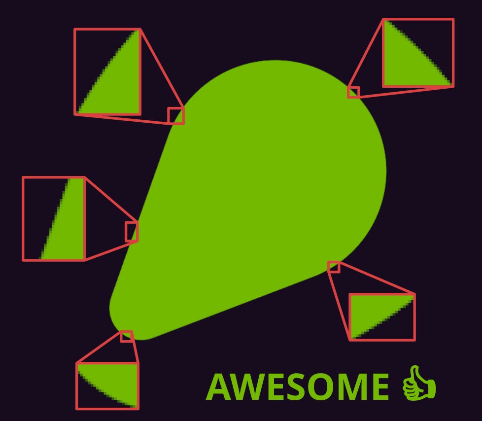

The reference shader implementation:

```cpp
// 1 / 255
#define ALPHA_8_BIT             3.92156e-3F

// 2.0F * ALPHA_8_BIT
#define INSIDE_TEST_FACTOR      7.84314e-3F

// From https://iquilezles.org/articles/distfunctions/
float32_t SDFLineSegment ( in float32_t3 p, in float32_t3 a, in float32_t3 b, in float32_t r )
{
    float32_t3 const pa = p - a;
    float32_t3 const ba = b - a;
    float32_t const h = saturate ( dot ( pa, ba ) / dot ( ba, ba ) );
    return length ( mad ( ba, -h, pa ) ) - r;
}

float32_t LinearStep ( in float32_t step, in float32_t x )
{
    float32_t const s = -step;
    return saturate ( ( x + s ) / s );
}

//----------------------------------------------------------------------------------------------------------------------

float32_t4 PS( in VertexToPixel inputData,
    in float32_t4 color,
    in float32_t3 segmentA,
    in float32_t3 segmentB,
    in float32_t segmentRadius,
    in float32_t maxDistance,
    in uint32_t maxSteps
)
{
    float32_t3 const ray = normalize ( inputData._canvas - inputData._camera );

    // precomputing part of dot product due to dot product property: dot(S * a, b) = S * dot(a, b)
    float32_t const pixelScale = dot ( ray, inputData._vi );

    // x - current distance from SDF
    // y - maximum allowed distance (camera far plane)
    float32_t2 alpha = float32_t2 ( 0.0F, maxDistance );

    // x - adjustable minimal distance to consider ray vs SDF hit
    // y - ray distance has traveled
    float32_t2 beta = (float32_t2)0.0F;

    // x - closest distance detected
    // y - closest ray length corresponding closest distance detected
    float32_t2 closest = (float32_t2)maxDistance;

    float32_t const dynamicThresholdFactor = pixelScale * ALPHA_8_BIT;

    for ( uint32_t steps = 0U; steps < maxSteps; ++steps )
    {
        alpha.x = SDFLineSegment ( mad ( ray, beta.y, inputData._camera ), segmentA, segmentB, segmentRadius );
        closest = lerp ( closest, float32_t2 ( alpha.x, beta.y ), closest.x > alpha.x );
        beta.y += alpha.x;
        beta.x = beta.y * dynamicThresholdFactor;

        if ( any ( alpha < beta ) )
        {
            break;
        }
    }

    float32_t const insideProbe = SDFLineSegment (
        mad ( ray, mad ( pixelScale * INSIDE_TEST_FACTOR, beta.y, closest.y ), inputData._camera ),
        segmentA,
        segmentB,
        segmentRadius
    );

    float32_t2 const cases = float32_t2 (
        // inside SDF shape
        color.w,

        // AA loop or outside SDF shape
        color.w * LinearStep ( closest.y * pixelScale, closest.x )
    );

    return float32_t4 ( color.xyz, cases[ (uint32_t)( insideProbe >= 0.0F ) ] );
}
```

[↬ table of content ⇧](#table-of-content)

## <a id="shell-extend">Shell extend</a>

By default there is some camera angles where anti-aliasing is missing:

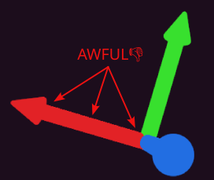

This issue occurs because the _SDF_ shell geometry lacks sufficient space to accommodate the pixel loop’s anti-aliasing transition zone. To resolve this, the shell geometry must be inflated using the following process:

- Calculate Pixel Size $\eta$: Determine the specific pixel size at each corner of the _SDF_ shell geometry using [_formula above_](#pixel-coverage).
- Apply Inflation Factor $\omega$: Use these calculated values as the inflation factor for each corresponding corner.
- Define Directionality: Ensure the corner data explicitly defines the direction of inflation.

The following image illustrates this concept applied to a box-shaped shell:

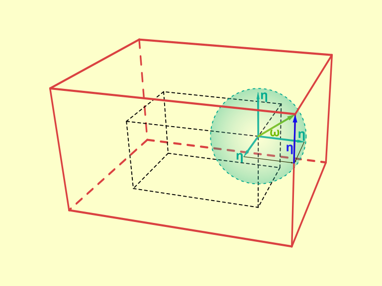

The value $\omega$ represents the length of the longest diagonal (the space diagonal) of a cube with a side length equal to the pixel size $\eta$:

$$
\begin{aligned}
    &\omega=\eta\sqrt{3}
\end{aligned}
$$


⚠️ **Crucial Note**: Ensure that the _SDF_ shell inflation direction remains independent of any scaling transformations. The inflation must ignore the object's scale to work properly.

[↬ table of content ⇧](#table-of-content)

## <a id="memory-layout">Memory layout</a>

To optimize the cache hit rate, sample data is organized to maximize spatial locality.

### <a id="samples">Samples</a>

The image is partitioned into 8x8x8 tiles (8x8 pixels across 8 layers), which are processed and stored using the following hierarchy:

**Memory Hierarchy & Layout**

- Sample Cubes: The foundational unit is a 2x2x2 cube of samples.
- Meta-Layers: Two layers are paired into a "meta-layer." Within these, samples are addressed using a Z-order pattern of sample cubes to maintain locality in 3D space.
- Tile Storage: Each tile is written to memory meta-layer by meta-layer.

**Image Layout**

Tiles themselves are arranged in a linear, row-by-row (raster) order.

**Example**

For an image size of 20x14, the data will be padded to consume a grid of 3x2 tiles.

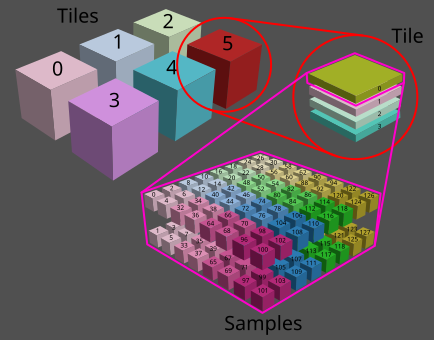

[↬ table of content ⇧](#table-of-content)

### <a id="counters">Counters</a>

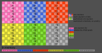

[↬ table of content ⇧](#table-of-content)

## <a id="simplification">_SDF_ simplifications</a>

[↬ table of content ⇧](#table-of-content)

### <a id="line-segment">Line segment</a>

The original formula was taken from [_iquilezles.org_](https://iquilezles.org/articles/distfunctions/)

```cpp
float32_t sdCapsule ( in float32_t3 p, in float32_t3 a, in float32_t3 b, float32_t r )
{
    float32_t3 const pa = p - a;
    float32_t3 const ba = b - a;
    float32_t const h = clamp ( dot ( pa, ba ) / dot ( ba, ba ), 0.0F, 1.0F );
    return length ( pa - ba * h ) - r;
}
```

Let's optimize it for X-axis line segment with half length $e$ and center at the origin.

$$
\begin{aligned}
    &a=\left(-e,0,0\right)                                                                                            \\
    &b=\left(e,0,0\right)                                                                                             \\
    &p=\left(p_x, p_y, p_z\right)                                                                                     \\
    &pa=\left(p_x-\left(-e\right),p_y,p_z\right)=\left(p_x+e,p_y,p_z\right)                                           \\
    &ba=\left(e-\left(-e\right),0,0\right)=\left(2e, 0, 0\right)                                                      \\
    &pa\cdot{ba}=2e\left(p_x+e\right)                                                                                 \\
    &ba\cdot{ba}=4e^2                                                                                                 \\
    &\text{------------}                                                                                              \\
    &h=saturate\left(\frac{2e\left(p_x+e\right)}{4e^2}\right)=saturate\left(\frac{p_x+e}{2e}\right)                   \\
    &h=saturate\left(\frac{p_x}{2e}+\frac{1}{2}\right)                                                                \\
    &\phi=\frac{1}{2e}                                                                                                \\
    &h=saturate\left({\phi}p_x+\frac{1}{2}\right)                                                                     \\
    &\alpha=mad\left(ba,-h,pa\right)=\left(-2he+p_x+e,p_y,p_z\right)                                                  \\
    &\alpha=\left(p_x+e\right(1-2h\left),p_y,p_z\right)                                                               \\
    &\beta=p_x+e\left(1-2h\right)                                                                                     \\
    &\left|\alpha\right|=\sqrt{{\beta}^2+{p_y}^2+{p_z}^2}                                                             \\
    &SDF=\sqrt{{\beta}^2+{p_y}^2+{p_z}^2}-r                                                                           \\
    &\text{------------}                                                                                              \\
    &\phi=\frac{1}{2e}                                                                                                \\
    &h=saturate\left({\phi}p_x+\frac{1}{2}\right)=saturate\left(mad\left(\phi, p_x, \frac{1}{2}\right)\right)         \\
    &\beta=p_x+e-2he=p_x+mad\left(h,-2e,e\right)                                                                      \\
    &\gamma=-2e                                                                                                       \\
    &\beta=p_x+mad\left(h,\gamma,e\right)                                                                             \\
    &SDF=\left|\left(\beta,p_y,p_z\right)\right|-r                                                                    \\
    &\text{------------}                                                                                              \\
    &\phi=\frac{1}{2e}                                                                                                \\
    &\gamma=-2e                                                                                                       \\
    &\lambda=-r                                                                                                       \\
    &h=saturate\left(mad\left(p_x,\phi,\frac{1}{2}\right)\right)                                                      \\
    &SDF=\lambda+\left|\left(p_x+mad\left(h,\gamma,e\right),p_y,p_z\right)\right|                                     \\
\end{aligned}
$$

[↬ table of content ⇧](#table-of-content)

## <a id="interaction">Interaction with mouse</a>

[↬ table of content ⇧](#table-of-content)

### <a id="inter-axis">Axis</a>

The core idea relies on the unique geometric properties of [_skew lines_](https://en.wikipedia.org/wiki/Skew_lines). The geometry focuses on the common perpendicular - the unique line segment that connects both skew lines at a right angle. This segment represents the shortest possible distance between them and serves as the primary "axis" for our calculations. This relationship is visualized in the illustration below:

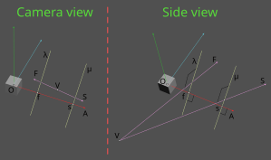

where:

- $O$ is gizmo position (📨provided)
- $\overrightarrow{A}$ is unit vector of the axis currently being manipulated by the mouse (📨provided)
- $V$ is camera position (📨provided)
- $\overrightarrow{S}$ is the unit vector representing the initial ray cast from the mouse's screen position into the 3D scene (📨provided)
- $s$ is the scalar distance along the active axis, measured from the gizmo origin to the initial 3D point of mouse interaction (🧮will be computed)
- $\overrightarrow{\mu}$ is the common perpendicular axis between the two skew lines, to solve for the distance $s$ (🧮will be computed)
- $\overrightarrow{F}$ is the unit vector representing the current ray cast from the mouse's screen position into the 3D scene (📨provided)
- $f$ is the scalar distance along the active axis, measured from the gizmo origin to the current 3D point of mouse interaction (🧮will be computed)
- $\overrightarrow{\lambda}$ is the common perpendicular axis between the two skew lines, to solve for the distance $f$ (🧮will be computed)

---

To compute the movement of the gizmo, we follow a two-stage process based on the geometry of skew lines:

**1. Initialization (first click)**

The first step is to establish the starting point. We calculate the initial distance $s$ along the axis and store the original gizmo position $O$.

**2. Update (mouse movement)**

On every frame the mouse moves, we compute the current distance $f$. The relationship between these values determines the transformation:

- displacement $d$: the scalar change is found by the difference between the current and initial distances: $d=f-s$
- direction: since $d$ is a scalar, we apply it to the unit vector $\overrightarrow{A}$ to determine the 3D displacement
- final position: the new gizmo position is calculated as $P=O+d\overrightarrow{A}$

---

**Deriving the formula**

We will now derive the formula to compute the scalar distance along the active axis by finding the shortest distance between the mouse ray and the gizmo axis.

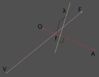

The idea is taken from [_nearest points paper_](https://en.wikipedia.org/wiki/Skew_lines#Nearest_points). The first key observation is that the direction of the common perpendicular $\overrightarrow{\lambda}$ is defined by the cross product of the two skew line directions:

$$
    \overrightarrow{\lambda}=\overrightarrow{A}\times\overrightarrow{F}
$$

**⚠️ATTENTION:** The mathematical model fails if vectors $\overrightarrow{A}$ and $\overrightarrow{F}$ are collinear. This occurs during the "edge case" where the manipulation axis aligns perfectly with the view direction. Intuitively, attempting to move an object along an axis pointing directly at the camera would result in the object "teleporting" to infinity, as the system cannot resolve depth changes from that perspective. To prevent this instability, we must implement a dot product test to detect it:

$$
    \left|\overrightarrow{A}\cdot\overrightarrow{F}\right| \lt 1
$$

Assuming the manipulation axis is not collinear with the view direction, we can proceed. Our next step is to precompute the vector $\overrightarrow{\omega}$:

$$
    \overrightarrow{\omega}=\overrightarrow{F}\times\overrightarrow{\lambda}
$$

Now the scalar distance $f$ equals:

$$
    f
    =
    \dfrac
    {
        \left(V-O\right)\cdot{\overrightarrow{\omega}}
    }
    {
        \overrightarrow{A}\cdot\overrightarrow{\omega}
    }
$$

And that's it!

[↬ table of content ⇧](#table-of-content)

### <a id="inter-plane">Plane</a>

The core concept relies on calculating the intersection of the mouse ray with the gizmo plane. This plane is defined as passing through the gizmo’s origin, with its orientation determined by one of the gizmo's primary axes acting as the plane normal.
This spatial relationship is visualized in the illustration below:

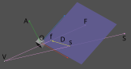

where:

- $O$ is gizmo position (📨provided)
- $\overrightarrow{A}$ is gizmo plane normal (📨provided)
- $V$ is camera position (📨provided)
- $\overrightarrow{S}$ is the unit vector representing the initial ray cast from the mouse's screen position into the 3D scene (📨provided)
- $s$ is intersection point of initial ray cast from the mouse's screen position into gizmo plane (🧮will be computed)
- $\overrightarrow{F}$ is the unit vector representing the current ray cast from the mouse's screen position into the 3D scene (📨provided)
- $f$ is intersection point of current ray cast from the mouse's screen position into gizmo plane (🧮will be computed)
- $\overrightarrow{D}$ is final displacement (🧮will be computed)

---

To compute the movement of the gizmo, we follow a two-stage process based:

**1. Initialization (first click)**

The first step is to establish the starting point. We calculate the initial intersection point $s$ along and store the original gizmo position $O$.

**2. Update (mouse movement)**

On every frame the mouse moves, we compute the current intersection point $f$. The relationship between these values determines the transformation:

- displacement $\overrightarrow{D}$: the change is found by the difference between the current and initial intersection points: $\overrightarrow{D}=f-s$
- final position: the new gizmo position is calculated as $P=O+\overrightarrow{D}$

---

**Deriving the formula**

To find intersection point of ray vs plane we gonna use the idea from the [_line–plane intersection paper_](https://en.wikipedia.org/wiki/Line%E2%80%93plane_intersection#Algebraic_form).

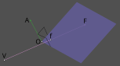

First step is to check if gizmo plane is parallel to view direction. This occurs during the "edge case" where the manipulation plane aligns perfectly with the view direction. Intuitively, attempting to move an object along an plane pointing directly at the camera would result in the object "teleporting" to infinity, as the system cannot resolve depth changes from that perspective. To prevent this instability, we must implement a dot product test to detect it:

$$
    \left|\overrightarrow{A}\cdot\overrightarrow{F}\right| \lt 1
$$

Assuming the manipulation plane is not parallel with the view direction, we can proceed. Our next step is to compute scalar distance $i$ of intersection point:

$$
    i=\dfrac{\left(O-V\right)\cdot\overrightarrow{A}}{\overrightarrow{A}\cdot\overrightarrow{F}}
$$

Now the point $f$ equals:

$$
    f=V+i\overrightarrow{F}
$$

And that's it!

[↬ table of content ⇧](#table-of-content)

### <a id="inter-ring">Ring</a>

The core idea is to find tangent line to the ring. This line will control rotation angle around ring normal. This relationship is visualized in the illustration below:

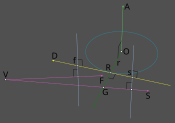

where:

- $O$ is gizmo position (📨provided)
- $\overrightarrow{A}$ is ring normal currently being manipulated by the mouse (📨provided)
- $r$ is ring radius (📨provided)
- $\overrightarrow{D}$ is tangent line direction (🧮will be computed)
- $G$ is the ring plane intersection point with the initial ray cast from the mouse's screen position into the 3D scene (🧮will be computed)
- $R$ is any fixed point on the tangent line (🧮will be computed)
- $V$ is camera position (📨provided)
- $\overrightarrow{S}$ is the unit vector representing the initial ray cast from the mouse's screen position into the 3D scene (📨provided)
- $s$ is the scalar distance along tangent line, measured from the tangent line touch point to the initial 3D point of mouse interaction (🧮will be computed)
- $\overrightarrow{F}$ is the unit vector representing the current ray cast from the mouse's screen position into the 3D scene (📨provided)
- $f$ is the scalar distance along tangent line, measured from the tangent line touch point to the current 3D point of mouse interaction (🧮will be computed)

The first step of to find intersection point of mouse initial ray $G$ with ring plane. We gonna use the idea from the [_line–plane intersection paper_](https://en.wikipedia.org/wiki/Line%E2%80%93plane_intersection#Algebraic_form).

$$
    G=V+\dfrac{\left(O-V\right)\cdot\overrightarrow{A}}{\overrightarrow{A}\cdot\overrightarrow{S}}\overrightarrow{S}
$$

The unit direction $\overrightarrow{\lambda}$ from gizmo origin to point $G$:

$$
    \overrightarrow{\lambda}=\dfrac{G-O}{\left|G-O\right|}
$$

Now it's possible to find tangent line direction $\overrightarrow{D}$:

$$
    \overrightarrow{D}=\overrightarrow{A}\times\overrightarrow{\lambda}
$$

And the point $R$ where the tangent line touches the ring:

$$
    R=O+r\overrightarrow{\lambda}
$$

**⚠️ATTENTION:** The mathematical model fails if vectors $\overrightarrow{A}$ and $\overrightarrow{S}$ are orthogonal. This occurs during the "edge case" where the manipulation ring is parallel the view direction. To test this case we should perform:

$$
    \overrightarrow{A}\cdot\overrightarrow{S} \ne 0
$$

If we are unlucky it's needed to use another approach to find direction $\overrightarrow{D}$ and point $R$. The direction $\overrightarrow{D}$ is simple. It is third axis of ring normal and camera view basis:

$$
    \overrightarrow{D}=\overrightarrow{A}\times\overrightarrow{S}
$$

Let's find $R$. We already know the tangent line direction $\overrightarrow{D}$. We gonna use the fact what gizmo control is the ring and we know it's radius $r$. We also know the direction where to move: gizmo origin $O$ and camera position $V$:

$$
    R=O+r{\dfrac{V-O}{\left|V-O\right|}}
$$

At this stage we have full information about tangent line! 🥳

Next core idea relies on the unique geometric properties of [_skew lines_](https://en.wikipedia.org/wiki/Skew_lines). The geometry focuses on the common perpendicular - the unique line segment that connects both skew lines at a right angle. This segment represents the shortest possible distance between them and serves as the primary "axis" for our calculations. So our primary goal is to compute $s$ and $f$ scalar distances.

In the end of the day to compute the rotation of the gizmo, we follow a two-stage process:

**1. Initialization (first click)**

The first step is to establish the starting point $s$. We calculate the initial intersection point $s$ along and store the original gizmo orientation $\theta$ as [_quaternion_](https://en.wikipedia.org/wiki/Quaternions_and_spatial_rotation#Using_quaternions_as_rotations).

**2. Update (mouse movement)**

On every frame the mouse moves, we compute the current intersection point $f$. The relationship between these values determines the transformation.

The change $d$ is found by the difference between the current and initial intersection points:

$$
    d=f-s
$$

We need to construct orientation change $\omega$ quaternion using [_axis-angle formula_](https://en.wikipedia.org/wiki/Quaternions_and_spatial_rotation#Using_quaternions_as_rotations). The axis is $\overrightarrow{A}$. The angle is $d$.

So the final orientation $\chi$ is:

$$
    \chi=\theta \omega
$$

Last question to answer is the formula to compute the the shortest distance between the mouse ray and the tangent line.

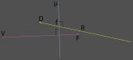

The idea is taken from [_nearest points paper_](https://en.wikipedia.org/wiki/Skew_lines#Nearest_points). The first key observation is that the direction of the common perpendicular $\overrightarrow{\mu}$ is defined by the cross product of the two skew line directions:

$$
    \overrightarrow{\mu}=\overrightarrow{D}\times\overrightarrow{F}
$$

**🥳NOTE:** The mathematical model never fails because vectors $\overrightarrow{D}$ and $\overrightarrow{F}$ are never collinear. Why? Because we handled this case previously by computing $\overrightarrow{D}$ and $R$ two ways.

Our next step is to precompute the vector $\overrightarrow{\eta}$:

$$
    \overrightarrow{\eta}=\overrightarrow{F}\times\overrightarrow{\mu}
$$

Now the scalar distance $f$ equals:

$$
    f
    =
    \dfrac
    {
        \left(V-R\right)\cdot{\overrightarrow{\eta}}
    }
    {
        \overrightarrow{D}\cdot\overrightarrow{\eta}
    }
$$

And that's it!

[↬ table of content ⇧](#table-of-content)

## <a id="limitations">Known limitations</a>

Avoid self-intersecting _SDF_ shapes with differing colors. These areas lose analytical anti-aliasing, leading to jagged edges.

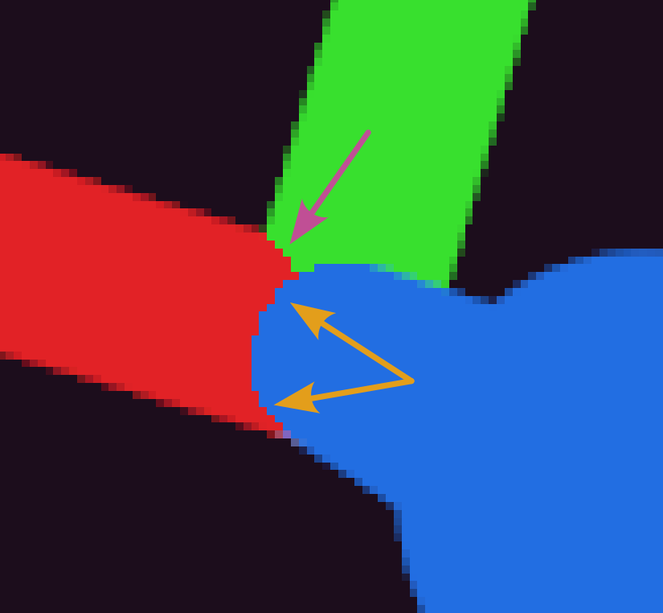

ℹ️ Suggestion: For the best visual quality, consider reassembling your geometry to eliminate overlaps.

[↬ table of content ⇧](#table-of-content)
