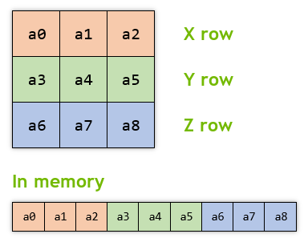

# _GXMat3_

```lua
require "av://engine/gx_mat3.lua"
```

## Table of content

- [_Brief_](#brief)
- [_Metamethods_](#metamethods)
- [`Constructor`](#constructor)
- [`GetX ( x )`](#method-get-x)
- [`GetY ( y )`](#method-get-y)
- [`GetZ ( z )`](#method-get-z)
- [`Identity ()`](#method-identity)

## <a id="brief">Brief</a>

The class represents 3x3 matrix of `float32_t` values. The matrix layout in memory looks like this:



## <a id="metamethods">Metamethods</a>

Metamethod | Used
--- | ---
`__add` | ❌
`__band` | ❌
`__bnot` | ❌
`__bor` | ❌
`__bxor` | ❌
`__call` | ✔️
`__close` | ❌
`__concat` | ✔️
`__div` | ❌
`__eq` | ❌
`__gc` | ✔️
`__idiv` | ❌
`__index` | ❌
`__le` | ❌
`__len` | ❌
`__lt` | ❌
`__mod` | ❌
`__mode` | ❌
`__mul` | ❌
`__name` | ❌
`__newindex` | ❌
`__pow` | ❌
`__shl` | ❌
`__shr` | ❌
`__sub` | ❌
`__tostring` | ✔️
`__unm` | ❌

## <a id="constructor">`Constructor`</a>

Constructor creates new object with undefined initial values.

**Parameters:**

- none

**Example:**

```lua
require "av://engine/gx_mat3.lua"


local m = GXMat3 ()
```

## <a id="method-get-x">`GetX ( x )`</a>

Method writes the [_X_ row](#brief) of current matrix to the supplied `x` vector of the [_GXVec3_](./gx-vec3.md) type.

**Parameters:**

- `x` [_required, writeonly, [_GXVec3_](./gx-vec3.md)_]: target vector

**Return values:**

- none

**Example:**

```lua
require "av://engine/gx_mat3.lua"


local m = GXMat3 ()
m:Identity ()

local v = GXVec3 ()
m:GetX ( v )
```

## <a id="method-get-y">`GetY ( y )`</a>

Method writes the [_Y_ row](#brief) of current matrix to the supplied `y` vector of the [_GXVec3_](./gx-vec3.md) type.

**Parameters:**

- `y` [_required, writeonly, [_GXVec3_](./gx-vec3.md)_]: target vector

**Return values:**

- none

**Example:**

```lua
require "av://engine/gx_mat3.lua"


local m = GXMat3 ()
m:Identity ()

local v = GXVec3 ()
m:GetY ( v )
```

## <a id="method-get-z">`GetZ ( z )`</a>

Method writes the [_Z_ row](#brief) of current matrix to the supplied `z` vector of the [_GXVec3_](./gx-vec3.md) type.

**Parameters:**

- `z` [_required, writeonly, [_GXVec3_](./gx-vec3.md)_]: target vector

**Return values:**

- none

**Example:**

```lua
require "av://engine/gx_mat4.lua"


local m = GXMat3 ()
m:Identity ()

local v = GXVec3 ()
m:GetZ ( v )
```

## <a id="method-identity">`Identity ()`</a>

Method initializes the matrix as [identity matrix](https://en.wikipedia.org/wiki/Identity_matrix).

**Parameters:**

- none

**Return values:**

- none

**Example:**

```lua
require "av://engine/gx_mat3.lua"


local m = GXMat3 ()
m:Identity ()
```
