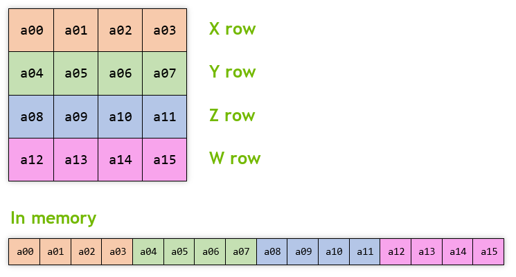

# _GXMat4_

```lua
require "av://engine/gx_mat4.lua"
```

## <a id="table-of-content">Table of content</a>

- [_Brief_](#brief)
- [_Metamethods_](#metamethods)
- [`Constructor`](#constructor)
- [`Clone ( other )`](#method-clone)
- [`FromFast ( unitQuaternion, origin )`](#method-from-fast)
- [`GetX ( x )`](#method-get-x)
- [`GetY ( y )`](#method-get-y)
- [`GetZ ( z )`](#method-get-z)
- [`GetW ( w )`](#method-get-w)
- [`Identity ()`](#method-identity)
- [`Inverse ( sourceMatrix )`](#method-inverse)
- [`Multiply ( a, b )`](#method-multiply)
- [`MultiplyMatrixVector ( out, v )`](#method-multiply-matrix-vector)
- [`MultiplyAsNormal ( out, v )`](#method-multiply-as-normal)
- [`MultiplyAsPoint ( out, v )`](#method-multiply-as-point)
- [`MultiplyVectorMatrix ( out, v )`](#method-multiply-vector-matrix)
- [`Perspective ( fieldOfViewYRadians, aspectRatio, zNear, zFar )`](#method-perspective)
- [`RotationX ( angle )`](#method-rotation-x)
- [`RotationY ( angle )`](#method-rotation-y)
- [`RotationZ ( angle )`](#method-rotation-z)
- [`Scale ( x, y, z )`](#method-scale)
- [`SetX ( x )`](#method-set-x)
- [`SetY ( y )`](#method-set-y)
- [`SetZ ( z )`](#method-set-z)
- [`SetW ( w )`](#method-set-w)
- [`Translation ( x, y, z )`](#method-translation)

## <a id="brief">Brief</a>

The class represents 4x4 matrix of `float32_t` values. The matrix layout in memory looks like this:



Usually matrix class is used in _3D_ transformations. So by convention the matrix multiplication must be in direct order:

`{vertex} x {transform #1} x {transform #2} x ...`

It's possible because internal construction of scale, translation, rotation and projection transformations. For example classical **_model|view|projection_** transform looks like this in _Lua_:

```lua
require "av://engine/gx_mat4.lua"


local m = GXMat4 ()
m:RotationX ( math.rad ( 33.3 ) )

local camera = GXMat4 ()
camera:Translation ( -77.0, 0.0, 0.0 )

local v = GXMat4 ()
v:Inverse ( camera )

local fov = 90.0
local width = 1920.0
local height = 1080.0
local p = GXMat4 ()
p:Perspective ( math.rad ( fov ), width / height, 1.0, 77777.77 )

local mv = GXMat4 ()
mv:Multiply ( m, v )

local mvp = GXMat4 ()
mvp:Multiply ( mv, p )

local vertexLocal = GXVec4 ()
vertexLocal:Init ( 7.0, 3.3, 0.0, 1.0 )

local vertexCVV = GXVec4 ()
mvp:MultiplyVectorMatrix ( vertexCVV, vertexLocal )
```

[↬ table of content ⇧](#table-of-content)

## <a id="metamethods">Metamethods</a>

Metamethod | Used
--- | ---
`__add` | ❌
`__band` | ❌
`__bnot` | ❌
`__bor` | ❌
`__bxor` | ❌
`__call` | ✔️
`__close` | ❌
`__concat` | ✔️
`__div` | ❌
`__eq` | ❌
`__gc` | ✔️
`__idiv` | ❌
`__index` | ❌
`__le` | ❌
`__len` | ❌
`__lt` | ❌
`__mod` | ❌
`__mode` | ❌
`__mul` | ❌
`__name` | ❌
`__newindex` | ❌
`__pow` | ❌
`__shl` | ❌
`__shr` | ❌
`__sub` | ❌
`__tostring` | ✔️
`__unm` | ❌

[↬ table of content ⇧](#table-of-content)

## <a id="constructor">`Constructor`</a>

Constructor creates new object with undefined initial values.

**Parameters:**

- none

**Example:**

```lua
require "av://engine/gx_mat4.lua"


local m = GXMat4 ()
```

[↬ table of content ⇧](#table-of-content)

## <a id="method-clone">`Clone ( other )`</a>

Method clones content of matrix to the current matrix.

**Parameters:**

- `other` [_required, readonly, [GXMat4](./gx-mat4.md)_]: matrix to clone

**Return values:**

- none

**Example:**

```lua
require "av://engine/gx_quat.lua"


local axis = GXVec3 ()
axis:Init ( 7.77, 3.33, 1.0 )
axis:Normalize ()

local rotation = GXQuat ()
rotation:FromAxisAngle ( axis, math.rad ( 77.7 ) )

local origin = GXVec3 ()
origin:Init ( 1.0, 333.0, 0.0 )

local transform = GXMat4 ()
transform:FromFast ( rotation, origin )

local transformCopy = GXMat4 ()
transformCopy:Clone ( transform )
```

[↬ table of content ⇧](#table-of-content)

## <a id="method-from-fast">`FromFast ( unitQuaternion, origin )`</a>

Method initializes the matrix with composite rotation and translation transformation.

**Note:** Result is valid if `unitQuaternion` is [normalized](https://en.wikipedia.org/wiki/Quaternion#Unit_quaternion).

**Parameters:**

- `unitQuaternion` [_required, readonly, [GXQuat](./gx-quat.md)_]: rotation which is represented by [quaternion](https://en.wikipedia.org/wiki/Quaternion)
- `origin` [_required, readonly, [GXVec3](./gx-vec3.md)_]: the coordinate of the origin of result transformation

**Return values:**

- none

**Example:**

```lua
require "av://engine/gx_quat.lua"


local axis = GXVec3 ()
axis:Init ( 7.77, 3.33, 1.0 )
axis:Normalize ()

local rotation = GXQuat ()
rotation:FromAxisAngle ( axis, math.rad ( 77.7 ) )

local origin = GXVec3 ()
origin:Init ( 1.0, 333.0, 0.0 )

local transform = GXMat4 ()
transform:FromFast ( rotation, origin )
```

[↬ table of content ⇧](#table-of-content)

## <a id="method-get-x">`GetX ( x )`</a>

Method writes first three components of the [_X_ row](#brief) of current matrix to the supplied `x` vector of the [_GXVec3_](./gx-vec3.md) type.

**Parameters:**

- `x` [_required, writeonly, [_GXVec3_](./gx-vec3.md)_]: target vector

**Return values:**

- none

**Example:**

```lua
require "av://engine/gx_mat4.lua"


local m = GXMat4 ()
m:RotationX ( math.rad ( 33.3 ) )

local v = GXVec3 ()
m:GetX ( v )
```

[↬ table of content ⇧](#table-of-content)

## <a id="method-get-y">`GetY ( y )`</a>

Method writes first three components of the [_Y_ row](#brief) of current matrix to the supplied `y` vector of the [_GXVec3_](./gx-vec3.md) type.

**Parameters:**

- `y` [_required, writeonly, [_GXVec3_](./gx-vec3.md)_]: target vector

**Return values:**

- none

**Example:**

```lua
require "av://engine/gx_mat4.lua"


local m = GXMat4 ()
m:RotationX ( math.rad ( 33.3 ) )

local v = GXVec3 ()
m:GetY ( v )
```

[↬ table of content ⇧](#table-of-content)

## <a id="method-get-z">`GetZ ( z )`</a>

Method writes first three components of the [_Z_ row](#brief) of current matrix to the supplied `z` vector of the [_GXVec3_](./gx-vec3.md) type.

**Parameters:**

- `z` [_required, writeonly, [_GXVec3_](./gx-vec3.md)_]: target vector

**Return values:**

- none

**Example:**

```lua
require "av://engine/gx_mat4.lua"


local m = GXMat4 ()
m:RotationX ( math.rad ( 33.3 ) )

local v = GXVec3 ()
m:GetZ ( v )
```

[↬ table of content ⇧](#table-of-content)

## <a id="method-get-w">`GetW ( w )`</a>

Method writes first three components of the [_W_ row](#brief) of current matrix to the supplied `w` vector of the [_GXVec3_](./gx-vec3.md) type.

**Parameters:**

- `w` [_required, writeonly, [_GXVec3_](./gx-vec3.md)_]: target vector

**Return values:**

- none

**Example:**

```lua
require "av://engine/gx_mat4.lua"


local m = GXMat4 ()
m:RotationX ( math.rad ( 33.3 ) )

local v = GXVec3 ()
m:GetW ( v )
```

[↬ table of content ⇧](#table-of-content)

## <a id="method-identity">`Identity ()`</a>

Method initializes the matrix as [identity matrix](https://en.wikipedia.org/wiki/Identity_matrix).

**Parameters:**

- none

**Return values:**

- none

**Example:**

```lua
require "av://engine/gx_mat4.lua"


local p = GXMat4 ()
p:Identity ()
```

[↬ table of content ⇧](#table-of-content)

## <a id="method-inverse">`Inverse ( sourceMatrix )`</a>

Method initializes the matrix as [inverse matrix](https://en.wikipedia.org/wiki/Invertible_matrix) to `sourceMatrix` matrix. `sourceMatrix` matrix is not changed during the operation.

**Parameters:**

- `sourceMatrix` [_required, readonly, [GXMat4](./gx-mat4.md)_]: matrix to inverse

**Return values:**

- none

**Example:**

```lua
require "av://engine/gx_mat4.lua"


local m = GXMat4 ()
m:RotationX ( math.rad ( 77.7 ) )

local i = GXMat4 ()
i:Inverse ( m )
```

[↬ table of content ⇧](#table-of-content)

## <a id="method-multiply">`Multiply ( a, b )`</a>

Method initializes the matrix as a product of the matrix multiplication `a` x `b` according classical [matrix multiplication rules](https://en.wikipedia.org/wiki/Matrix_multiplication#Definition).

**Parameters:**

- `a` [_required, readonly, [GXMat4](./gx-mat4.md)_]: left matrix
- `b` [_required, readonly, [GXMat4](./gx-mat4.md)_]: right matrix

**Return values:**

- none

**Example:**

```lua
require "av://engine/gx_mat4.lua"


local a = GXMat4 ()
a:RotationX ( math.rad ( 77.7 ) )

local fov = 90.0
local width = 1920.0
local height = 1080.0

local b = GXMat4 ()
b:Perspective ( math.rad ( fov ), width / height, 1.0, 77777.77 )

local m = GXMat4 ()
m:Multiply ( a, b )
```

[↬ table of content ⇧](#table-of-content)

## <a id="method-multiply-matrix-vector">`MultiplyMatrixVector ( out, v )`</a>

Method performs matrix-vector multiplication of current matrix `self` and `v` [column-vector](https://en.wikipedia.org/wiki/Row_and_column_vectors): `self` x `v`. The result is written to the `out` [column-vector](https://en.wikipedia.org/wiki/Row_and_column_vectors).

**Parameters:**

- `out` [_required, writeonly, [GXVec4](./gx-vec4.md)_]: result [column-vector](https://en.wikipedia.org/wiki/Row_and_column_vectors)
- `v` [_required, readonly, [GXVec4](./gx-vec4.md)_]: source [column-vector](https://en.wikipedia.org/wiki/Row_and_column_vectors)

**Return values:**

- none

**Example:**

```lua
require "av://engine/gx_mat4.lua"


local v0 = GXVec4 ()
v0:Init ( 1.0, 777.0, 33.3, 1.0 )

local m = GXMat4 ()
m:RotationX ( math.rad ( 33.3 ) )

local v1 = GXVec4 ()
m:MultiplyMatrixVector ( v1, v0 )
```

[↬ table of content ⇧](#table-of-content)

## <a id="method-multiply-as-normal">`MultiplyAsNormal ( out, v )`</a>

Method applies rotation and scale transforms of current matrix to vector `v` and writes the result to vector `out`. 

**Parameters:**

- `out` [_required, writeonly, [GXVec3](./gx-vec3.md)_]: result vector
- `v` [_required, readonly, [GXVec3](./gx-vec3.md)_]: source vector

**Return values:**

- none

**Example:**

```lua
require "av://engine/gx_mat4.lua"


local v = GXVec3 ()
v:Init ( 1.0, 777.0, 33.3 )

local r = GXMat4 ()
r:RotationX ( math.rad ( 77.7 ) )

local n = GXVec3 ()
r:MultiplyAsNormal ( n, v )
```

[↬ table of content ⇧](#table-of-content)

## <a id="method-multiply-as-point">`MultiplyAsPoint ( out, v )`</a>

Method applies rotation, scale and translation transforms of current matrix to vector `v` and writes the result to vector `out`. 

**Parameters:**

- `out` [_required, writeonly, [GXVec3](./gx-vec3.md)_]: result vector
- `v` [_required, readonly, [GXVec3](./gx-vec3.md)_]: source vector

**Return values:**

- none

**Example:**

```lua
require "av://engine/gx_mat4.lua"


local vLocal = GXVec3 ()
vLocal:Init ( 1.0, 777.0, 33.3 )

local m = GXMat4 ()
m:RotationX ( math.rad ( 33.3 ) )

local camera = GXMat4 ()
camera:Translation ( 77.0, -10.0, 3.33 )

local v = GXMat4 ()
v:Inverse ( camera )

local mv = GXMat4 ()
mv:Multiply ( m, v )

local vView = GXVec3 ()
mv:MultiplyAsPoint ( vView, vLocal )
```

[↬ table of content ⇧](#table-of-content)

## <a id="method-multiply-vector-matrix">`MultiplyVectorMatrix ( out, v )`</a>

Method performs vector-matrix multiplication of `v` [row-vector](https://en.wikipedia.org/wiki/Row_and_column_vectors) and current matrix `self`: `v` x `self`. The result is written to the `out` [row-vector](https://en.wikipedia.org/wiki/Row_and_column_vectors).

**Parameters:**

- `out` [_required, writeonly, [GXVec4](./gx-vec4.md)_]: result [row-vector](https://en.wikipedia.org/wiki/Row_and_column_vectors)
- `v` [_required, readonly, [GXVec4](./gx-vec4.md)_]: source [row-vector](https://en.wikipedia.org/wiki/Row_and_column_vectors)

**Return values:**

- none

**Example:**

```lua
require "av://engine/gx_mat4.lua"


local m = GXMat4 ()
m:RotationX ( math.rad ( 33.3 ) )

local camera = GXMat4 ()
camera:Translation ( -77.0, 0.0, 0.0 )

local v = GXMat4 ()
v:Inverse ( camera )

local fov = 90.0
local width = 1920.0
local height = 1080.0
local p = GXMat4 ()
p:Perspective ( math.rad ( fov ), width / height, 1.0, 77777.77 )

local mv = GXMat4 ()
mv:Multiply ( m, v )

local mvp = GXMat4 ()
mvp:Multiply ( mv, p )

local vertexLocal = GXVec4 ()
vertexLocal:Init ( 7.0, 3.3, 0.0, 1.0 )

local vertexCVV = GXVec4 ()
mvp:MultiplyVectorMatrix ( vertexCVV, vertexLocal )
```

[↬ table of content ⇧](#table-of-content)

## <a id="method-perspective">`Perspective ( fieldOfViewYRadians, aspectRatio, zNear, zFar )`</a>

Method initializes the matrix with _Vulkan CVV_ perspective transformation.

**Parameters:**

- `fieldOfViewYRadians` [_required, readonly, number_]: view angle in vertical direction in [radians](https://en.wikipedia.org/wiki/Radian)
- `aspectRatio` [_required, readonly, number_]: the aspect ratio of the viewport
- `zNear` [_required, readonly, number_]: the distance to the near cutting plane
- `zFar` [_required, readonly, number_]: the distance to the far cutting plane

**Return values:**

- none

**Example:**

```lua
require "av://engine/gx_mat4.lua"


local fov = 90.0
local width = 1920.0
local height = 1080.0

local p = GXMat4 ()
p:Perspective ( math.rad ( fov ), width / height, 1.0, 77777.77 )
```

[↬ table of content ⇧](#table-of-content)

## <a id="method-rotation-x">`RotationX ( angle )`</a>

Method initializes the current matrix as rotation transform about _X_-axis.

**Parameters:**

- `angle` [_required, readonly, number_]: rotation angle about _X_-axis in [radians](https://en.wikipedia.org/wiki/Radian)

**Return values:**

- none

**Example:**

```lua
require "av://engine/gx_mat4.lua"


local r = GXMat4 ()
r:RotationX ( math.rad ( 33.3 ) )
```

[↬ table of content ⇧](#table-of-content)

## <a id="method-rotation-y">`RotationY ( angle )`</a>

Method initializes the current matrix as rotation transform about _Y_-axis.

**Parameters:**

- `angle` [_required, readonly, number_]: rotation angle about _Y_-axis in [radians](https://en.wikipedia.org/wiki/Radian)

**Return values:**

- none

**Example:**

```lua
require "av://engine/gx_mat4.lua"


local r = GXMat4 ()
r:RotationY ( math.rad ( 33.3 ) )
```

[↬ table of content ⇧](#table-of-content)

## <a id="method-rotation-z">`RotationZ ( angle )`</a>

Method initializes the current matrix as rotation transform about _Z_-axis.

**Parameters:**

- `angle` [_required, readonly, number_]: rotation angle about _Z_-axis in [radians](https://en.wikipedia.org/wiki/Radian)

**Return values:**

- none

**Example:**

```lua
require "av://engine/gx_mat4.lua"


local r = GXMat4 ()
r:RotationZ ( math.rad ( 33.3 ) )
```

[↬ table of content ⇧](#table-of-content)

## <a id="method-scale">`Scale ( x, y, z )`</a>

Method initializes the matrix with scale transformation.

**Parameters:**

- `x` [_required, readonly, number_]: _X_-axis scale value
- `y` [_required, readonly, number_]: _Y_-axis scale value
- `z` [_required, readonly, number_]: _Z_-axis scale value

**Return values:**

- none

**Example:**

```lua
require "av://engine/gx_mat4.lua"


local s = GXMat4 ()
s:Scale ( 77.7, 3.33, 1.0 )
```

[↬ table of content ⇧](#table-of-content)

## <a id="method-set-x">`SetX ( x )`</a>

Method sets first three components of the [_X_ row](#brief) of current matrix from the supplied `x` vector of the [_GXVec3_](./gx-vec3.md) type.

**Parameters:**

- `x` [_required, readonly, [_GXVec3_](./gx-vec3.md)_]: source vector

**Return values:**

- none

**Example:**

```lua
require "av://engine/gx_mat4.lua"


local v = GXVec3 ()
v:Init ( 1.0, 777.0, 33.3 )

local m = GXMat4 ()
m:RotationX ( math.rad ( 33.3 ) )
m:SetX ( v )
```

[↬ table of content ⇧](#table-of-content)

## <a id="method-set-y">`SetY ( y )`</a>

Method sets first three components of the [_Y_ row](#brief) of current matrix from the supplied `y` vector of the [_GXVec3_](./gx-vec3.md) type.

**Parameters:**

- `y` [_required, readonly, [_GXVec3_](./gx-vec3.md)_]: source vector

**Return values:**

- none

**Example:**

```lua
require "av://engine/gx_mat4.lua"


local v = GXVec3 ()
v:Init ( 1.0, 777.0, 33.3 )

local m = GXMat4 ()
m:RotationX ( math.rad ( 33.3 ) )
m:SetY ( v )
```

[↬ table of content ⇧](#table-of-content)

## <a id="method-set-z">`SetZ ( z )`</a>

Method sets first three components of the [_Z_ row](#brief) of current matrix from the supplied `z` vector of the [_GXVec3_](./gx-vec3.md) type.

**Parameters:**

- `z` [_required, readonly, [_GXVec3_](./gx-vec3.md)_]: source vector

**Return values:**

- none

**Example:**

```lua
require "av://engine/gx_mat4.lua"


local v = GXVec3 ()
v:Init ( 1.0, 777.0, 33.3 )

local m = GXMat4 ()
m:RotationX ( math.rad ( 33.3 ) )
m:SetZ ( v )
```

[↬ table of content ⇧](#table-of-content)

## <a id="method-set-w">`SetW ( w )`</a>

Method sets first three components of the [_W_ row](#brief) of current matrix from the supplied `w` vector of the [_GXVec3_](./gx-vec3.md) type.

**Parameters:**

- `w` [_required, readonly, [_GXVec3_](./gx-vec3.md)_]: source vector

**Return values:**

- none

**Example:**

```lua
require "av://engine/gx_mat4.lua"


local v = GXVec3 ()
v:Init ( 1.0, 777.0, 33.3 )

local m = GXMat4 ()
m:RotationX ( math.rad ( 33.3 ) )
m:SetW ( v )
```

[↬ table of content ⇧](#table-of-content)

## <a id="method-translation">`Translation ( x, y, z )`</a>

Method initializes the current matrix as translation transformation.

**Parameters:**

- `x` [_required, readonly, number_]: _X_-coordinate of the origin
- `y` [_required, readonly, number_]: _Y_-coordinate of the origin
- `z` [_required, readonly, number_]: _Z_-coordinate of the origin

**Return values:**

- none

**Example:**

```lua
require "av://engine/gx_mat4.lua"


local s = GXMat4 ()
s:Translation ( 77.7, 3.33, 1.0 )
```

[↬ table of content ⇧](#table-of-content)
