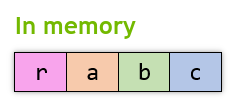

# _GXQuat_

```lua
require "av://engine/gx_quat.lua"
```

## Table of content

- [_Brief_](#brief)
- [_Metamethods_](#metamethods)
- [`Constructor`](#constructor)
- [`FromAxisAngle ( axis, angle )`](#method-from-axis-angle)
- [`Multiply ( a, b )`](#method-multiply)
- [`Normalize ()`](#method-normalize)
- [`TransformFast ( out, v )`](#method-transfrom-fast)

## <a id="brief">Brief</a>

The class represents [quaternion](https://en.wikipedia.org/wiki/Quaternion): `r` + `a`_i_ + `b`_j_ + `c`_k_. The quaternion layout looks like this:



## <a id="metamethods">Metamethods</a>

Metamethod | Used
--- | ---
`__add` | ❌
`__band` | ❌
`__bnot` | ❌
`__bor` | ❌
`__bxor` | ❌
`__call` | ✔️
`__close` | ❌
`__concat` | ✔️
`__div` | ❌
`__eq` | ❌
`__gc` | ✔️
`__idiv` | ❌
`__index` | ❌
`__le` | ❌
`__len` | ❌
`__lt` | ❌
`__mod` | ❌
`__mode` | ❌
`__mul` | ❌
`__name` | ❌
`__newindex` | ❌
`__pow` | ❌
`__shl` | ❌
`__shr` | ❌
`__sub` | ❌
`__tostring` | ✔️
`__unm` | ❌

## <a id="constructor">`Constructor`</a>

Constructor creates new object with undefined initial values.

**Parameters:**

- none

**Example:**

```lua
require "av://engine/gx_quat.lua"


local q = GXQuat ()
```

## <a id="method-from-axis-angle">`FromAxisAngle ( axis, angle )`</a>

Method constructs [quaternion](https://en.wikipedia.org/wiki/Quaternion) from specified `axis` and `angle` values.

**Note:** The `axis` must be a [unit vector](https://en.wikipedia.org/wiki/Unit_vector).

**Parameters:**

- `axis` [_required, readonly, [GXVec3](./gx-vec3.md)_]: [unit vector](https://en.wikipedia.org/wiki/Unit_vector) axis of rotation
- `angle` [_required, readonly, number_]: angle of rotation in [radians](https://en.wikipedia.org/wiki/Radian)

**Return values:**

- none

**Example:**

```lua
require "av://engine/gx_quat.lua"


local v = GXVec3 ()
v:Init ( 7.77, 3.33, 1.0 )
v:Normalize ()

local q = GXQuat ()
q:FromAxisAngle ( v, math.rad ( 77.7 ) )
```

## <a id="method-multiply">`Multiply ( a, b )`</a>

Method initializes the [quaternion](https://en.wikipedia.org/wiki/Quaternion) as a product of the quaternion multiplication `a` x `b` according [_Hamilton_ product rules](https://en.wikipedia.org/wiki/Quaternion#Hamilton_product).

**Parameters:**

- `a` [_required, readonly, [GXQuat](./gx-quat.md)_]: left [quaternion](https://en.wikipedia.org/wiki/Quaternion)
- `b` [_required, readonly, [GXQuat](./gx-quat.md)_]: right [quaternion](https://en.wikipedia.org/wiki/Quaternion)

**Return values:**

- none

**Example:**

```lua
require "av://engine/gx_quat.lua"


local v0 = GXVec3 ()
v0:Init ( 7.77, 3.33, 1.0 )
v0:Normalize ()

local q0 = GXQuat ()
q0:FromAxisAngle ( v0, math.rad ( 77.7 ) )

local v1 = GXVec3 ()
v1:Init ( -1.0, 0.77, -3.0 )
v1:Normalize ()

local q1 = GXQuat ()
q1:FromAxisAngle ( v1, math.rad ( -33.3 ) )

local q2 = GXQuat ()
q2:Multiply ( q1, q0 )
```

## <a id="method-normalize">`Normalize ()`</a>

Method normalizes the current [quaternion](https://en.wikipedia.org/wiki/Quaternion).

**Parameters:**

- none

**Return values:**

- none

**Example:**

```lua
require "av://engine/gx_quat.lua"


local v0 = GXVec3 ()
v0:Init ( 7.77, 3.33, 1.0 )
v0:Normalize ()

local q0 = GXQuat ()
q0:FromAxisAngle ( v0, math.rad ( 77.7 ) )

local v1 = GXVec3 ()
v1:Init ( -1.0, 0.77, -3.0 )
v1:Normalize ()

local q1 = GXQuat ()
q1:FromAxisAngle ( v1, math.rad ( -33.3 ) )

local q2 = GXQuat ()
q2:Multiply ( q1, q0 )
q2:Normalize ()
```

## <a id="method-transfrom-fast">`TransformFast ( out, v )`</a>

Method applies current [quaternion](https://en.wikipedia.org/wiki/Quaternion) transformation to specified `v` vector of the [_GXVec3_](./gx-vec3.md) type according to [_sandwich rule_](https://en.wikipedia.org/wiki/Quaternions_and_spatial_rotation#Using_quaternions_as_rotations). The result is written to `out` vector of the [_GXVec3_](./gx-vec3.md) type.

**Note:** Result is valid if current [quaternion](https://en.wikipedia.org/wiki/Quaternion) is [normalized](https://en.wikipedia.org/wiki/Quaternion#Unit_quaternion).

**Parameters:**

- `out` [_required, writeonly, [GXVec3](./gx-vec3.md)_]: result vector
- `v` [_required, readonly, [GXVec3](./gx-vec3.md)_]: source vector

**Return values:**

- none

**Example:**

```lua
require "av://engine/gx_quat.lua"


local axis = GXVec3 ()
axis:Init ( 7.77, 3.33, 1.0 )
axis:Normalize ()

local q = GXQuat ()
q:FromAxisAngle ( axis, math.rad ( 77.7 ) )

local v0 = GXVec3 ()
v0:Init ( -1.0, 0.77, -3.0 )

local v1 = GXVec3 ()
q:TransformFast ( v1, v0 )
```
