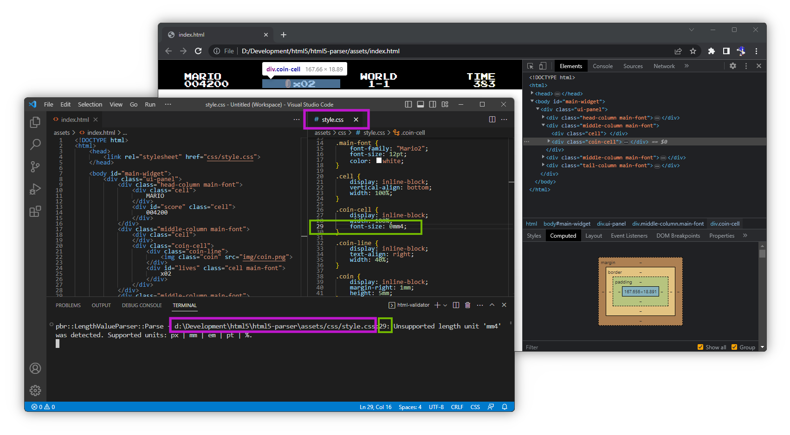

# _HTML_ validator

## <a id="table-of-content">Table of content</a>

- [_Brief_](#brief)
- [_How to use_](#how-to-use)
- [_How to build_](#how-to-build)
  - [_Requirements_](#requirements)
  - [_Source code_](#source-code)

## <a id="brief">Brief</a>

_HTML_ validator tool assists the content creator during the process of creating _HTML_ layout for _UI_ assets. The tool periodically checks whole _HTML_ and _CSS_ files and notifies the creator about detected problems. Creator could work with files while the tool performs all checks in background. Usually the process looks like this:



[↬ table of content ⇧](#table-of-content)

## <a id="how-to-use">How to use</a>

The tool is located in

`<repo>/tools/bin/html-validator.exe`

To start the validation process call the program with single parameter - full path to main _HTML_ file:

```cmd
html-validator.exe <path to HTML file>
```

For example:

```cmd
html-validator.exe "D:\Development\html5\assets\index.html"
```

Or just drag'n'drop main _HTML_ file on `html-validator.exe`.

[↬ table of content ⇧](#table-of-content)

## <a id="how-to-build">How to build</a>

### <a id="requirements">Requirements</a>

- _Windows 10+_
- _Visual Studio 2022 Community 17.10.0_
- _Desktop development with C++_
- _MSBuild_
- _MSVC v143 - VS 2022 C++ x64/x86 build tools (v14.40-17.10)_
- _Windows Universal CRT SDK_
- _C++ core features_
- _Windows 11 SDK (10.0.22621.0)_
- _Windows Universal C Runtime_
- _CMake 3.22.1_

### <a id="source-code">Source code</a>

The project file is written on _CMake_. It's located in

`<repo>/tools/html-validator/CMakeLists.txt`

It's expected that the project will build out of the box for toolchain from [_requirements_](#requirements).

[↬ table of content ⇧](#table-of-content)
