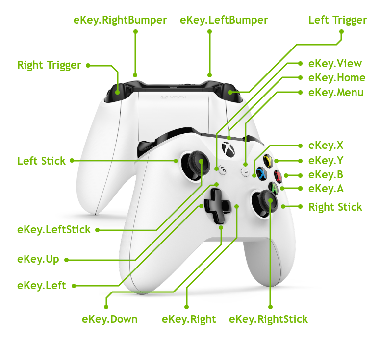

# _InputEvent_

```lua
require "av://engine/input_event.lua"
```

## <a id="table-of-content">Table of content</a>

- [_Brief_](#brief)
- [_Key event_](#key-event)
- [_Stick event_](#stick-event)
- [_Trigger event_](#trigger-event)

## <a id="brief">Brief</a>

The engine supports controller input events. The official supported controller is [_XBOX ONE S model_](https://en.wikipedia.org/wiki/Xbox_Wireless_Controller#Second_revision_(2016)) via [_Bluetooth_](https://en.wikipedia.org/wiki/Bluetooth) connection. Other controllers might work but not tested.

The controller layout is the following:



The input events are handled by user scripts via user provided [_ScriptComponent:OnInput_](./script-component.md#method-on-input) handler.

As you can see there are several types of events which controller could produce:

- Analog events
- Digital events

The analog events are the stick events and trigger events. They contain the state which is described by floating point values. The digital events are button events. They contain state which is described by boolean values.

[↬ table of content ⇧](#table-of-content)

## <a id="key-event">Key event</a>

The key event is a _digital event_ and is described by the following table:

```lua
InputEvent = {
    _type = ...,
    _key = ...
}
```

The `_type` could be `eEventType.KeyDown` or `eEventType.KeyUp`.

The `_key` state could be one of the following values:

- `eKey.A`
- `eKey.B`
- `eKey.X`
- `eKey.Y`
- `eKey.Down`
- `eKey.Left`
- `eKey.Right`
- `eKey.Up`
- `eKey.LeftStick`
- `eKey.RightStick`
- `eKey.LeftBumper`
- `eKey.RightBumper`
- `eKey.Home`
- `eKey.Menu`
- `eKey.View`

[↬ table of content ⇧](#table-of-content)

## <a id="stick-event">Stick event</a>

The stick event is an _analog_ event and is described by the following table:

```lua
InputEvent = {
    _type = ...,
    _x = ...,
    _y = ...
}
```

The `_type` could be `eEventType.LeftStick` or `eEventType.RightStick`.

The `_x` state could contain the floating point value in range from `-1.0` to `1.0`. The physical direction of the _X_ axis from left to right.

The `_y` state could contain the floating point value in range from `-1.0` to `1.0`. The physical direction of the _Y_ axis from bottom to top.

[↬ table of content ⇧](#table-of-content)

## <a id="trigger-event">Trigger event</a>

The trigger event is an _analog_ event and is described by the following table:

```lua
InputEvent = {
    _type = ...,
    _value = ...
}
```

The `_type` could be `eEventType.LeftTrigger` or `eEventType.RightTrigger`.

The `_value` state could contain the floating point value in range from `0.0` to `1.0`. The `0.0` value corresponds fully neutral trigger state. The `1.0` corresponds fully pressed trigger state.

[↬ table of content ⇧](#table-of-content)
