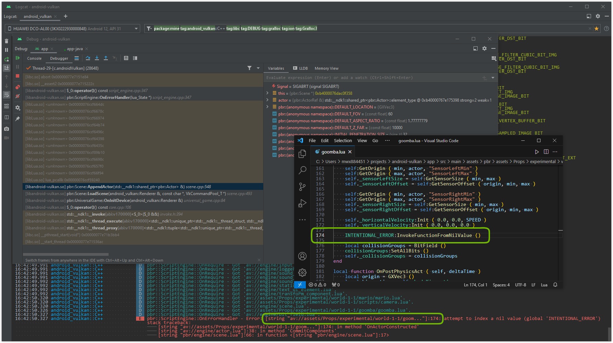

# _Lua scripting frontend_

## <a id="table-of-content">Table of content</a>

- [_Lua environment_](#lua-environment)
- [_Debugging_](#debugging)
- [_API reference_](#api-reference)

## <a id="lua-environment">_Lua_ environment</a>

Project is using _Lua 5.4.6_.

Script side `number` type has been changed from `double` to `float32_t`. This means that according to [_source_](https://betterprogramming.pub/compute-without-floating-point-errors-7b92695bde4) safe range for integer operations has been reduced:

Minimum value | Maximum value
--- | ---
`-16'777'215` | `16'777'216`

The following standard modules have been excluded from _Lua_ environment:

- `dofile`
- `print`
- `xpcall`

[↬ table of content ⇧](#table-of-content)

## <a id="debugging">Debugging</a>

The main tool for debugging is [_Logcat_](./logcat.md). Engine will print _**call stack**_ of _Lua_ for any runtime execution error. _Lua **call stack**_ will contain the **script file name**, **function** and **line number** at which problem occurred. Every error on script side will also raise `assert` in debug builds. This will pause application and debugger will show _CPU **call stack**_ as well.

Running **_debug version_** of the application without debugger will print _Lua **call stack**_ and then simply crash the application if script error occurred.

Running **_release version_** of the application will only print _Lua **call stack**_ and cancel execution of the script if script error occurred.

Here is an example of _Lua **call stack**_. Error occurred in `goomba.lua` script in function `OnActorConstructed` at line `174`:

[↬ table of content ⇧](#table-of-content)

## <a id="api-reference">_API_ reference</a>

- [_Actor_](./actor.md)
- [_AnimationGraph_](./animation-graph.md)
- [_AnimationPlayerNode_](./animation-player-node.md)
- [_BitField_](./bit-field.md)
- [_CameraComponent_](./camera-component.md)
- [_DIVUIElement_](./div_ui_element.md)
- [_GXMat3_](./gx-mat3.md)
- [_GXMat4_](./gx-mat4.md)
- [_GXQuat_](./gx-quat.md)
- [_GXVec3_](./gx-vec3.md)
- [_GXVec4_](./gx-vec4.md)
- [_ImageUIElement_](./image-ui-element.md)
- [_InputEvent_](./input-event.md)
- [_Logger_](./logger.md)
- [_Material_](./material.md)
- [_RigidBodyComponent_](./rigid-body-component.md)
- [_Scene_](./scene.md)
- [_ScriptComponent_](./script-component.md)
- [_SkeletalMeshComponent_](./skeletal-mesh-component.md)
- [_SoundEmitterGlobalComponent_](./sound-emitter-global-component.md)
- [_SoundEmitterSpatialComponent_](./sound-emitter-spatial-component.md)
- [_StaticMeshComponent_](./static-mesh-component.md)
- [_TextUIElement_](./text-ui-element.md)
- [_TransformComponent_](./transform-component.md)
- [_eSoundChannel_](./sound-channel.md)
- [_UILayer_](./ui-layer.md)

[↬ table of content ⇧](#table-of-content)
