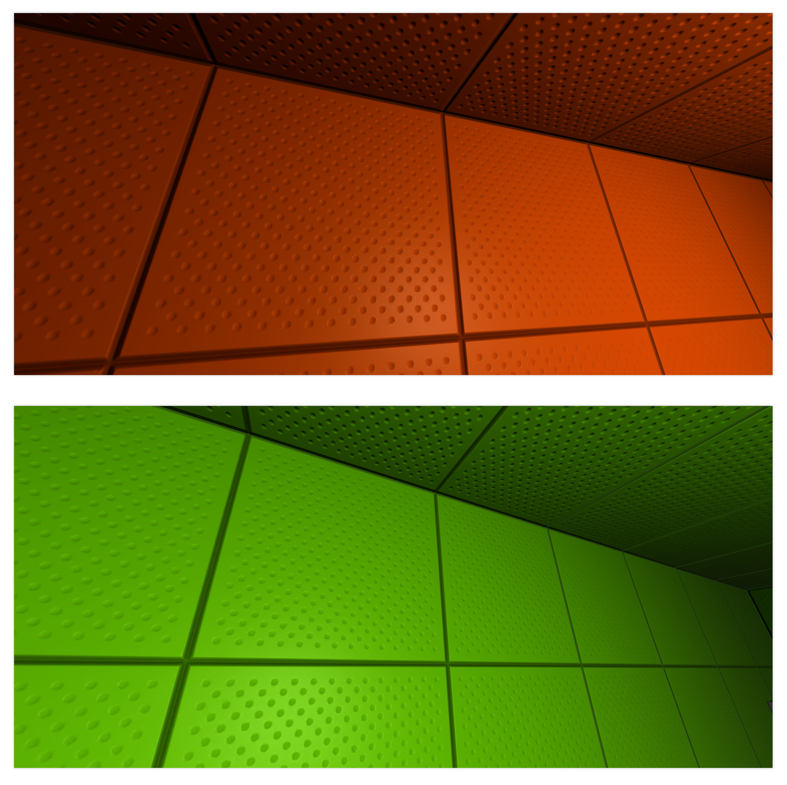

# _Material_

```lua
require "av://engine/material.lua"
```

## Table of content

- [_Brief_](#brief)
- [_Metamethods_](#metamethods)
- [`Constructor`](#constructor)

## <a id="brief">Brief</a>

Class allows to load materials from `*.mtl` assets. Later material instance could be assigned to renderable entity. For example to [_StaticMeshComponent_](./static-mesh-component.md).

Material is a set of textures. Albedo, normal map, blend mask, emission and material physical parameters. Also material has type: _opaque_ or _stipple_.

<a id="blend-mask">The blend mask</a> contains three components which are responsible for additional coloring of the result material. The best illustration is the following picture:



The geometry has exact same material in terms of texture set. The only difference is `Color0` value. Top image has orange hue. Bottom image has green hue. As said before the material system supports up to **3** feature color per instance. The picture above uses only one feature color. By convention this colors are called `Color0`, `Color1` and `Color2`.

Material supports dedicated color for <a id="emisson">emission</a>. By convention this color is called `Emission`. This value will be multiplied with sample value from actual emission texture.

_Opaque_ and _stipple_ material types have only one significant difference: transparency support. _Opaque_ material does not support transparency but way more optimal from _GPU_ perspective. The alpha values from `Color0` and albedo texture are ignored for _opaque_ material. From other hand _stipple_ material supports so called [_screen door transparency_](https://digitalrune.github.io/DigitalRune-Documentation/html/fa431d48-b457-4c70-a590-d44b0840ab1e.htm). The alpha values from `Color0` and albedo texture are used for final transparency computation of the _stipple_ material.

## <a id="metamethods">Metamethods</a>

Metamethod | Used
--- | ---
`__add` | ❌
`__band` | ❌
`__bnot` | ❌
`__bor` | ❌
`__bxor` | ❌
`__call` | ✔️
`__close` | ❌
`__concat` | ❌
`__div` | ❌
`__eq` | ❌
`__gc` | ✔️
`__idiv` | ❌
`__index` | ❌
`__le` | ❌
`__len` | ❌
`__lt` | ❌
`__mod` | ❌
`__mode` | ❌
`__mul` | ❌
`__name` | ❌
`__newindex` | ❌
`__pow` | ❌
`__shl` | ❌
`__shr` | ❌
`__sub` | ❌
`__tostring` | ❌
`__unm` | ❌

## <a id="constructor">`Constructor`</a>

Constructor creates new material instance from `*.mtl` asset.

**Parameters:**

- `materialFile` [_required, readonly, string_]: file path to material asset

**Example:**

```lua
require "av://engine/material.lua"
require "av://engine/scene.lua"


local rock = Actor ( "Rock" )
local mesh = StaticMeshComponent ( "Mesh", "pbr/assets/System/Default.mesh2" )
mesh:SetMaterial ( Material ( "pbr/assets/System/Default.mtl" ) )

rock:AppendComponent ( mesh )
g_scene:AppendActor ( rock )
```
