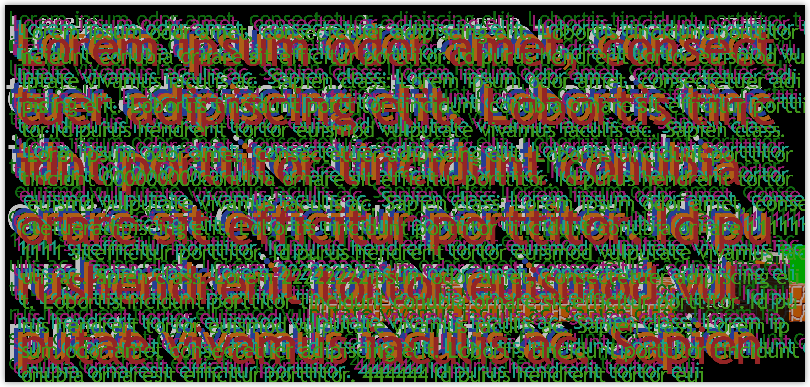

# Proper _UI_

## <a id="table-of-content">Table of content</a>

- [_Proper bending_](#blending)
- [_Proper text rendering_](#text)
- [_Benchmarking_](#benchmark)

## <a id="blending">Proper blending</a>

TODO

[↬ table of content ⇧](#table-of-content)

## <a id="text">Proper text rendering</a>

[↬ table of content ⇧](#table-of-content)

## <a id="benchmark">Benchmarking</a>

⁘ Scene complexity

**Metric** | **Submitted** | **Rendered** | **Culled**
--- | --- | --- | ---
Vertices | 10182 | 1392 | 87%
Opaque meshes | 70 | 13 | 82%
Stipple meshes | 4 | 0 | 100%
Point lights | 0 | 0 | N/A
Local reflections | 0 | 0 | N/A
Global reflections | 0 | 0 | N/A
_UI_ vertices | 35520 | 35520 | 0%

⁘ Performance

**Method** | **Frame time**
--- | ---
Newton approximation | 17.281 ms
Lossless _LUT_ | ??? ms
Compressed _LUT_ | ??? ms

[↬ table of content ⇧](#table-of-content)
