# Proper _UI_

## <a id="table-of-content">Table of content</a>

- [_Proper blending_](#blending)
- [_Proper text rendering_](#text)
- [_GPU implementation_](#gpu)
  - [_Exact analytic solution_](#cardano)
  - [_Newton approximation_](#newton)
  - [_LUT solution_](#lut)
- [_Benchmarking_](#benchmark)
- [_Conclusion_](#conclusion)

## <a id="blending">Proper blending</a>

Let's start from the issue:

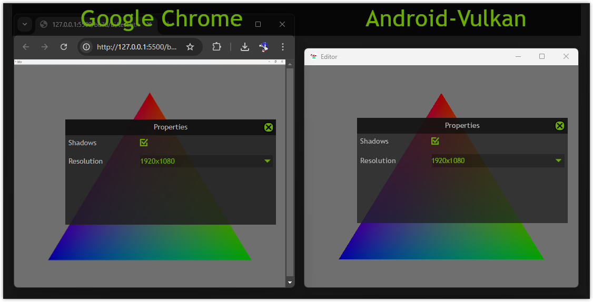

You could notice than _Google Chrome_ much darker that _Android-Vulkan_. Caption area is a good example that blending looks different. Same time any opaque area has exactly the same color in both impementations. For example close button color is 1 to 1 match. Accoriding to [_CSS_](https://www.w3.org/TR/SVG11/masking.html#SimpleAlphaBlending) it should be used _premultiplied alpha_ or classic alpha blending. One blending could be transformed into another. _Premultiplied alpha_ has advantages in image filtering and it allows to separate blending areas for later compositing.

It turns out that the answer is `UNORM` format for render target. Hardware produces slightly different results for `UNORM` and `sRGB` during blending. In the case above the render target format was `sRGB`. After changing it to `UNORM` the blending starts to match:

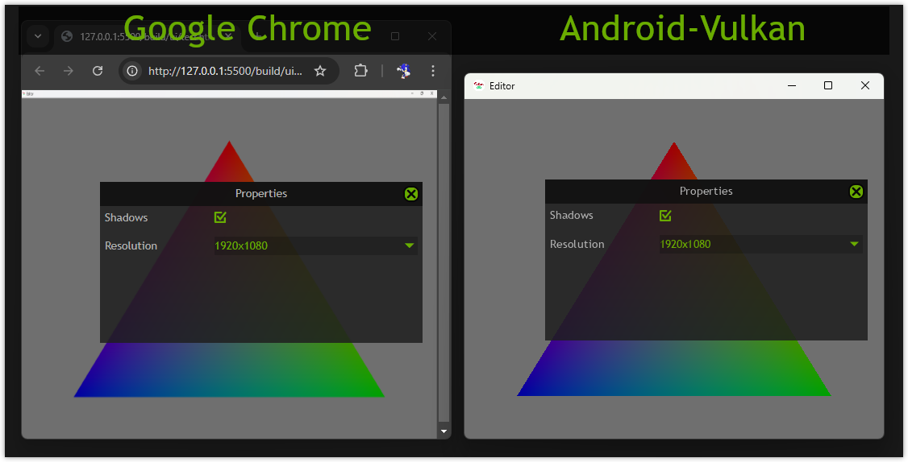

The blending equation is classical:

```cpp
...

.blendEnable = VK_TRUE,
.srcColorBlendFactor = VK_BLEND_FACTOR_SRC_ALPHA,
.dstColorBlendFactor = VK_BLEND_FACTOR_ONE_MINUS_SRC_ALPHA,
.colorBlendOp = VK_BLEND_OP_ADD,
.srcAlphaBlendFactor = VK_BLEND_FACTOR_ZERO,
.dstAlphaBlendFactor = VK_BLEND_FACTOR_ONE,
.alphaBlendOp = VK_BLEND_OP_ADD,

.colorWriteMask =
    VK_COLOR_COMPONENT_R_BIT |
    VK_COLOR_COMPONENT_G_BIT |
    VK_COLOR_COMPONENT_B_BIT |
    VK_COLOR_COMPONENT_A_BIT

...
```

[↬ table of content ⇧](#table-of-content)

## <a id="text">Proper text rendering</a>

Let's start from the issue:

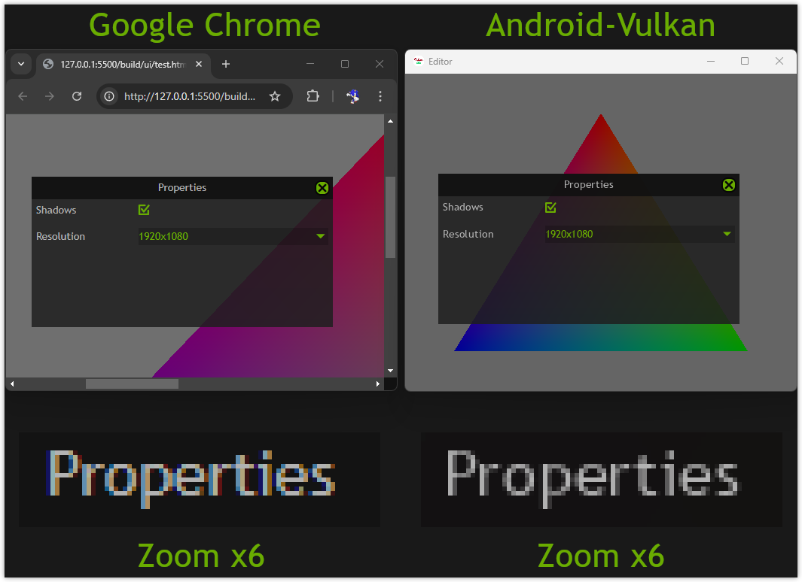

The text looks thinner in _Android-Vulkan_ implementation than _Google Chrome_ implementation.

On the first thought it could be subpixel rendering on the _Windows_. It has impact on appearance of course. But I assure you that this is not the main contribution to the visuals.

It should be some mapping from:

- Glyph luma
- Color alpha

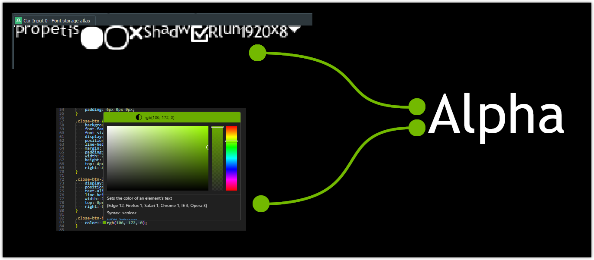

After some amount of experiments such mapping has been found. Here is final result:

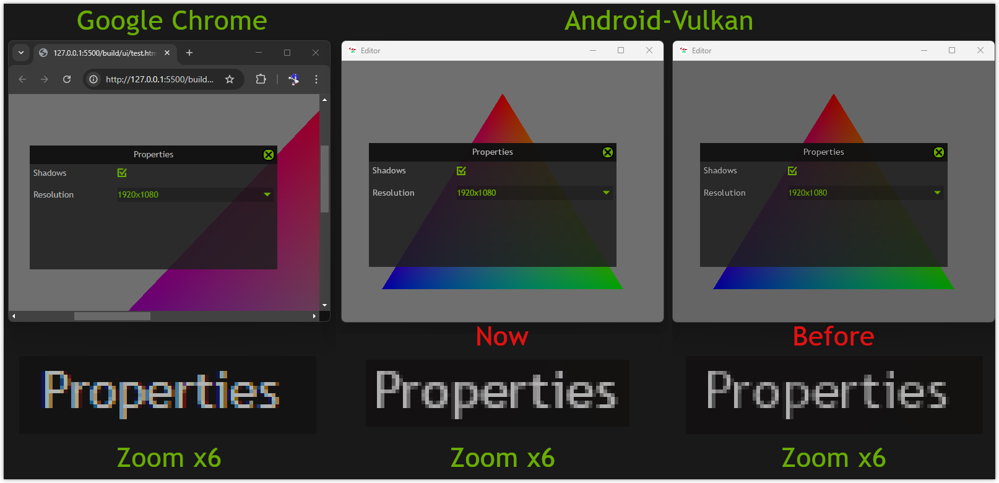

Let's look at this fancy surface first:

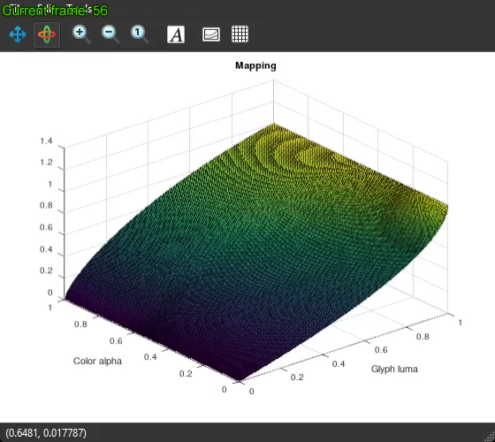

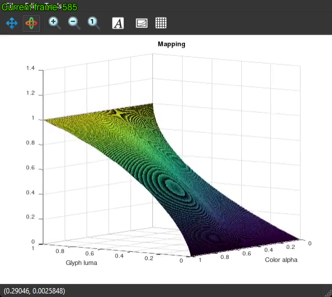

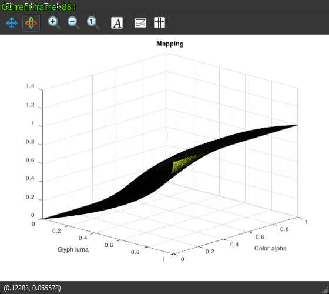

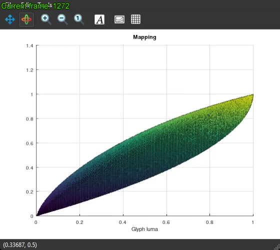

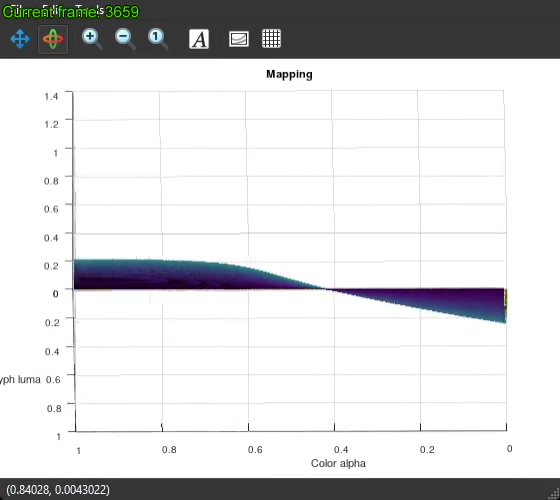

Full video link is [here](./videos/ui-text-alpha-mapping.mp4).

This fancy mapping is constructed by three cubic [Bezier curves](https://en.wikipedia.org/wiki/B%C3%A9zier_curve).

Let's call first two curves _Luma top_ and _Luma bottom_. They are defined like this:

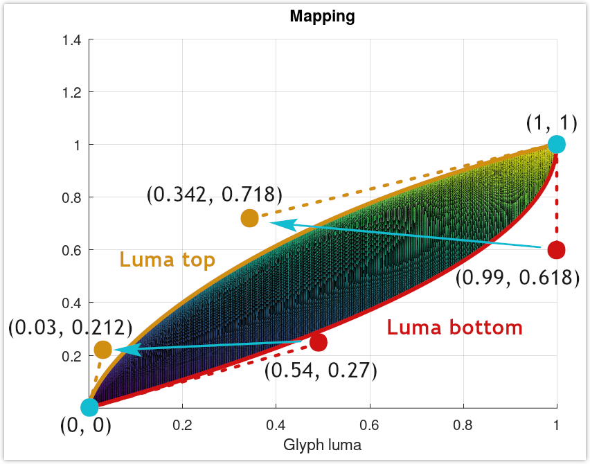

Blue arrows show how control points should be interpolated. The interpolation is controlled by _Color alpha_ curve. It's defined like this:

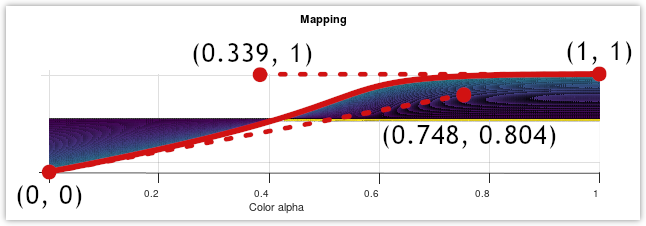

That's it.

[↬ table of content ⇧](#table-of-content)

## <a id="gpu">_GPU_ implementation</a>

There are three ways to use this fancy surface in runtime: exact runtime analytic solution, approximate iterative solution, precomputed _LUT_. All three solutions share common math about cubic _Bezier_ curve:

$$
P=(1-t)^3P_0+3(1-t)^2P_1t+3(1-t)P_2t^2+P_3t^3
$$

Note that

$$
    \begin{array}{l}
        P_0=(0, 0)\\
        P_3=(1, 1)
    \end{array}
$$

So first term and last could be simplified.

$$
    P=3(1-t)^2P_1t+3(1-t)P_2t^2+t^3
$$

Opening brackets:

$$
    \begin{array}{l}
        P=3(1-2t+t^2)P_1t+3P_2t^2-3P_2t^3+t^3\\
        P=3P_1t-6P_1t^2+3P_1t^3+3P_2t^2-3P_2t^3+t^3\\
        P=(3P_1-3P_2+1)t^3+(3P_2-6P_1)t^2+3P_1t\\
        P=3\left(\left(P_1-P_2+\dfrac{1}{3}\right)t^3+(P_2-2P_1)t^2+P_1t\right)
    \end{array}
$$

Equation above is usefull for computing $P_y$ component.

For computing $P_x$ component let's rearrange queation to general form.

$$
    (3P_1-3P_2+1)t^3+(3P_2-6P_1)t^2+3P_1t-P=0
$$

This gives us:

$$
    \begin{array}{l}
        a=3P_1-3P_2+1\\
        b=3P_2-6P_1\\
        c=3P_1\\
        d=-P
    \end{array}
$$

[↬ table of content ⇧](#table-of-content)

---

### <a id="cardano">Exact analytic solution</a>

Using [_Cardano method_](https://en.wikipedia.org/wiki/Cubic_equation#General_cubic_formula) to solve cubic:

$$
    \begin{array}{l}
        T^3+pT+q=0\\
        \text{}\\
        T=t+\dfrac{b}{3a}\\
        p=\dfrac{3ac-b^2}{3a^2}\\
        q=\dfrac{2b^3-9abc+27a^2d}{27a^3}\\
        \text{}\\
        u_1=-\dfrac{q}{2}+\sqrt{\dfrac{q^2}{4}+\dfrac{p^3}{27}}\\
        u_2=-\dfrac{q}{2}-\sqrt{\dfrac{q^2}{4}+\dfrac{p^3}{27}}\\
        \text{}\\
        T_1=\sqrt[3]{u_1}+\sqrt[3]{u_2}\\
        T_2=\dfrac{-1+i\sqrt{3}}{2}\sqrt[3]{u_1}+\dfrac{-1-i\sqrt{3}}{2}\sqrt[3]{u_2}\\
        T_3=\dfrac{-1-i\sqrt{3}}{2}\sqrt[3]{u_1}+\dfrac{-1+i\sqrt{3}}{2}\sqrt[3]{u_2}\\
    \end{array}
$$

So all three roots equal:

$$
    \begin{array}{l}
        t_1=T_1-\dfrac{b}{3a}\\
        t_2=T_2-\dfrac{b}{3a}\\
        t_3=T_3-\dfrac{b}{3a}
    \end{array}
$$

Here is where the problems begins.

Experiments show that $\sqrt{\dfrac{q^2}{4}+\dfrac{p^3}{27}}$ produces complex value.

This leads to extract cubic root from complex values: $\sqrt[3]{u_1}$ and $\sqrt[3]{u_2}$.

Testing shows that target solution is derived from **!!!_complex values_!!!**. So explicit analytic solution sounds complex enough for implementation on shader side for each pixel of the _UI_. It's not practical.

[↬ table of content ⇧](#table-of-content)

---

### <a id="newton">_Newton_ approximation</a>

Using [_Newton method_](https://en.wikipedia.org/wiki/Newton%27s_method) to solve cubic:

$$
    \begin{array}{l}
        x_{n+1} = x_n - \dfrac{f(x_n)}{f'(x_n)}\\
        \text{}
        f(x_n)=(3P_1-3P_2+1)t^3+(3P_2-6P_1)t^2+3P_1t-P\\
        f'(x_n)=(9P_1-9P_2+3)t^2+(6P_2-12P_1)t+3P_1\\
        \text{}\\
        \alpha=3\left(P_1-P_2+\dfrac{1}{3}\right)\\
        \beta=3P_2-6P_1\\
        \omega=3P_1\\
        \xi=3\alpha\\
        \zeta=2\beta\\
        \text{}\\
        f(x_n)=\alpha{t}^3+\beta{t}^2+\omega{t}-P\\
        f'(x_n)=\xi{t}^2+\zeta{t}+\omega\\
        \text{}\\
        \gamma=t^2\\
        \text{}\\
        f(x_n)=\gamma(\alpha{t}+\beta)+(\omega{t}-P)\\
        f'(x_n)=\xi\gamma+(\zeta{t}+\omega)
    \end{array}
$$

The key of success for _Newton_ method is initial guess. Experiments showed that three lines are good initial guess for _Color alpha_. Such initial guess returns very precise value after `3` iterations of the the _Newton_ method:

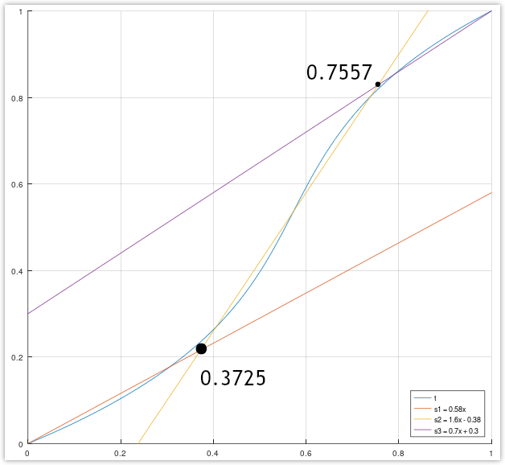

For solving _Glyph luma_ the good initial guess is just $t$ value itself. After only `3` iterations the good precision will be achieved. Here is absolute difference between surfaces from exact solution and approximation using _Newton_ method:

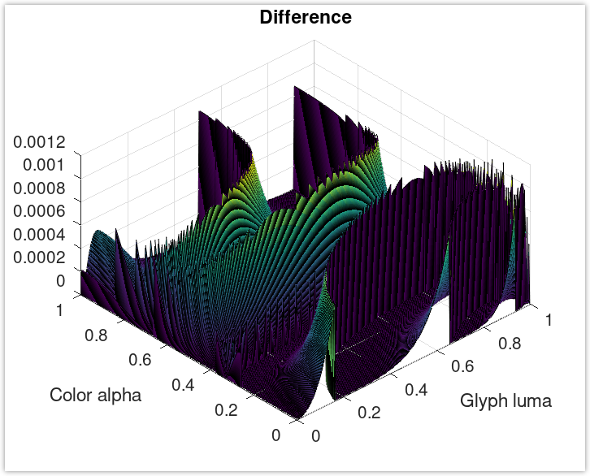

[↬ table of content ⇧](#table-of-content)

---

### <a id="lut">_LUT_ solution</a>

The easiest approach. Precompute all 256x256 values into 8bit `UNORM` image. The only possible optimization here is to use some hardware compression format. For example _ASTC 6x6 UNORM_.

**Type** | **Size**
--- | ---
Uncompressed | 64 kb
_ASTC 6x6 UNORM_ | 29 kb

[↬ table of content ⇧](#table-of-content)

## <a id="benchmark">Benchmarking</a>

After having several solutions it's needed to decide which to use. It's perfect task for profiling. The fastest method will be the winner. Let's go.

Testing device: [_Redmi Note 8 Pro_](https://vulkan.gpuinfo.org/displayreport.php?id=12030).


⁘ Scene complexity

**Metric** | **Submitted** | **Rendered** | **Culled**
--- | --- | --- | ---
Vertices | 10182 | 1392 | 87%
Opaque meshes | 70 | 13 | 82%
Stipple meshes | 4 | 0 | 100%
Point lights | 0 | 0 | N/A
Local reflections | 0 | 0 | N/A
Global reflections | 0 | 0 | N/A
_UI_ vertices | 35520 | 35520 | 0%

⁘ Performance

**Method** | **Frame time**
--- | ---
Lossless _LUT_ | 14.651 ms
Compressed _ASTC 6x6 LUT_ | 14.671 ms
_Newton_ approximation | 17.967 ms

[↬ table of content ⇧](#table-of-content)

## <a id="conclusion">Conclusion</a>

_LUT_ approach shows better performance compare to iterative _Newton_ approximation of two Bezier curves. Lossless and compressed _LUT_ show similar performance on real hardware. So it's decided to stick with _Lossless LUT_.

So:

- Swapchain format has been changed to `UNORM`
- It was added 3 types of primitives at pixel shader level: text, images and geometry
- _LUT_ is faster then _Newton_ approximation by 18.5%🟢
- Uncompress _LUT_ is universal solution (_ASTC_ is not widely supported on _PC_)

[↬ table of content ⇧](#table-of-content)
