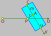

# Ray vs cylinder intersection

## <a id="table-of-content">Table of content</a>

- [_Formula_](#formula)
- [_Step by step derivation_](#derivation)
- [_Comparing result with original paper_](#comparison)
  - [_k term_](#comp-k)
  - [_a term_](#comp-a)
  - [_c term_](#comp-c)

## <a id="formula">Formula</a>

TODO

[↬ table of content ⇧](#table-of-content)

## <a id="derivation">Step by step derivation</a>

Idea is taken from [here](https://hugi.scene.org/online/hugi24/coding%20graphics%20chris%20dragan%20raytracing%20shapes.htm)

Ray $\overrightarrow{P}$ is defined:

$$
    \overrightarrow{P}=\overrightarrow{O}+t\overrightarrow{D}
$$

where:

- $\overrightarrow{O}$ ray origin
- $\overrightarrow{D}$ ray unit vector direction
- $t$ ray length

Define $\overrightarrow{C}$ is a center point of a start cylinder cap and $\overrightarrow{X}$ which is equal

$$
    \overrightarrow{X}=\overrightarrow{O}-\overrightarrow{C}
$$

Now the ray equation looks like this:

$$
    \overrightarrow{P}-\overrightarrow{C}=t\overrightarrow{D}+\overrightarrow{X}
$$

Let's define cylinder

where:

- $\overrightarrow{C}$ is the start cap point of the cylinder
- $\overrightarrow{V}$ is a unit vector that determines cylinder's axis
- $r$ is the cylinder's radius
- $u$ determines cylinder's end cap point

Let's define length $m$ which corresponds closest point to ray hit on cylinder axis. The closest point must be perpendicular to $\overrightarrow{V}$. In other words it's a projection length onto cylinder axis $\overrightarrow{V}$:

$$
    \begin{aligned}
        \left(\overrightarrow{P}-\overrightarrow{C}\right)\cdot\overrightarrow{V}=m\\
        m=\left(t\overrightarrow{D}+\overrightarrow{X}\right)\cdot\overrightarrow{V}
    \end{aligned}
$$

Using dot product distributive, scalar-multiplicative properties as part of [bilinear](https://en.wikipedia.org/wiki/Dot_product#Properties) property:

$$
    \begin{aligned}
        \left(\alpha\overrightarrow{a}+\beta\overrightarrow{b}\right)
        \cdot
        \left(\gamma\overrightarrow{c}+\delta\overrightarrow{d}\right)
        =
        \alpha\gamma\left(\overrightarrow{a}\cdot\overrightarrow{c}\right)
        +
        \alpha\delta\left(\overrightarrow{a}\cdot\overrightarrow{d}\right)
        +
        \beta\gamma\left(\overrightarrow{b}\cdot\overrightarrow{c}\right)
        +
        \beta\delta\left(\overrightarrow{b}\cdot\overrightarrow{d}\right)\\
    \end{aligned}
$$

$$
    \begin{aligned}
        \begin{matrix}
            \text{assuming:}&\alpha=\omega&\beta=1&\gamma=1&\delta=0
        \end{matrix}
        \\
        \left(\omega\overrightarrow{a}+\overrightarrow{b}\right)\cdot\overrightarrow{c}
        =
        \omega\left(\overrightarrow{a}\cdot\overrightarrow{c}\right)+\overrightarrow{b}\cdot\overrightarrow{c}
    \end{aligned}
$$

Now $m$ equals:

$$
    \begin{aligned}
        m=t\left(\overrightarrow{D}\cdot\overrightarrow{V}\right)+\overrightarrow{X}\cdot\overrightarrow{V}
    \end{aligned}
$$

The $m$ will be useful at last step to decide which part ray hits the cylinder: side or cap. But for now let's switch to another task - intersection with cylinder side. The following picture shows the connection with cylinder radius $r$:

$$
    \left\|\overrightarrow{P}-\overrightarrow{C}-m\overrightarrow{V}\right\|=r
$$

Substituting ray equation and rearrange equation:

$$
    \begin{aligned}
        \left\|t\overrightarrow{D}+\overrightarrow{X}-m\overrightarrow{V}\right\|=r\\
        \left\|
            t\overrightarrow{D}+\overrightarrow{X}
            -
            \left(
                t\left(\overrightarrow{D}\cdot\overrightarrow{V}\right)
                +\overrightarrow{X}\cdot\overrightarrow{V}
            \right)
            \overrightarrow{V}
        \right\|
        =
        r\\
    \end{aligned}
$$

Now trick is to treat $\left(\overrightarrow{D}\cdot\overrightarrow{V}\right)$ and $\left(\overrightarrow{X}\cdot\overrightarrow{V}\right)$ as scalars and rearrange equation using dot product [bilinear](https://en.wikipedia.org/wiki/Dot_product#Properties) property again.

$$
    \left\|
        t\overrightarrow{D}+\overrightarrow{X}
        -
        t\left(\overrightarrow{D}\cdot\overrightarrow{V}\right)\overrightarrow{V}
        -
        \left(\overrightarrow{X}\cdot\overrightarrow{V}\right)\overrightarrow{V}
    \right\|
    =
    r
$$

Now combine parts with $t$:

$$
    \left\|
        t\left(\overrightarrow{D}-\left(\overrightarrow{D}\cdot\overrightarrow{V}\right)\overrightarrow{V}\right)
        +
        \overrightarrow{X}-\left(\overrightarrow{X}\cdot\overrightarrow{V}\right)\overrightarrow{V}
    \right\|
    =
    r
$$

Let's substitute as $\overrightarrow{K}$:

$$
    \begin{aligned}
        \overrightarrow{K}
        =
        t\left(\overrightarrow{D}-\left(\overrightarrow{D}\cdot\overrightarrow{V}\right)\overrightarrow{V}\right)
        +
        \overrightarrow{X}-\left(\overrightarrow{X}\cdot\overrightarrow{V}\right)\overrightarrow{V}\\
        \left\|\overrightarrow{K}\right\|=r
    \end{aligned}
$$

Using dot product property related to square length:

$$
    \overrightarrow{a}\cdot\overrightarrow{a}={\left\|\overrightarrow{a}\right\|}^2
$$

Now equation looks like this:

$$
    \overrightarrow{K}\cdot\overrightarrow{K}=r^2
$$

Trick now is to simplify $\overrightarrow{K}\cdot\overrightarrow{K}$ computation. Let's refer to dot product [bilinear](https://en.wikipedia.org/wiki/Dot_product#Properties) property again and make experiment of computing dot product of sum of two vectors:

$$
    \begin{aligned}
        \left(\alpha\overrightarrow{a}+\beta\overrightarrow{b}\right)
        \cdot
        \left(\gamma\overrightarrow{c}+\delta\overrightarrow{d}\right)
        =
        \alpha\gamma\left(\overrightarrow{a}\cdot\overrightarrow{c}\right)
        +
        \alpha\delta\left(\overrightarrow{a}\cdot\overrightarrow{d}\right)
        +
        \beta\gamma\left(\overrightarrow{b}\cdot\overrightarrow{c}\right)
        +
        \beta\delta\left(\overrightarrow{b}\cdot\overrightarrow{d}\right)\\
    \end{aligned}
$$

$$
    \begin{aligned}
        \begin{matrix}
            \text{assuming:}&\alpha=1&\beta=1&\gamma=1&\delta=1&\overrightarrow{c}=\overrightarrow{a}&\overrightarrow{d}=\overrightarrow{b}
        \end{matrix}
        \\
        \left(\overrightarrow{a}+\overrightarrow{b}\right)\cdot\left(\overrightarrow{a}+\overrightarrow{b}\right)
        =
        \left(\overrightarrow{a}\cdot\overrightarrow{a}\right)
        +
        \left(\overrightarrow{a}\cdot\overrightarrow{b}\right)
        +
        \left(\overrightarrow{b}\cdot\overrightarrow{a}\right)
        +
        \left(\overrightarrow{b}\cdot\overrightarrow{b}\right)
    \end{aligned}
$$

We could swap dot product operands using dot product [commutative]((https://en.wikipedia.org/wiki/Dot_product#Properties)) property and also use "square length" property:

$$
    \left(\overrightarrow{a}+\overrightarrow{b}\right)\cdot\left(\overrightarrow{a}+\overrightarrow{b}\right)
    =
    {\left\|\overrightarrow{a}\right\|}^2
    +
    2\left(\overrightarrow{a}\cdot\overrightarrow{b}\right)
    +
    {\left\|\overrightarrow{b}\right\|}^2
$$

Now let's make several substitution to simplify $\overrightarrow{K}$ even further:

$$
    \begin{aligned}
        \overrightarrow{I}=\overrightarrow{D}-\left(\overrightarrow{D}\cdot\overrightarrow{V}\right)\overrightarrow{V}\\
        \overrightarrow{G}=t\overrightarrow{I}\\
        \overrightarrow{J}=\overrightarrow{X}-\left(\overrightarrow{X}\cdot\overrightarrow{V}\right)\overrightarrow{V}
    \end{aligned}
$$

So now the $\overrightarrow{K}$ looks like this

$$
    \overrightarrow{K}=\overrightarrow{G}+\overrightarrow{J}
$$

Let's combine all observations and compute $\overrightarrow{K}\cdot\overrightarrow{K}$.

$$
    \overrightarrow{K}\cdot\overrightarrow{K}
    =
    \left\|\overrightarrow{G}\right\|^2
    +
    2\left(\overrightarrow{G}\cdot\overrightarrow{J}\right)
    +
    \left\|\overrightarrow{J}\right\|^2
$$

Merge this into single quadratic equation recovering $r$ term:

$$
    \left\|\overrightarrow{G}\right\|^2
    +
    2\left(\overrightarrow{G}\cdot\overrightarrow{J}\right)
    +
    \left\|\overrightarrow{J}\right\|^2-r^2
    =
    0
$$

Let's try to transform it into quadratic equation. Let's do it step by step by exposing $t$ term:

$$
    \begin{aligned}
        \left\|\overrightarrow{G}\right\|^2=t^2\left(\overrightarrow{I}\cdot\overrightarrow{I}\right)\\
        2\left(\overrightarrow{G}\cdot\overrightarrow{J}\right)
        =
        2t\left(\overrightarrow{I}\cdot\overrightarrow{J}\right)\\
        \left\|\overrightarrow{J}\right\|^2-r^2=\left(\overrightarrow{J}\cdot\overrightarrow{J}\right)-r^2
    \end{aligned}
$$

At this step we can finally write quadratic equation:

$$
    t^2\left(\overrightarrow{I}\cdot\overrightarrow{I}\right)
    +
    2t\left(\overrightarrow{I}\cdot\overrightarrow{J}\right)
    +
    \left(\overrightarrow{J}\cdot\overrightarrow{J}\right)-r^2
    =
    0
$$

We gonna use the trick with odd $b$ term of quadratic equation which simplifies the computation:

$$
    \begin{aligned}
        k=\dfrac{b}{2}\\
        D_1=k^2-ac\\
        t_{1,2}=\dfrac{-k\pm\sqrt{D_1}}{a}
    \end{aligned}
$$

Back to the original formula we get this:

$$
    \begin{aligned}
        k=\overrightarrow{I}\cdot\overrightarrow{J}\\
        a=\overrightarrow{I}\cdot\overrightarrow{I}\\
        c=\overrightarrow{J}\cdot\overrightarrow{J}-r^2
    \end{aligned}
$$

So combining everything together we finally able to find intersection points on ⚠️cylinder side⚠️:

$$
    \begin{aligned}
        t_{1,2}=\dfrac{-k\pm\sqrt{D_1}}{a}
    \end{aligned}
$$

where:

$$
    \begin{aligned}
        \overrightarrow{X}=\overrightarrow{O}-\overrightarrow{C}\\
        \overrightarrow{I}=\overrightarrow{D}-\left(\overrightarrow{D}\cdot\overrightarrow{V}\right)\overrightarrow{V}\\
        \overrightarrow{J}=\overrightarrow{X}-\left(\overrightarrow{X}\cdot\overrightarrow{V}\right)\overrightarrow{V}\\
        k=\overrightarrow{I}\cdot\overrightarrow{J}\\
        a=\overrightarrow{I}\cdot\overrightarrow{I}\\
        c=\overrightarrow{J}\cdot\overrightarrow{J}-r^2\\
        D_1=k^2-ac\\
    \end{aligned}
$$

- $\overrightarrow{O}$ ray origin
- $\overrightarrow{D}$ ray unit vector direction
- $t$ ray length
- $\overrightarrow{C}$ is the start cap point of the cylinder
- $\overrightarrow{V}$ is a unit vector that determines cylinder's axis
- $r$ is the cylinder's radius

[↬ table of content ⇧](#table-of-content)

## <a id="comparison">Comparing result with original paper</a>

Original paper [link](https://hugi.scene.org/online/hugi24/coding%20graphics%20chris%20dragan%20raytracing%20shapes.htm).

### <a id="comp-k">k term</a>

$k$ term is $b/2$ from original paper

$$
    \begin{aligned}
        \left(\alpha\overrightarrow{a}+\beta\overrightarrow{b}\right)
        \cdot
        \left(\gamma\overrightarrow{c}+\delta\overrightarrow{d}\right)
        =
        \alpha\gamma\left(\overrightarrow{a}\cdot\overrightarrow{c}\right)
        +
        \alpha\delta\left(\overrightarrow{a}\cdot\overrightarrow{d}\right)
        +
        \beta\gamma\left(\overrightarrow{b}\cdot\overrightarrow{c}\right)
        +
        \beta\delta\left(\overrightarrow{b}\cdot\overrightarrow{d}\right)\\
    \end{aligned}
$$

$$
    \begin{aligned}
        \begin{matrix}
            \text{assuming:}&
            \alpha=1&
            \beta=-\overrightarrow{D}\cdot\overrightarrow{V}&
            \gamma=1&
            \delta=-\overrightarrow{X}\cdot\overrightarrow{V}&
            \overrightarrow{a}=\overrightarrow{D}&
            \overrightarrow{b}=\overrightarrow{V}&
            \overrightarrow{c}=\overrightarrow{X}&
            \overrightarrow{d}=\overrightarrow{V}
        \end{matrix}\\
        \\
        \left(\overrightarrow{D}-\left(\overrightarrow{D}\cdot\overrightarrow{V}\right)\overrightarrow{V}\right)\cdot\left(\overrightarrow{X}-\left(\overrightarrow{X}\cdot\overrightarrow{V}\right)\overrightarrow{V}\right)\\
        =\overrightarrow{D}\cdot\overrightarrow{X}
        -
        \left(\overrightarrow{X}\cdot\overrightarrow{V}\right)\left(\overrightarrow{D}\cdot\overrightarrow{V}\right)
        -
        \left(\overrightarrow{D}\cdot\overrightarrow{V}\right)\left(\overrightarrow{V}\cdot\overrightarrow{X}\right)
        +
        \left(\overrightarrow{D}\cdot\overrightarrow{V}\right)\left(\overrightarrow{X}\cdot\overrightarrow{V}\right)\left(\overrightarrow{V}\cdot\overrightarrow{V}\right)\\
        =\overrightarrow{D}\cdot\overrightarrow{X}
        -
        2\left(\overrightarrow{X}\cdot\overrightarrow{V}\right)\left(\overrightarrow{D}\cdot\overrightarrow{V}\right)
        +
        \left(\overrightarrow{D}\cdot\overrightarrow{V}\right)\left(\overrightarrow{X}\cdot\overrightarrow{V}\right)\left(\overrightarrow{V}\cdot\overrightarrow{V}\right)\\
        \\
        \overrightarrow{V}\text{ - is unit vector}\\
        =\overrightarrow{D}\cdot\overrightarrow{X}
        -
        \left(\overrightarrow{D}\cdot\overrightarrow{V}\right)\left(\overrightarrow{X}\cdot\overrightarrow{V}\right)
    \end{aligned}
$$

✅ $k$ term matches.

[↬ table of content ⇧](#table-of-content)

### <a id="comp-a">a term</a>

$$
    \begin{aligned}
        \left(\alpha\overrightarrow{a}+\beta\overrightarrow{b}\right)
        \cdot
        \left(\gamma\overrightarrow{c}+\delta\overrightarrow{d}\right)
        =
        \alpha\gamma\left(\overrightarrow{a}\cdot\overrightarrow{c}\right)
        +
        \alpha\delta\left(\overrightarrow{a}\cdot\overrightarrow{d}\right)
        +
        \beta\gamma\left(\overrightarrow{b}\cdot\overrightarrow{c}\right)
        +
        \beta\delta\left(\overrightarrow{b}\cdot\overrightarrow{d}\right)\\
    \end{aligned}
$$

$$
    \begin{aligned}
        \begin{matrix}
            \text{assuming:}&
            \alpha=1&
            \beta=-\overrightarrow{D}\cdot\overrightarrow{V}&
            \gamma=1&
            \delta=-\overrightarrow{D}\cdot\overrightarrow{V}&
            \overrightarrow{a}=\overrightarrow{D}&
            \overrightarrow{b}=\overrightarrow{V}&
            \overrightarrow{c}=\overrightarrow{D}&
            \overrightarrow{d}=\overrightarrow{V}
        \end{matrix}\\
        \\
        \left(\overrightarrow{D}-\left(\overrightarrow{D}\cdot\overrightarrow{V}\right)\overrightarrow{V}\right)
        \cdot
        \left(\overrightarrow{D}-\left(\overrightarrow{D}\cdot\overrightarrow{V}\right)\overrightarrow{V}\right)\\
        =
        \overrightarrow{D}\cdot\overrightarrow{D}
        -
        \left(\overrightarrow{D}\cdot\overrightarrow{V}\right)\left(\overrightarrow{D}\cdot\overrightarrow{V}\right)
        -
        \left(\overrightarrow{D}\cdot\overrightarrow{V}\right)\left(\overrightarrow{V}\cdot\overrightarrow{D}\right)
        +
        \left(\overrightarrow{D}\cdot\overrightarrow{V}\right)\left(\overrightarrow{D}\cdot\overrightarrow{V}\right)\left(\overrightarrow{V}\cdot\overrightarrow{V}\right)\\
        =\overrightarrow{D}\cdot\overrightarrow{D}-2\left(\overrightarrow{D}\cdot\overrightarrow{V}\right)^2+\left(\overrightarrow{D}\cdot\overrightarrow{V}\right)^2\left(\overrightarrow{V}\cdot\overrightarrow{V}\right)\\
        \\
        \overrightarrow{V}\text{ - is unit vector}\\
        =\overrightarrow{D}\cdot\overrightarrow{D}-\left(\overrightarrow{D}\cdot\overrightarrow{V}\right)^2
    \end{aligned}
$$

✅ $a$ term matches.

[↬ table of content ⇧](#table-of-content)

### <a id="comp-c">c term</a>

$$
    \begin{aligned}
        \left(\alpha\overrightarrow{a}+\beta\overrightarrow{b}\right)
        \cdot
        \left(\gamma\overrightarrow{c}+\delta\overrightarrow{d}\right)
        =
        \alpha\gamma\left(\overrightarrow{a}\cdot\overrightarrow{c}\right)
        +
        \alpha\delta\left(\overrightarrow{a}\cdot\overrightarrow{d}\right)
        +
        \beta\gamma\left(\overrightarrow{b}\cdot\overrightarrow{c}\right)
        +
        \beta\delta\left(\overrightarrow{b}\cdot\overrightarrow{d}\right)\\
    \end{aligned}
$$

$$
    \begin{aligned}
        \begin{matrix}
            \text{assuming:}&
            \alpha=1&
            \beta=-\overrightarrow{X}\cdot\overrightarrow{V}&
            \gamma=1&
            \delta=-\overrightarrow{X}\cdot\overrightarrow{V}&
            \overrightarrow{a}=\overrightarrow{X}&
            \overrightarrow{b}=\overrightarrow{V}&
            \overrightarrow{c}=\overrightarrow{X}&
            \overrightarrow{d}=\overrightarrow{V}
        \end{matrix}\\
        \\
        \left(\overrightarrow{X}-\left(\overrightarrow{X}\cdot\overrightarrow{V}\right)\overrightarrow{V}\right)\cdot\left(\overrightarrow{X}-\left(\overrightarrow{X}\cdot\overrightarrow{V}\right)\overrightarrow{V}\right)\\
        =\overrightarrow{X}\cdot\overrightarrow{X}
        -
        \left(\overrightarrow{X}\cdot\overrightarrow{V}\right)\left(\overrightarrow{X}\cdot\overrightarrow{V}\right)
        -
        \left(\overrightarrow{X}\cdot\overrightarrow{V}\right)\left(\overrightarrow{V}\cdot\overrightarrow{X}\right)
        +
        \left(\overrightarrow{X}\cdot\overrightarrow{V}\right)\left(\overrightarrow{X}\cdot\overrightarrow{V}\right)\left(\overrightarrow{V}\cdot\overrightarrow{V}\right)\\
        =\overrightarrow{X}\cdot\overrightarrow{X}
        -
        2\left(\overrightarrow{X}\cdot\overrightarrow{V}\right)^2
        +
        \left(\overrightarrow{X}\cdot\overrightarrow{V}\right)^2\left(\overrightarrow{V}\cdot\overrightarrow{V}\right)\\
        \\
        \overrightarrow{V}\text{ - is unit vector}\\
        =\overrightarrow{X}\cdot\overrightarrow{X}-\left(\overrightarrow{X}\cdot\overrightarrow{V}\right)^2\\
        \\
        c=\overrightarrow{X}\cdot\overrightarrow{X}-\left(\overrightarrow{X}\cdot\overrightarrow{V}\right)^2-r^2
    \end{aligned}
$$

✅ $c$ term matches.

[↬ table of content ⇧](#table-of-content)
