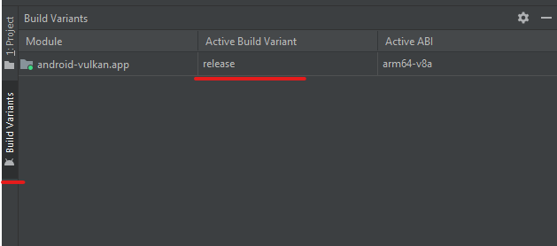

# Release build

## <a id="table-of-content">Table of content</a>

- [_Brief_](#brief)
- [_Release environment setup_](#release-env)
- [_Selecting release build_](#select-release)
- [_Recommended `CMakeLists.txt` settings_](#recommended-settings)

## <a id="brief">Brief</a>

_Android_ development ecosystem requires to sign every release _APK_. It's achieved via `app/build.gradle` file. The sign certificate can be generated locally per user basis via built-in [_Android Studio_ tool](https://developer.android.com/studio/publish/app-signing#generate-key).

[↬ table of content ⇧](#table-of-content)

## <a id="release-env">Release environment setup</a>

As mentioned above the certificate information must be linked to the building process via `app/build.gradle` file. So it was decided to use approach based on user _environment variables_. This allows to not include security sensitive information under development repo. So the user have to declare the following environment variables:

Name | Description | Example
--- | --- | ---
`ANDROID_VULKAN_CERTIFICATE_STORE_FILE` | Full path to the `.jks` file | `D:\Development\android-certificates\android-vulkan.jks`
`ANDROID_VULKAN_CERTIFICATE_STORE_PASSWORD` | Password to the `.jks` file | `Secret`
`ANDROID_VULKAN_CERTIFICATE_KEY_ALIAS` | Certificate alias name | `android-vulkan`
`ANDROID_VULKAN_CERTIFICATE_KEY_PASSWORD` | Password for certificate alias | `Secret`

[↬ table of content ⇧](#table-of-content)

## <a id="select-release">Selecting release build</a>

`Build Variats` subsystem is responsible for the selection:



[↬ table of content ⇧](#table-of-content)

## <a id="recommended-settings">Recommended `CMakeLists.txt` settings</a>

```cmake
...

# See docs/preprocessor-macros.md
target_compile_definitions ( android-vulkan PRIVATE
#    AV_ENABLE_TRACE
    AV_NATIVE_MODE_PORTRAIT
#    AV_DEBUG
#    AV_ENABLE_RENDERDOC
#    AV_ENABLE_VVL
#    AV_STRICT_MODE
    AV_ARM_NEON
    VK_NO_PROTOTYPES
    VK_USE_PLATFORM_ANDROID_KHR
)

...
```

[↬ table of content ⇧](#table-of-content)
