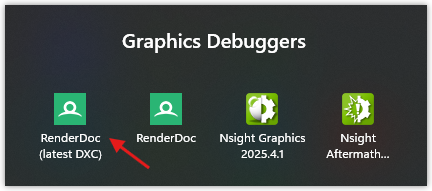

# _RenderDoc_ integration

## <a id="table-of-content">Table of content</a>

- [_Brief_](#brief)
- [_Using custom `dxc.exe`_](#custom-dxc)
- [_Reported issues_](#issues)

## <a id="brief">Brief</a>

The project supports integration with [_RenderDoc v1.40_](https://renderdoc.org/). But there is a catch. This tool implies additional limitations to hardware features:

- `VK_IMAGE_USAGE_TRANSIENT_ATTACHMENT_BIT`
- `VK_MEMORY_PROPERTY_LAZILY_ALLOCATED_BIT`

You could refer to [this thread](https://github.com/baldurk/renderdoc/issues/2681) which covers example of such limitations.

So it's needed to make proper build of the project:

- disable [_Vulkan Validation layers_](https://github.com/KhronosGroup/Vulkan-ValidationLayers) feature: `AV_ENABLE_VVL`. [How to](preprocessor-macros.md#macro-av-enable-vvl)
- activate [_RenderDoc v1.40_](https://renderdoc.org/) compatibility feature: `AV_ENABLE_RENDERDOC`. [How to](preprocessor-macros.md#macro-av-enable-renderdoc)

For example the `CMakeLists.txt` should look like this:

```cmake
...

# See docs/preprocessor-macros.md
target_compile_definitions ( android-vulkan
    PRIVATE
    AV_ARM_NEON
#    AV_DEBUG
    AV_ENABLE_RENDERDOC
#    AV_ENABLE_TRACE
#    AV_ENABLE_VVL
    AV_FREETYPE
    AV_NATIVE_MODE_PORTRAIT
#    AV_STRICT_MODE
    LUA_32BITS
    VK_NO_PROTOTYPES
    VK_USE_PLATFORM_ANDROID_KHR
)

...
```

**Note:** The application will crash without _RenderDoc_ after using `AV_ENABLE_RENDERDOC`. It's expected. The reason for this is that application will try to find and call _Vulkan_ debug marker and debug group functions. Most likely they will not be available on device.

That's it.

[↬ table of content ⇧](#table-of-content)

## <a id="custom-dxc">Using custom `dxc.exe`</a>

Sometimes you need to switch _RenderDoc_ to use the exact same `dxc.exe` build required to build a given project. One example of a version mismatch occurred on October 25, 2025:

```txt
dxc failed : unable to parse shader model.

Process exited with code 1.
Output file is 0 bytes
```

This error occurred whenever attempting to edit a shader in _RenderDoc_. This is because _RenderDoc_ uses `QStandardPaths::findExecutable` to locate all tools during initialization. At that time, _VulkanSDK 1.4.328.1_ was installed. The SDK's `dxc.exe` didn't yet know about the `6_10` shader model.

The solution is to change the `PATH` environment variable. You need to specify the directory where `dxc.exe` is located.

Here's a step-by-step guide on how to do this with minimal system intervention:

1. Create _PowerShell_ script with following code:

```powershell
# Forcing RenderDoc to use custom dxc.exe
$env:Path = "$env:ANDROID_VULKAN_DXC_ROOT;$env:Path"

Push-Location <path to dxc.exe directory>

# For example:
# Push-Location "D:\Programs\RenderDoc"

.\qrenderdoc.exe
```

Note that `ANDROID_VULKAN_DXC_ROOT` is used. Here is the full description of that variable: [link](shader-compilation.md#automation)

2. Create _Windows_ shortcut with the following `Type the location of the item`:

```txt
<absolute path to pwsh.exe> <absolute path to script above>

For example:
D:\Programs\PowerShell\7\pwsh.exe D:\Development\tools\start-good-renderdoc.ps1
```

3. Use that shortcut to run _RenderDoc_ with latest _DXC_ build.



4. That's it!

[↬ table of content ⇧](#table-of-content)

## <a id="issues">Reported issues</a>

Name | Link | Status
--- | --- | ---
spirv-cross.exe error when editing shaders | [#3353](https://github.com/baldurk/renderdoc/issues/3353) | ✔️ Fixed
_Vulkan HLSL_ with source edit issue | [#3425](https://github.com/baldurk/renderdoc/issues/3425) | 🛡️ _DXC_ issue
Can't compile shaders in Edit mode | [#3448](https://github.com/baldurk/renderdoc/issues/3448) | 🛡️ _DXC_ issue
_RenderDoc 1.39_ closing connection during _Vulkan_ capture inspection | [#3643](https://github.com/baldurk/renderdoc/issues/3643) | ✔️ Fixed

[↬ table of content ⇧](#table-of-content)
