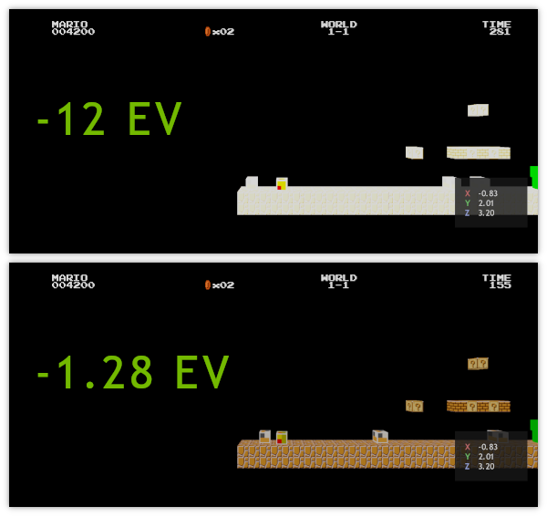

# _Scene_

```lua
-- No need to require anything. g_scene is an object instance of the Scene class and it's created globally.
```

## <a id="table-of-content">Table of content</a>

- [_Brief_](#brief)
- [_Metamethods_](#metamethods)
- [`Constructor`](#constructor)
- [`AppendActor ( actor )`](#method-append-actor)
- [`FindActor ( name )`](#method-find-actor)
- [`FindActors ( name )`](#method-find-actors)
- [`GetPenetrationBox ( localMatrix, size, groups )`](#method-get-penetration-box)
- [`GetPhysicsToRendererScaleFactor ()`](#method-get-physics-to-renderer-scale-factor)
- [`GetRendererToPhysicsScaleFactor ()`](#method-get-renderer-to-physics-scale-factor)
- [`GetRenderTargetAspectRatio ()`](#method-get-render-target-aspect-ratio)
- [`GetRenderTargetWidth ()`](#method-get-render-target-width)
- [`GetRenderTargetHeight ()`](#method-get-render-target-height)
- [`OverlapTestBoxBox ( localMatrixA, sizeA, localMatrixB, sizeB )`](#method-overlap-test-box-box)
- [`Quit ()`](#method-quit)
- [`SetActiveCamera ( camera )`](#method-set-active-camera)
- [`SetBrightness ( brightnessBalance )`](#method-set-brightness)
- [`SetExposureCompensation ( exposureValue )`](#method-set-exposure-compensation)
- [`SetExposureMaximumBrightness ( exposureValue )`](#method-set-exposure-maximum-brightness)
- [`SetExposureMinimumBrightness ( exposureValue )`](#method-set-exposure-minimum-brightness)
- [`SetEyeAdaptationSpeed ( speed )`](#method-set-eye-adaptation-speed)
- [`SetSoundChannelVolume ( soundChannel, volume )`](#method-set-sound-channel-volume)
- [`SetSoundListenerTransform ( localMatrix )`](#method-set-sound-listener-transform)
- [`SetSoundMasterVolume ( volume )`](#method-set-sound-master-volume)
- [`SweepTestBox ( localMatrix, size, groups )`](#method-sweep-test-box)

## <a id="brief">Brief</a>

Class represents scene entity which is used as foundation for scriptable logic. Scene holds active [actors](./actor.md) and allows to manage them via various methods. There is only one instance of [_Scene_](./scene.md) class called `g_scene` which is accessible from everywhere.

[↬ table of content ⇧](#table-of-content)

## <a id="metamethods">Metamethods</a>

Metamethod | Used
--- | ---
`__add` | ❌
`__band` | ❌
`__bnot` | ❌
`__bor` | ❌
`__bxor` | ❌
`__call` | ❌
`__close` | ❌
`__concat` | ❌
`__div` | ❌
`__eq` | ❌
`__gc` | ❌
`__idiv` | ❌
`__index` | ❌
`__le` | ❌
`__len` | ❌
`__lt` | ❌
`__mod` | ❌
`__mode` | ❌
`__mul` | ❌
`__name` | ❌
`__newindex` | ❌
`__pow` | ❌
`__shl` | ❌
`__shr` | ❌
`__sub` | ❌
`__tostring` | ❌
`__unm` | ❌

[↬ table of content ⇧](#table-of-content)

## <a id="constructor">`Constructor`</a>

_N/A_

[↬ table of content ⇧](#table-of-content)

## <a id="method-append-actor">`AppendActor ( actor )`</a>

Method appends `actor` to scene.

**Parameters:**

- `actor` [_required, readonly, [Actor](./actor.md)_]: [_Actor_](./actor.md) to append

**Return values:**

- none

**Example:**

```lua
require "av://engine/actor.lua"
require "av://engine/point_light_component.lua"


local sun = Actor ( "Sun" )
sun:AppendComponent ( PointLightComponent ( "Light" ) )

g_scene:AppendActor ( sun )
```

[↬ table of content ⇧](#table-of-content)

## <a id="method-find-actor">`FindActor ( name )`</a>

Method returns first existing [_Actor_](./actor.md) with `name`. Otherwise method returns `nil`.

**Parameters:**

- `name` [_required, readonly, string_]: name of [_Actor_](./actor.md) for search

**Return values:**

- `#1` [_required, [Actor](./actor.md) or nil_]: [_Actor_](./actor.md) with `name` if it exists. Otherwise `nil` if there is no any [_Actor_](./actor.md) objects with `name`

**Example:**

```lua
require "av://engine/actor.lua"
require "av://engine/point_light_component.lua"


local sun = Actor ( "Sun" )
sun:AppendComponent ( PointLightComponent ( "Light" ) )
g_scene:AppendActor ( sun )

local lightSource = g_scene:FindActor ( "Sun" )
```

[↬ table of content ⇧](#table-of-content)

## <a id="method-find-actors">`FindActors ( name )`</a>

Method returns an array of [_Actors_](./actor.md) with `name`. Otherwise method returns `nil`.

**Parameters:**

- `name` [_required, readonly, string_]: name of [_Actor_](./actor.md) for search

**Return values:**

- `#1` [_required, array of [Actors](./actor.md) or nil_]: array of [_Actors_](./actor.md) objects with `name` if they exists. Otherwise `nil` if there is no any [_Actor_](./actor.md) objects with `name`

**Example:**

```lua
require "av://engine/actor.lua"
require "av://engine/point_light_component.lua"


local lamp0 = Actor ( "Lamp" )
lamp0:AppendComponent ( PointLightComponent ( "Light" ) )
g_scene:AppenActor ( lamp0 )

local lamp1 = Actor ( "Lamp" )
lamp1:AppendComponent ( PointLightComponent ( "Light" ) )
g_scene:AppenActor ( lamp1 )

local lamps = g_scene:FindActors ( "Lamp" )
```

[↬ table of content ⇧](#table-of-content)

## <a id="method-get-penetration-box">`GetPenetrationBox ( localMatrix, size, groups )`</a>

Method performs penetration test of box shape against physical scene. As a result method returns all colliding objects with information how to resolve each penetration.

The test result is described by the following <a id="table-penetration">`Penetration`</a> table:

```lua
local Penetration = {
    _count = ... as integer,

    _penetrations = ... as array of tables,
    {
        1 = {
            ._depth = ... as number,
            ._normal = ... as GXVec3,
            ._body = ... as RigidBodyComponent
        },

        2 = {
            ._depth = ... as number,
            ._normal = ... as GXVec3,
            ._body = ... as RigidBodyComponent
        },

        ...

        n = {
            ._depth = ... as number,
            ._normal = ... as GXVec3,
            ._body = ... as RigidBodyComponent
        }
    }
}
```

`_count` contains number of detected penetrations. The `_penetrations` field contains an array with penetration information. Note you **MUST NOT** rely on `_penetration` array length because it could be bigger than actual number of penetrations for performance reasons. The indexing is from `1` to be consistent with _Lua_ conventions. `_depth` and `_normal` fields contain information how to resolve each penetration. This values describe how to move shape box to eliminate penetration. Note that values are in the [physics coordinate system](./rigid-body-component.md#note-physics-coordinate-system). And finally `_body` contains the reference to the [_RigidBodyComponent_](./rigid-body-component.md).

**Parameters:**

- `localMatrix` [_required, readonly, [GXMat4](./gx-mat4.md)_]: transformation matrix for box shape in [physics coordinate system](./rigid-body-component.md#note-physics-coordinate-system). Origin is in the centre of the box shape
- `size` [_required, readonly, [GXVec3](./gx-vec3.md)_]: width, height and depth of the box in [physics coordinate system](./rigid-body-component.md#note-physics-coordinate-system)
- `groups` [_required, readonly, integer_]: 32-bitmask with collision groups which will be used during the test

**Return values:**

- `#1` [_required, readonly, [Penetration](#table-penetration)_]: penetration test result. You **MUST NOT** modify any field of this table because it's tightly connected with internal engine implementation for performance reasons. You **SHOULD** copy any data from the structure if needed. Caching results could trigger **undefined behaviour**

**Example:**

```lua
require "av://engine/gx_quat.lua"


local axis = GXVec3 ()
axis:Init ( 7.77, 3.33, 1.0 )
axis:Normalize ()

local rotation = GXQuat ()
rotation:FromAxisAngle ( axis, math.rad ( 77.7 ) )

local origin = GXVec3 ()
origin:Init ( 1.0, 333.0, 0.0 )

local transform = GXMat4 ()
transform:FromFast ( rotation, origin )

local size = GXVec3 ()
size:Init ( 7.0, 3.0, 15.0 )

local penetrations = g_scene:GetPenetrationBox ( transform, size, 0xFFFFFFFF )
```

[↬ table of content ⇧](#table-of-content)

## <a id="method-get-physics-to-renderer-scale-factor">`GetPhysicsToRendererScaleFactor ()`</a>

Method returns scale factor to convert [physics coordinate system](./rigid-body-component.md#note-physics-coordinate-system) to render coordinate system.

**Parameters:**

- none

**Return values:**

- `#1` [_required, number_]: scale factor

**Example:**

```lua
require "av://engine/scene.lua"


local actor = Actor ( "Box" )
local body = RigidBodyComponent ( "RigidBody" )
actor:AppendComponent ( body )
g_scene:AppendActor ( actor )

local locationPhysics = GXVec3 ()
body:GetLocation ( locationPhysics )

local locationRender = GXVec3 ()
locationRender:MultiplyScalar ( locationPhysics, g_scene:GetPhysicsToRenderScaleFactor () )
```

[↬ table of content ⇧](#table-of-content)

## <a id="method-get-renderer-to-physics-scale-factor">`GetRendererToPhysicsScaleFactor ()`</a>

Method returns scale factor to convert render coordinate system to [physics coordinate system](./rigid-body-component.md#note-physics-coordinate-system).

**Parameters:**

- none

**Return values:**

- `#1` [_required, number_]: scale factor

**Example:**

```lua
require "av://engine/scene.lua"


local locationRender = GXVec3 ()
locationRender:Init ( 777.0, 3.33, 1.0 )

local locationPhysics = GXVec3 ()
locationPhysics:MultiplyScalar ( locationRender, g_scene:GetRendererToPhysicsScaleFactor () )
```

[↬ table of content ⇧](#table-of-content)

## <a id="method-get-render-target-aspect-ratio">`GetRenderTargetAspectRatio ()`</a>

Method returns effective aspect ratio for perspective cameras.

**Note:** Using this value is especially important because of _dynamic resolution_ engine feature.

**Parameters:**

- none

**Return values:**

- `#1` [_required, number_]: aspect ratio

**Example:**

```lua
require "av://engine/scene.lua"


local aspectRatio = g_scene:GetRenderTargetAspectRatio ()
```

[↬ table of content ⇧](#table-of-content)

## <a id="method-get-render-target-width">`GetRenderTargetWidth ()`</a>

Method returns render target width in pixels.

**Parameters:**

- none

**Return values:**

- `#1` [_required, integer_]: width in pixels

**Example:**

```lua
require "av://engine/scene.lua"


local width = g_scene:GetRenderTargetAspectRatio ()
```

[↬ table of content ⇧](#table-of-content)

## <a id="method-get-render-target-height">`GetRenderTargetHeight ()`</a>

Method returns render target height in pixels.

**Parameters:**

- none

**Return values:**

- `#1` [_required, integer_]: height in pixels

**Example:**

```lua
require "av://engine/scene.lua"


local height = g_scene:GetRenderTargetHeight ()
```

[↬ table of content ⇧](#table-of-content)

## <a id="method-overlap-test-box-box">`OverlapTestBoxBox ( localMatrixA, sizeA, localMatrixB, sizeB )`</a>

Method performs overlap test of two box shapes.

**Parameters:**

- `localMatrixA` [_required, readonly, [GXMat4](./gx-mat4.md)_]: transformation matrix for box shape _A_ in [physics coordinate system](./rigid-body-component.md#note-physics-coordinate-system). Origin is in the centre of the box shape
- `sizeA` [_required, readonly, [GXVec3](./gx-vec3.md)_]: width, height and depth of the box _A_ in [physics coordinate system](./rigid-body-component.md#note-physics-coordinate-system)
- `localMatrixB` [_required, readonly, [GXMat4](./gx-mat4.md)_]: transformation matrix for box shape _B_ in [physics coordinate system](./rigid-body-component.md#note-physics-coordinate-system). Origin is in the centre of the box shape
- `sizeB` [_required, readonly, [GXVec3](./gx-vec3.md)_]: width, height and depth of the box _B_ in [physics coordinate system](./rigid-body-component.md#note-physics-coordinate-system)

**Return values:**

- `#1` [_required, readonly, boolean_]: `true` if two shapes overlap. `false` otherwise 

**Example:**

```lua
require "av://engine/gx_quat.lua"


local axis = GXVec3 ()
axis:Init ( 7.77, 3.33, 1.0 )
axis:Normalize ()

local rotation = GXQuat ()
rotation:FromAxisAngle ( axis, math.rad ( 77.7 ) )

local origin = GXVec3 ()
origin:Init ( 1.0, 333.0, 0.0 )

local transformA = GXMat4 ()
transformA:FromFast ( rotation, origin )

local sizeA = GXVec3 ()
sizeA:Init ( 7.0, 3.0, 15.0 )

local transformB = GXMat4 ()
transformB:Identity ()

local sizeB = GXVec3 ()
sizeB:Init ( 3.0, 15.0, 7.0 )

local isOverlap = g_scene:OverlapTestBoxBox ( transformA, sizeA, transformB, sizeB )
```

[↬ table of content ⇧](#table-of-content)

## <a id="method-quit">`Quit ()`</a>

Method closes application.

**Parameters:**

- none

**Return values:**

- none

**Example:**

```lua
require "av://engine/scene.lua"

g_scene:Quit ()
```

[↬ table of content ⇧](#table-of-content)

## <a id="method-set-active-camera">`SetActiveCamera ( camera )`</a>

Method sets active camera of [_CameraComponent_](./camera-component.md) type.

**Parameters:**

- `camera` [_required, readonly, [_CameraComponent_](./camera-component.md)_]: future active camera

**Return values:**

- none

**Example:**

```lua
require "av://engine/scene.lua"


local mainCamera = Actor ( "Main Camera" )
local cameraComponent = CameraComponent ( "Camera" )

mainCamera:AppendComponent ( cameraComponent )
g_scene:AppendActor ( mainCamera )

local axis = GXVec3 ()
axis:Init ( 7.77, 3.33, 1.0 )
axis:Normalize ()

local rotation = GXQuat ()
rotation:FromAxisAngle ( axis, math.rad ( 77.7 ) )

local origin = GXVec3 ()
origin:Init ( 1.0, 333.0, 0.0 )

local transform = GXMat4 ()
transform:FromFast ( rotation, origin )
cameraComponent:SetLocal ( transform )

local width = 1920.0
local height = 1080.0
cameraComponent:SetProjection ( math.rad ( 60.0 ), width / height, 1.0e-1, 1.0e+4 )

g_scene:SetActiveCamera ( cameraComponent )
```

[↬ table of content ⇧](#table-of-content)

## <a id="method-set-brightness">`SetBrightness ( brightnessBalance )`</a>

Method sets relative brightness of the final image.

**Parameters:**

- `brightnessBalance` [_required, readonly, number_]: should be in range from `-1.0` to `1.0`. `-1.0` means dark image, `1.0` means bright image

**Return values:**

- none

**Example:**

```lua
require "av://engine/scene.lua"


g_scene:SetBrightness ( 0.777 )
```

[↬ table of content ⇧](#table-of-content)

## <a id="method-set-exposure-compensation">`SetExposureCompensation ( exposureValue )`</a>

Method sets exposure compensation value for auto-exposure metering. For more details about internal implementation please refer to [_auto-exposure_](./auto-exposure.md) documentation page.

**Parameters:**

- `exposureValue` [_required, readonly, number_]: compensation value in [_EV_](./auto-exposure.md) units. Range from `-∞` to `∞`. `-10.0` is default value

**Return values:**

- none

**Example:**

```lua
require "av://engine/scene.lua"


g_scene:SetExposureCompensation ( -7.77 )
```

[↬ table of content ⇧](#table-of-content)

## <a id="method-set-exposure-maximum-brightness">`SetExposureMaximumBrightness ( exposureValue )`</a>

Method sets maximum brightness value for auto-exposure metering. For more details about internal implementation please refer to [_auto-exposure_](./auto-exposure.md) documentation page.

**Parameters:**

- `exposureValue` [_required, readonly, number_]: maximum brightness in [_EV_](./auto-exposure.md) units. Range from `-∞` to `∞`. `15.0` is default value

**Return values:**

- none

**Example:**

```lua
require "av://engine/scene.lua"


g_scene:SetExposureMaximumBrightness ( 10.0 )
```

[↬ table of content ⇧](#table-of-content)

## <a id="method-set-exposure-minimum-brightness">`SetExposureMinimumBrightness ( exposureValue )`</a>

Method sets minimum brightness value for auto-exposure metering. For more details about internal implementation please refer to [_auto-exposure_](./auto-exposure.md) documentation page.

**Practical example:** Minimum brightness affects auto-exposure. For scene with small average brightness the effect will be the following:



**Parameters:**

- `exposureValue` [_required, readonly, number_]: minimum brightness in [_EV_](./auto-exposure.md) units. Range from `-∞` to `∞`. `-1.28` is default value

**Return values:**

- none

**Example:**

```lua
require "av://engine/scene.lua"


g_scene:SetExposureMinimumBrightness ( 1.0 )
```

[↬ table of content ⇧](#table-of-content)

## <a id="method-set-eye-adaptation-speed">`SetEyeAdaptationSpeed ( speed )`</a>

Method sets eye adaptation speed. For more details about internal implementation please refer to [_auto-exposure_](./auto-exposure.md) documentation page.

**Parameters:**

- `speed` [_required, readonly, number_]: range from `-∞` to `∞`. `1.0` is default value

**Return values:**

- none

**Example:**

```lua
require "av://engine/scene.lua"


g_scene:SetEyeAdaptationSpeed ( 3.33 )
```

[↬ table of content ⇧](#table-of-content)

## <a id="method-set-sound-channel-volume">`SetSoundChannelVolume ( soundChannel, volume )`</a>

Method sets sound channel volume.

**Parameters:**

- `soundChannel` [_required, readonly, [eSoundChannel](./sound-channel.md)_]: sound channel
- `volume` [_required, readonly, number_]: volume in range from `0.0` to `1.0`. The `0.0` value means total silence

**Return values:**

- none

**Example:**

```lua
g_scene:SetSoundChannelVolume ( eSoundChannel.SFX, 0.42 )
```

[↬ table of content ⇧](#table-of-content)

## <a id="method-sweep-test-box">`SweepTestBox ( localMatrix, size, groups )`</a>

Method performs sweep test of box shape against physical scene. As a result method returns all objects which are covered by the box shape.

The test result is described by the following <a id="table-sweep-test-result">`SweepTestResult`</a> table:

```lua
local SweepTestResult = {
    _count = ... as integer,

    _bodies = ... as array of tables,
    {
        1 = ... as RigidBodyComponent,
        2 = ... as RigidBodyComponent,

        ...

        n = ... as RigidBodyComponent
    }
}
```

[↬ table of content ⇧](#table-of-content)

## <a id="method-set-sound-listener-transform">`SetSoundListenerTransform ( localMatrix )`</a>

Method sets sound listener transformation.

**Parameters:**

- `localMatrix` [_required, readonly, [GXMat4](./gx-mat4.md)_]: transformation matrix in [physics coordinate system](./rigid-body-component.md#note-physics-coordinate-system)

**Return values:**

- none

**Example:**

```lua
require "av://engine/gx_quat.lua"


local axis = GXVec3 ()
axis:Init ( 7.77, 3.33, 1.0 )
axis:Normalize ()

local rotation = GXQuat ()
rotation:FromAxisAngle ( axis, math.rad ( 77.7 ) )

local origin = GXVec3 ()
origin:Init ( 1.0, 333.0, 0.0 )

local transform = GXMat4 ()
transform:FromFast ( rotation, origin )

g_scene:SetSoundListenerTransform ( transform )
```

[↬ table of content ⇧](#table-of-content)

## <a id="method-set-sound-master-volume">`SetSoundMasterVolume ( volume )`</a>

Method sets sound system master volume.

**Parameters:**

- `volume` [_required, readonly, number_]: volume in range from `0.0` to `1.0`. The `0.0` value means total silence

**Return values:**

- none

**Example:**

```lua
g_scene:SetSoundMasterVolume ( 0.42 )
```

[↬ table of content ⇧](#table-of-content)

## <a id="method-sweep-test-box">`SweepTestBox ( localMatrix, size, groups )`</a>

Method performs sweep test of box shape against physical scene. As a result method returns all objects which are covered by the box shape.

The test result is described by the following <a id="table-sweep-test-result">`SweepTestResult`</a> table:

```lua
local SweepTestResult = {
    _count = ... as integer,

    _bodies = ... as array of tables,
    {
        1 = ... as RigidBodyComponent,
        2 = ... as RigidBodyComponent,

        ...

        n = ... as RigidBodyComponent
    }
}
```

`_count` contains number of rigid body components after sweep test. The `_bodies` field contains an array with [_RigidBodyComponent_](./rigid-body-component.md) object which passed sweep test. Note you **MUST NOT** rely on `_bodies` array length because it could be bigger than actual number of results for performance reasons. The indexing is from `1` to be consistent with _Lua_ conventions.

**Parameters:**

- `localMatrix` [_required, readonly, [GXMat4](./gx-mat4.md)_]: transformation matrix for box shape in [physics coordinate system](./rigid-body-component.md#note-physics-coordinate-system). Origin is in the centre of the box shape
- `size` [_required, readonly, [GXVec3](./gx-vec3.md)_]: width, height and depth of the box in [physics coordinate system](./rigid-body-component.md#note-physics-coordinate-system)
- `groups` [_required, readonly, integer_]: 32-bitmask with collision groups which will be used during the test

**Return values:**

- `#1` [_required, readonly, [SweepTestResult](#table-sweep-test-result)_]: sweep test result. You **MUST NOT** modify any field of this table because it's tightly connected with internal engine implementation for performance reasons. You **SHOULD** copy any data from the structure if needed. Caching results could trigger **undefined behaviour**

**Example:**

```lua
require "av://engine/gx_quat.lua"


local axis = GXVec3 ()
axis:Init ( 7.77, 3.33, 1.0 )
axis:Normalize ()

local rotation = GXQuat ()
rotation:FromAxisAngle ( axis, math.rad ( 77.7 ) )

local origin = GXVec3 ()
origin:Init ( 1.0, 333.0, 0.0 )

local transform = GXMat4 ()
transform:FromFast ( rotation, origin )

local size = GXVec3 ()
size:Init ( 7.0, 3.0, 15.0 )

local sweep = g_scene:SweepTestBox ( transform, size, 0xFFFFFFFF )
```

[↬ table of content ⇧](#table-of-content)
