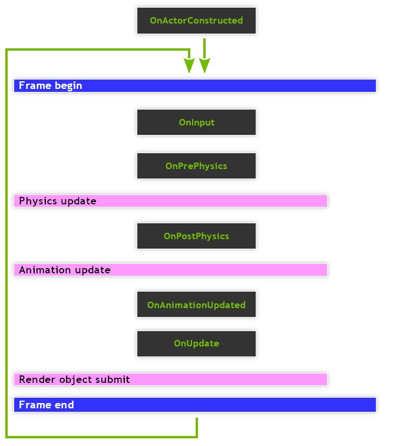

# _ScriptComponent_

```lua
require "av://engine/script_component.lua"
```

## Table of content

- [_Brief_](#brief)
- [_Metamethods_](#metamethods)
- [`Constructor`](#constructor)
- [`GetName ()`](#method-get-name)
- [`OnActorConstructed ( self, actor )`](#method-on-actor-constructed)
- [`OnPostPhysics ( self, deltaTime )`](#method-on-post-physics)
- [`OnPrePhysics ( self, deltaTime )`](#method-on-pre-physics)
- [`OnUpdate ( self, deltaTime )`](#method-on-update)

## <a id="brief">Brief</a>

[_ScriptComponent_](./script-component.md) is a fundamental building block for scriptable logic. The class allows to create custom user scripts, handle events and interact with various scene entities. This class not can be used directly because it's a base abstract class. The user must subclass [_ScriptComponent_](./script-component.md) and attach the its instance to any [_Actor_](./actor.md) instance.

Subclassing example:

```lua
require "av://engine/script_component.lua"


local Player = {}

-- Engine events
local function OnActorConstructed ( self, actor )
    -- Some implementation
end

local function OnPostPhysics ( self, deltaTime )
    -- Some implementation
end

local function OnPrePhysics ( self, deltaTime )
    -- Some implementation
end

local function OnUpdate ( self, deltaTime )
    -- Some implementation
end

-- Metamethods
local function Constructor ( self, handle, params )
    local obj = ScriptComponent ( handle )

    -- Data
    obj._health = params._health
    obj._damage = params._damage

    -- Engine events (all optional)
    obj.OnActorConstructed = OnActorConstructed
    obj.OnPostPhysics = OnPostPhysics
    obj.OnPrePhysics = OnPrePhysics
    obj.OnUpdate = OnUpdate

    return obj
end

setmetatable ( Player, { __call = Constructor } )

-- Module function: fabric callable for Player class.
return Player
```

Usage example:

```lua
require "av://engine/scene.lua"


local actor = Actor ( "Player" )

local params = {
    _health = 100,
    _damage = 7
}

actor:AppendComponent ( ScriptComponent ( "Script", "av://assets/Scripts/player.lua", params ) )
g_scene:AppendActor ( actor )
```

As you can see there are several engine events which could be handled by custom script.

One important note: all event handlers are **OPTIONAL**. That means that user class could define only required handlers without any penalty in performance. So it's recommended to define as minimum handlers as possible.

The event handler calling <a id="event-calling-order">order</a> looks like this:



## <a id="metamethods">Metamethods</a>

Metamethod | Used
--- | ---
`__add` | ❌
`__band` | ❌
`__bnot` | ❌
`__bor` | ❌
`__bxor` | ❌
`__call` | ✔️
`__close` | ❌
`__concat` | ❌
`__div` | ❌
`__eq` | ❌
`__gc` | ❌
`__idiv` | ❌
`__index` | ❌
`__le` | ❌
`__len` | ❌
`__lt` | ❌
`__mod` | ❌
`__mode` | ❌
`__mul` | ❌
`__name` | ❌
`__newindex` | ❌
`__pow` | ❌
`__shl` | ❌
`__shr` | ❌
`__sub` | ❌
`__tostring` | ❌
`__unm` | ❌

## <a id="constructor">`Constructor`</a>

Constructor makes new script component from the source code and parameters.

**Parameters:**

- `name` [_required, readonly, string_]: name of the component
- `script` [_required, readonly, string_]: virtual path to script source code
- `params` [_required, readonly, table or nil_]: optional table with user parameters or _nil_

**Example:**

```lua
require "av://engine/scene.lua"


local actor = Actor ( "Player" )

local params = {
    _health = 100,
    _damage = 7
}

actor:AppendComponent ( ScriptComponent ( "Script", "av://assets/Scripts/player.lua", params ) )
g_scene:AppendActor ( actor )
```

## <a id="method-get-name">`GetName ()`</a>

Method returns name of the component.

**Parameters:**

- none

**Return values:**

- `#1` [_required, string_]: name of the component

**Example:**

```lua
require "av://engine/scene.lua"


local actor = Actor ( "Player" )

local params = {
    _health = 100,
    _damage = 7
}

actor:AppendComponent ( ScriptComponent ( "Script", "av://assets/Scripts/player.lua", params ) )
g_scene:AppendActor ( actor )

local script = actor:FindComponent ( "Script" )
local name = script:GetName ()
```

## <a id="method-on-actor-constructed">`OnActorConstructed ( self, actor )`</a>

Oprtional user provided event handler in the subclass implementaion. The method will be called by the engine after creation and appending of all components to the current [_Actor_](./actor.md) instance. The event graph is presented [here](#event-calling-order).

**Note:** If [_Actor_](./actor.md) instance contains several [_ScriptComponent_](./script-component.md) instances the invocation order of `OnActorConstructed` for those components is undefined. That means that it's safe to query and find components attached to current [_Actor_](./actor.md) instance. But it's not safe to call any methods or read/modify any properties in the sibling components. They could not be initialized yet.

**Parameters:**

- `self` [_required, read/write, [ScriptComponent](./script-component.md)_]: part of _Lua OOP_ convention requred to invoke method via `:` syntax
- `actor` [_required, read/write, [Actor](./actor.md)_]: current [_Actor_](./actor.md) instance

**Return values:**

- none

**Example:**

```lua
require "av://engine/logger.lua"
require "av://engine/script_component.lua"


local Player = {}

-- Engine events
local function OnActorConstructed ( self, actor )
    LogD ( "My name is %s, actor name is %s.", self:GetName (), actor:GetName () )
end

-- Metamethods
local function Constructor ( self, handle, params )
    local obj = ScriptComponent ( handle )

    -- Engine events
    obj.OnActorConstructed = OnActorConstructed
    return obj
end

setmetatable ( Player, { __call = Constructor } )

-- Module function: fabric callable for Player class.
return Player
```

## <a id="method-on-post-physics">`OnPostPhysics ( self, deltaTime )`</a>

Oprtional user provided event handler in the subclass implementaion. The method will be called by the engine right after physics simulation. The event graph is presented [here](#event-calling-order).

**Parameters:**

- `self` [_required, read/write, [ScriptComponent](./script-component.md)_]: part of _Lua OOP_ convention requred to invoke method via `:` syntax
- `deltaTime` [_required, readonly, number_]: delta time in seconds between frames

**Return values:**

- none

**Example:**

```lua
require "av://engine/logger.lua"
require "av://engine/script_component.lua"


local Player = {}

-- Engine events
local function OnPostPhysics ( self, deltaTime )
    LogD ( "My name is %s, delta time is %.3f", self:GetName (), deltaTime )
end

-- Metamethods
local function Constructor ( self, handle, params )
    local obj = ScriptComponent ( handle )

    -- Engine events
    obj.OnPostPhysics = OnPostPhysics
    return obj
end

setmetatable ( Player, { __call = Constructor } )

-- Module function: fabric callable for Player class.
return Player
```

## <a id="method-on-pre-physics">`OnPrePhysics ( self, deltaTime )`</a>

Oprtional user provided event handler in the subclass implementaion. The method will be called by the engine right before physics simulation. The event graph is presented [here](#event-calling-order).

**Parameters:**

- `self` [_required, read/write, [ScriptComponent](./script-component.md)_]: part of _Lua OOP_ convention requred to invoke method via `:` syntax
- `deltaTime` [_required, readonly, number_]: delta time in seconds between frames

**Return values:**

- none

**Example:**

```lua
require "av://engine/logger.lua"
require "av://engine/script_component.lua"


local Player = {}

-- Engine events
local function OnPrePhysics ( self, deltaTime )
    LogD ( "My name is %s, delta time is %.3f", self:GetName (), deltaTime )
end

-- Metamethods
local function Constructor ( self, handle, params )
    local obj = ScriptComponent ( handle )

    -- Engine events
    obj.OnPrePhysics = OnPrePhysics
    return obj
end

setmetatable ( Player, { __call = Constructor } )

-- Module function: fabric callable for Player class.
return Player
```

## <a id="method-on-update">`OnUpdate ( self, deltaTime )`</a>

Oprtional user provided event handler in the subclass implementaion. The method will be called by the engine right after render object submissions and before end of the frame. The event graph is presented [here](#event-calling-order).

**Parameters:**

- `self` [_required, read/write, [ScriptComponent](./script-component.md)_]: part of _Lua OOP_ convention requred to invoke method via `:` syntax
- `deltaTime` [_required, readonly, number_]: delta time in seconds between frames

**Return values:**

- none

**Example:**

```lua
require "av://engine/logger.lua"
require "av://engine/script_component.lua"


local Player = {}

-- Engine events
local function OnUpdate ( self, deltaTime )
    LogD ( "My name is %s, delta time is %.3f", self:GetName (), deltaTime )
end

-- Metamethods
local function Constructor ( self, handle, params )
    local obj = ScriptComponent ( handle )

    -- Engine events
    obj.OnUpdate = OnUpdate
    return obj
end

setmetatable ( Player, { __call = Constructor } )

-- Module function: fabric callable for Player class.
return Player
```
