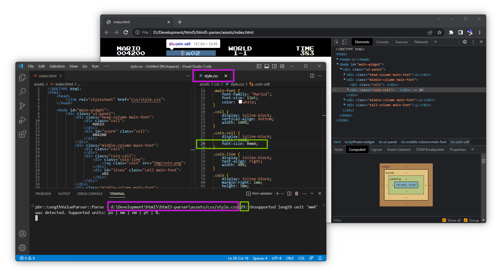

# _UI_ system

## <a id="table-of-content">Table of content</a>

- [_Brief_](#brief)
- [_HTML constraints_](#html-constraints)
  - [_Head_](#head)
    - [_Link_](#link)
  - [_Body_ ](#body)
    - [_DIV_ ](#div)
    - [_IMG_ ](#img)
    - [_Text_ ](#text)
- [_CSS constraints_](#css-constraints)
  - [`@font-face`](#font-face)
  - [`backgroground-color`](#background-color)
  - [`background-size`](#background-size)
  - [`color`](#color)
  - [`display`](#display)
  - [`font-family`](#font-family)
  - [`font-size`](#font-size)
  - [`margin-bottom`](#margin-bottom)
  - [`margin-left`](#margin-left)
  - [`margin-right`](#margin-right)
  - [`margin-top`](#margin-top)
  - [`margin`](#margin)
  - [`padding-bottom`](#padding-bottom)
  - [`padding-left`](#padding-left)
  - [`padding-right`](#padding-right)
  - [`padding-top`](#padding-top)
  - [`padding`](#padding)
  - [`position`](#position)
  - [`text-align`](#text-align)
  - [`vertical-align`](#vertical-align)
  - [`width`](#width)
  - [`height`](#height)

## <a id="brief">Brief</a>

Framework is using [_HTML_](https://en.wikipedia.org/wiki/HTML) + [_CSS_](https://en.wikipedia.org/wiki/CSS) files for _UI_ assets. The system very similar to _Web_-development. The main difference is _Lua_ scripting instead of _JavaScript_. It's needed to understand that frameworks is using subset of [_HTML_](https://en.wikipedia.org/wiki/HTML) + [_CSS_](https://en.wikipedia.org/wiki/CSS) entities as common sence. Such limited set of elements allows to create robust user interfaces without legacy complexity of modern _Web_ technology.

In addition framework provides [_HTML_ + _CSS_ validator](./html-validator.md). The validator could work in background and notify content creator about detected problems at exact file and line. Usually content creation workflow looks like this:



Such approach allows to use powerful browser's development tools. For example [_Chrome DevTool_](https://developer.chrome.com/docs/devtools/overview/). Content creator could access such tools by drag
n'drop main _HTML_ file onto browser window and press _F12_ in case of [_Google Chrome_](https://www.google.com/chrome/).

In order to create _UI_ elements the content creator has to create [_UILayer_](./ui-layer.md) instance from _lua_ script.

[↬ table of content ⇧](#table-of-content)

## <a id="html-constraints">_HTML_ constraints</a>

The _HTML_ document **MUST HAVE** the following structure:

```html
<!DOCTYPE html>
<html>
    <head>
        <link rel="stylesheet" href="...">
    </head>

    <body>
        ...
    </body>
</html>
```

_UI_ system only supports the following entities: [`head`](#head), [`link`](#link), [`body`](#body), [`div`](#div), [`img`](#img) and [`text`](#text).

[↬ table of content ⇧](#table-of-content)

### <a id="head">_Head_</a>

Supported child element: [`link`](#link).

[↬ table of content ⇧](#table-of-content)

### <a id="link">_Link_</a>

Current implementation supports **ONLY ONE** _link_ element.

Attribute | Constraint
--- | ---
`rel` | Must be `stylesheet`.
`href` | _UTF-8_ path to _CSS_ file. The path is relative from current _HTML_ file.

[↬ table of content ⇧](#table-of-content)

### <a id="body">_Body_</a>

Supported child elements: [`div`](#div), [`img`](#img) and [`text`](#text).

Supported attributes:

Attribute | Constraint
--- | ---
`id` | _UTF-8_ string. Must be unique. _CSS_ will be applied **AFTER** styles from `class` attribute.
`class` | _UTF-8_ string. Supports list of classes. _CSS_ will be applied in order of declaration of the classes and **BEFORE** styles from `id` attribute.

Default style:

Property | Value
--- | ---
[`background-color`](#background-color) | `transparent`
[`background-size`](#background-size) | `100%`
[`color`](#color) | `black`
[`display`](#display) | `block`
[`font-family`](#font-family) | `inherit`
[`font-size`](#font-size) | `16px`
[`margin-bottom`](#margin-bottom) | `8px`
[`margin-left`](#margin-left) | `8px`
[`margin-right`](#margin-right) | `8px`
[`margin-top`](#margin-top) | `8px`
[`padding-bottom`](#padding-bottom) | `0px`
[`padding-left`](#padding-left) | `0px`
[`padding-right`](#padding-right) | `0px`
[`padding-top`](#padding-top) | `0px`
[`position`](#position) | `static`
[`text-align`](#text-align) | `left`
[`vertical-align`](#vertical-align) | `top`
[`width`](#width) | `100%`
[`height`](#height) | `100%`

[↬ table of content ⇧](#table-of-content)

#### <a id="div">_DIV_</a>

Supported attributes:

Attribute | Constraint
--- | ---
`id` | _UTF-8_ string. Must be unique. _CSS_ will be applied **AFTER** styles from `class` attribute.
`class` | _UTF-8_ string. Supports list of classes. _CSS_ will be applied in order of declaration of the classes and **BEFORE** styles from `id` attribute.

Default style:

Property | Value
--- | ---
[`background-color`](#background-color) | `transparent`
[`background-size`](#background-size) | `100%`
[`color`](#color) | `transparent`
[`display`](#display) | `block`
[`font-family`](#font-family) | `inherit`
[`font-size`](#font-size) | `1em`
[`margin-bottom`](#margin-bottom) | `0px`
[`margin-left`](#margin-left) | `0px`
[`margin-right`](#margin-right) | `0px`
[`margin-top`](#margin-top) | `0px`
[`padding-bottom`](#padding-bottom) | `0px`
[`padding-left`](#padding-left) | `0px`
[`padding-right`](#padding-right) | `0px`
[`padding-top`](#padding-top) | `0px`
[`position`](#position) | `static`
[`text-align`](#text-align) | `left`
[`vertical-align`](#vertical-align) | `top`
[`width`](#width) | `100%`
[`height`](#height) | `auto`

[↬ table of content ⇧](#table-of-content)

#### <a id="img">_IMG_</a>

Supported attributes:

Attribute | Constraint
--- | ---
`id` | _UTF-8_ string. Must be unique. _CSS_ will be applied **AFTER** styles from `class` attribute.
`class` | _UTF-8_ string. Supports list of classes. _CSS_ will be applied in order of declaration of the classes and **BEFORE** styles from `id` attribute.
`src` | _UTF-8_ path to image asset. The path is relative from main _HTML_ file. Asset could be `.ktx`, `.png`, `.jpeg`, `.bmp` and `.tga`. In case of `.ktx` the framework will try to find `.png` version of the file. It's for browser compatibility as a preview tool.

Default style:

Property | Value
--- | ---
[`background-color`](#background-color) | `transparent`
[`background-size`](#background-size) | `100%`
[`color`](#color) | `transparent`
[`display`](#color) | `inline-block`
[`font-family`](#font-family) | `inherit`
[`font-size`](#font-size) | `1em`
[`margin-bottom`](#margin-bottom) | `0px`
[`margin-left`](#margin-left) | `0px`
[`margin-right`](#margin-right) | `0px`
[`margin-top`](#margin-top) | `0px`
[`padding-bottom`](#padding-bottom) | `0px`
[`padding-left`](#padding-left) | `0px`
[`padding-right`](#padding-right) | `0px`
[`padding-top`](#padding-top) | `0px`
[`position`](#position) | `static`
[`text-align`](#text-align) | `left`
[`vertical-align`](#vertical-align) | `top`
[`width`](#vertical-align) | `auto`
[`height`](#vertical-align) | `auto`

[↬ table of content ⇧](#table-of-content)

#### <a id="text">Text</a>

Supported attributes: _N/A_.

Default style: _N/A_, all attributes are `inherit`.

[↬ table of content ⇧](#table-of-content)

### <a id="css-constraints">_CSS_ constraints</a>

_UI_ system only supports the following _CSS_ entities:

### <a id="font-face">`@font-face`</a>

Property | Value
--- | ---
`font-family` | _UTF-8_ identifier. Must be unique.
`src` | _UTF-8_ path to font asset. The path is relative current _CSS_ file. Supported formats: `.ttf`, `.otf`, `.woff` and numerous font formats which [_FreeType_](https://freetype.org/freetype2/docs/index.html) supports. Note current [_FreeType_](https://freetype.org/freetype2/docs/index.html) version is specified at [main page](../README.md) of the current project.

[↬ table of content ⇧](#table-of-content)

### <a id="background-color">`backgroground-color`</a>

Supported values: [_HEX_ color](https://www.w3schools.com/css/css_colors_hex.asp), [_RGB_ color](https://www.w3schools.com/css/css_colors_rgb.asp), [_HSL_ color](https://www.w3schools.com/css/css_colors_hsl.asp) and [named color](https://developer.mozilla.org/en-US/docs/Web/CSS/named-color).

[↬ table of content ⇧](#table-of-content)

### <a id="background-size">`background-size`</a>

Supported values: `em`, `px`, `pt`, `mm` and `%`.

[↬ table of content ⇧](#table-of-content)

### <a id="color">`color`</a>

Supported values: [_HEX_ color](https://www.w3schools.com/css/css_colors_hex.asp), [_RGB_ color](https://www.w3schools.com/css/css_colors_rgb.asp), [_HSL_ color](https://www.w3schools.com/css/css_colors_hsl.asp) and [named color](https://developer.mozilla.org/en-US/docs/Web/CSS/named-color).

[↬ table of content ⇧](#table-of-content)

### <a id="display">`display`</a>

Supported values: `block`, `inline-block` and `none`.

[↬ table of content ⇧](#table-of-content)

### <a id="font-family">`font-family`</a>

Supported values: _UTF-8_ identifier. The font itself must be specified via [`@font-face`](#font-face) rule. There are **NO ANY DEFALUT FONT** _UI_ system. Every font **MUST BE** specified explicitly.

[↬ table of content ⇧](#table-of-content)

### <a id="font-size">`font-size`</a>

Supported values: `em`, `px`, `pt`, `mm` and `%`.

[↬ table of content ⇧](#table-of-content)

### <a id="margin-bottom">`margin-bottom`</a>

Supported values: `em`, `px`, `pt`, `mm` and `%`.

[↬ table of content ⇧](#table-of-content)

### <a id="margin-left">`margin-left`</a>

Supported values: `em`, `px`, `pt`, `mm` and `%`.

[↬ table of content ⇧](#table-of-content)

### <a id="margin-right">`margin-right`</a>

Supported values: `em`, `px`, `pt`, `mm` and `%`.

[↬ table of content ⇧](#table-of-content)

### <a id="margin-top">`margin-top`</a>

Supported values: `em`, `px`, `pt`, `mm` and `%`.

[↬ table of content ⇧](#table-of-content)

### <a id="margin">`margin`</a>

Supported values: From 1 to 4 values accoring to [_CSS_ specification](https://developer.mozilla.org/en-US/docs/Web/CSS/margin). Units: `em`, `px`, `pt`, `mm` and `%`.

[↬ table of content ⇧](#table-of-content)

### <a id="padding-bottom">`padding-bottom`</a>

Supported values: `em`, `px`, `pt`, `mm` and `%`.

[↬ table of content ⇧](#table-of-content)

### <a id="padding-left">`padding-left`</a>

Supported values: `em`, `px`, `pt`, `mm` and `%`.

[↬ table of content ⇧](#table-of-content)

### <a id="padding-right">`padding-right`</a>

Supported values: `em`, `px`, `pt`, `mm` and `%`.

[↬ table of content ⇧](#table-of-content)

### <a id="padding-top">`padding-top`</a>

Supported values: `em`, `px`, `pt`, `mm` and `%`.

[↬ table of content ⇧](#table-of-content)

### <a id="padding">`padding`</a>

Supported values: From 1 to 4 values accoring to [_CSS_ specification](https://developer.mozilla.org/en-US/docs/Web/CSS/padding). Units: `em`, `px`, `pt`, `mm` and `%`.

[↬ table of content ⇧](#table-of-content)

### <a id="position">`position`</a>

Supported values: `absolute` and `static`.

[↬ table of content ⇧](#table-of-content)

### <a id="text-align">`text-align`</a>

Supported values: `center`, `left` and `right`.

[↬ table of content ⇧](#table-of-content)

### <a id="vertical-align">`vertical-align`</a>

Supported values: `bottom`, `middle` and `top`.

[↬ table of content ⇧](#table-of-content)

### <a id="width">`width`</a>

Supported values: `auto`, `em`, `px`, `pt`, `mm` and `%`.

[↬ table of content ⇧](#table-of-content)

### <a id="height">`height`</a>

Supported values: `auto`, `em`, `px`, `pt`, `mm` and `%`.

[↬ table of content ⇧](#table-of-content)
