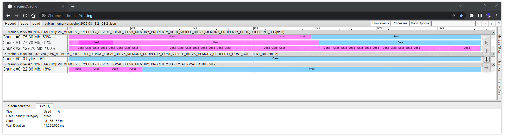
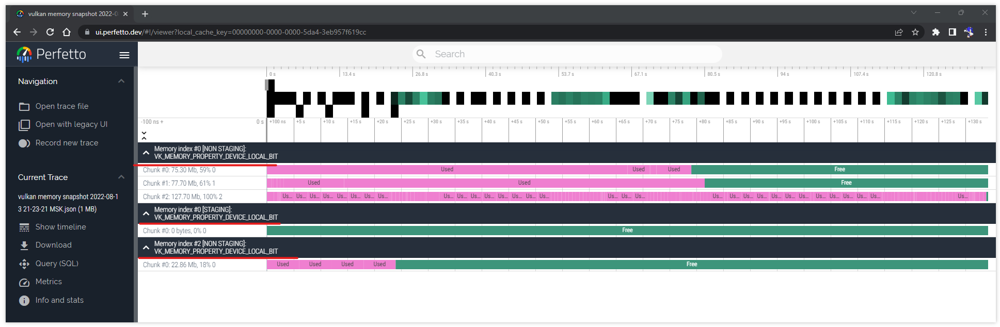

# _Vulkan_ memory view

## Requirements

- _Google Chrome v105.0.5195.127_

## Brief

The project has ability to make a snapshot of current _Vulkan_ memory state. The _API_ to do that is `android_vulkan::Renderer::MakeMakeVulkanMemorySnapshot`. The resulting file could be opened in [_Google Chrome Tracing_](https://slack.engineering/chrome-tracing-for-fun-and-profit) build-in tool.

A couple notes about data interpretation:

`Chunk #0: 75.30Mb, 59%` means that memory chunk contains 75.30 Mb data which is in use and has occupancy of 59% used memory.

`Wall Duration 11,206.656 ms` should be interpreted as size in **BYTES** for selected block.

`[STAGING]` means that block is created for intercommunicating with _GPU_ device memory and visible by host _CPU_.

`[NON STAGING]` is opposite to `[STAGING]` memory. Anything but intercommunicating.

Note that empty space between blocks is just for better visualization in viewer. There is **NO** any empty space between blocks in actual memory layout.

## Snapshot location

The snapshot is located in the app's cache directory and has name:

`vulkan memory snapshot <date and time>.json`

For example: `/data/data/com.goshidoInc.androidVulkan/cache/vulkan memory snapshot 2022-08-13 21-23-21 MSK.json`

**Note:** cache directory only presents in **debug build**.

## About _Perfetto_

It's not a secret that [_Perfetto_](https://ui.perfetto.dev/) tool could also preview trace files. Unfortunately it was detected that version _v26.1-ef7b0_ has a bug which trims memory property information for memory index information block.

So it's up for you to use [_Perfetto_](https://ui.perfetto.dev/) or not.