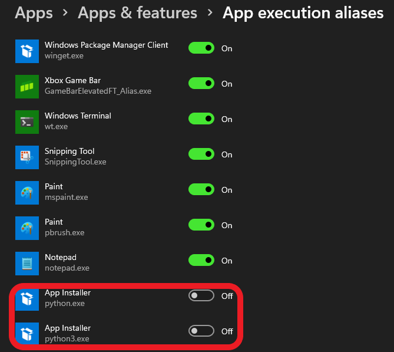

# Building _Vulkan_ validation layers for _Android OS_

## Brief

Starting from _Android NDK_ `23.0.7599858` the _Vulkan_ validation layers have been removed (see [source](https://github.com/android/ndk/wiki/Changelog-r23)). The official _Khronos_ [repo](https://github.com/KhronosGroup/Vulkan-ValidationLayers) does not provide enough information about building `libVkLayer_khronos_validation.so` from scratch for _Android OS_. So in this document essential steps for building will be covered.

## Compatible version

The manual is based on `bbff1dc59468540736f2535cdfbad3ff436e26ec` commit of the [_Vulkan-ValidationLayers_](https://github.com/KhronosGroup/Vulkan-ValidationLayers) repo. The manual is primary aimed for _Windows OS_ users.

## Requirements

- _Windows 11_
- _Android NDK 25.0.8775105_
- _CMake 3.22.1_
- _Ninja 1.8.2_
- _Python 3.10.0_

## Building

First of all clone the [_Vulkan-ValidationLayers_](https://github.com/KhronosGroup/Vulkan-ValidationLayers) repo. Next step is to switch to the `master` branch.

Then you have to prepare building utils for _Vulkan-ValidationLayers_ project. It is [_Python 3.7+_](https://www.python.org/).

After installing the _Python_ you have to disable _Windows 11_ aliases for python apps.



It's needed because bootstrap scripts of the _Vulkan-ValidationLayers_ project are using `python3` calls. So the next obvious step is to create symbolic link `python3.exe` which will be connected with `python.exe`. Yes. It's possible on _Windows OS_. Run _cmd.exe_ with admistrative rights and call

```batch
cd <python directory>
mklink python3.exe python.exe
```

At this point we able to download source code dependencies of the _Vulkan-ValidationLayers_ project. Go the project directory and run

```batch
cd build-android
python3 ../scripts/update_deps.py --no-build --config release
```

At this point it's time to build dependencies: `glslang`, `SPIRV-Tools` and `SPIRV-Tools-opt`.

### Building `glslang`

To build `glslang` go to `build-android/glslang` and run

```cmake
set ANDROID_NDK_ROOT=<Path to Android NDK v25.0.8775105>
set ANDROID_CMAKE_DIR=<Path to Android's CMake v3.22.1>
"%ANDROID_CMAKE_DIR%\cmake" . -G "Unix Makefiles" -DCMAKE_INSTALL_PREFIX=./install -DANDROID_ABI=arm64-v8a -DCMAKE_BUILD_TYPE=Release -DANDROID_STL=c++_static -DANDROID_PLATFORM=android-30 -DCMAKE_SYSTEM_NAME=Android -DANDROID_TOOLCHAIN=clang -DANDROID_ARM_MODE=arm -DCMAKE_MAKE_PROGRAM=%ANDROID_NDK_ROOT%/prebuilt/windows-x86_64/bin/make -DCMAKE_TOOLCHAIN_FILE=%ANDROID_NDK_ROOT%/build/cmake/android.toolchain.cmake
"%ANDROID_CMAKE_DIR%\cmake" --build .
```

The artifact will be here:

`<repo>/build-android/glslang/glslang/libglslang.a`

### Building `SPIRV-Tools` and `SPIRV-Tools-opt`

First it's needed to change target _Android_ platform and compiler. So modify the `<repo>/build-android/SPIRV-Tools/android_test/jni/Application.mk`:

```txt
// Line 1
APP_ABI := arm64-v8a

// Line 4
APP_PLATFORM := android-30

// Line 5
NDK_TOOLCHAIN_VERSION := clang
```

To build `SPIRV-Tools` and `SPIRV-Tools-opt` go to `build-android/SPIRV-Tools` and run

```txt
python utils/git-sync-deps
set ANDROID_NDK=<Path to Android NDK v25.0.8775105>

mkdir build && cd build
mkdir libs
mkdir app

%ANDROID_NDK%/ndk-build -C ../android_test NDK_PROJECT_PATH=. NDK_LIBS_OUT=%CD%\libs NDK_APP_OUT=%CD%\app
```

The artifacts will be here:

`<repo>/build-android/SPIRV-Tools/build/app/local/arm64-v8a/libSPIRV-Tools.a`

`<repo>/build-android/SPIRV-Tools/build/app/local/arm64-v8a/libSPIRV-Tools-opt.a`

### Building `libVkLayer_khronos_validation.so`

At this point we able to build _Vulkan_ validation layers for _Android_. Unfortunatelly stock building process via `Android.mk` files does not work out of the box. There are two reasons:

1) Force autotests with dependencies
2) Mess with linking of the static libraries: `layer_utils`, `SPIRV-Tools` and `SPIRV-Tools-opt`

Good news is the legacy `Android.mk` could be written to _CMakeLists_ + _Ninja_ systems.

So the last building process for _Windows OS_ is automated via script `<repo>/third-party/vulkan-validation-layers/windows-host/x-build.bat`

In order to use it you have to specify two enviroment variables:

Variable name | Meaning | Example
--- | --- | ---
`NDK_DIR` | Directory where Android NDK is installed | `D:\Development\android-sdk\ndk\25.0.8775105`
`ANDROID_CMAKE_DIR` | Directory where Android CMake is installed | `D:\Programs\Android\Sdk\cmake\3.22.1\bin`
`VK_LAYER_DIR` | directory where Vulkan validation layer source code is located for Android | `D:\Development\Vulkan-ValidationLayers\build-android`


Next what you should to do is to double click `x-build.bat` file.

The artifact will be here:

`<repo>/build-android/build/arm64-v8a/Release/stripped/libVkLayer_khronos_validation.so`

**Note:** At this moment there is no overwriting support for _CMake_/_Ninja_ files. So you have to manually delete `VK_LAYER_DIR/build` directory.

That's all!

### Reported issues

Name | Link | Status
--- | --- | ---
Incorrect validation of the `vkGetPhysicalDeviceSurfaceFormatsKHR` | [#3251](https://github.com/KhronosGroup/Vulkan-ValidationLayers/issues/3251) | ✔️ Fixed
Incorrect deinitialization and `VK_EXT_debug_report` | [#3327](https://github.com/KhronosGroup/Vulkan-ValidationLayers/issues/3327) | ☄️ Driver bug
